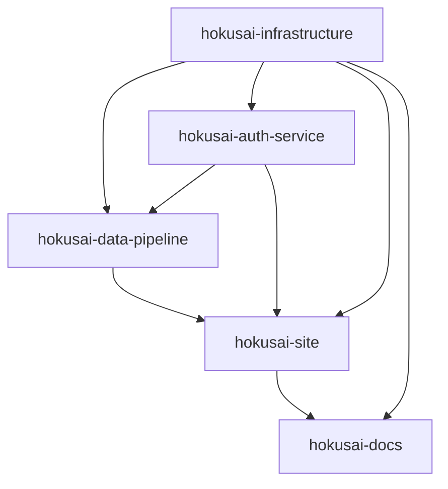

# Hokusai Documentation - Claude Configuration

<!-- START: SHARED ARCHITECTURE SECTION - DO NOT MODIFY -->
# Hokusai Multi-Repository Architecture

## System Overview
Hokusai is a distributed AI model serving platform consisting of five interconnected repositories. When working on ANY feature or fix, you MUST consider cross-repository dependencies and impacts.

## Repository Map

| Repository | Purpose | Location | Primary Domain |
|------------|---------|----------|----------------|
| hokusai-infrastructure | Shared AWS infrastructure (Terraform) | `../hokusai-infrastructure` | N/A - Infrastructure only |
| hokusai-data-pipeline | ML tooling, MLFlow registry, model serving | `../hokusai-data-pipeline` | `api.hokus.ai`, `registry.hokus.ai` |
| hokusai-auth-service | Authentication, authorization, billing | `../hokusai-auth-service` | `auth.hokus.ai` |
| hokusai-site | Public website, model marketplace | `../hokusai-site` | `hokus.ai` |
| hokusai-docs | Documentation (Docusaurus) | `../hokusai-docs` | `docs.hokus.ai` |

## Cross-Repository Dependencies



## Service Communication

### Internal Services (ECS/Service Discovery)
- Auth Service: `http://auth.hokusai-development.local:8000`
- MLFlow Service: `http://mlflow.hokusai-development.local:5000`
- API Service: `http://api.hokusai-development.local:8001`

### External Endpoints (via ALB)
- Auth API: `https://auth.hokus.ai`
- Data Pipeline API: `https://api.hokus.ai`
- Model Registry: `https://registry.hokus.ai`
- Main Site: `https://hokus.ai`
- Documentation: `https://docs.hokus.ai`

## Before Making Changes - CRITICAL CHECKLIST

1. **Check Infrastructure Dependencies**
   ```bash
   # From any repo, check infrastructure configuration
   grep -r "your-change" ../hokusai-infrastructure/environments/
   ```

2. **Verify Service Communication**
   - Will this break any API contracts?
   - Do other services depend on this endpoint?
   - Are there hardcoded URLs that need updating?

3. **Database Impact**
   - Does this require schema changes?
   - Will this affect other services using the same database?

4. **Authentication Flow**
   - Does this change require auth service updates?
   - Will this affect JWT token validation?

## Deployment Order (ALWAYS FOLLOW)
1. Infrastructure changes (Terraform)
2. Database migrations
3. Auth service (if changed)
4. Data pipeline services (if changed)
5. Site updates
6. Documentation updates

## Hokusai Architect Agent

When planning features that span multiple repositories, ALWAYS use the hokusai-architect agent:

```typescript
await Task({
  subagent_type: "hokusai-architect",
  description: "Plan multi-repo feature",
  prompt: `
    Analyze and plan: ${feature_description}
    
    Current repository: hokusai-docs
    
    Requirements:
    1. Identify ALL affected repositories
    2. Check for breaking changes
    3. Define implementation order
    4. Create tasks for each repository
    5. Document API changes
    6. Plan rollback strategy
  `
});
```

### When to Use hokusai-architect Agent
- Adding new features that touch multiple services
- Changing API contracts
- Modifying authentication/authorization
- Adding new infrastructure components
- Planning major refactoring
- Implementing new ML model serving capabilities
- Adding billing/payment features

## Environment Variables (Consistent Across Services)

```bash
# Standard across all services
ENVIRONMENT=development|staging|production
AWS_REGION=us-east-1

# Service discovery
MLFLOW_SERVER_URL=http://mlflow.hokusai-development.local:5000
AUTH_SERVICE_URL=https://auth.hokus.ai  # External
AUTH_SERVICE_INTERNAL_URL=http://auth.hokusai-development.local:8000  # Internal

# Database connections (from Secrets Manager)
DATABASE_URL=postgresql://[user]@[host]:5432/[database]
```

## Common Pitfalls to Avoid

1. **Never hardcode service URLs** - Use environment variables
2. **Don't skip infrastructure repo** when adding AWS resources
3. **Always update service discovery** when changing internal endpoints
4. **Check ALB routing rules** before adding new paths
5. **Verify CORS settings** for cross-domain requests
6. **Test inter-service auth** after any auth changes
7. **Update docs repo** for any API changes

## Quick Commands for Cross-Repo Work

```bash
# Check all repos for a specific string/configuration
for repo in infrastructure data-pipeline auth-service site docs; do
  echo "=== hokusai-$repo ==="
  grep -r "search-term" ../hokusai-$repo/ --include="*.ts" --include="*.tf" --include="*.yml"
done

# Check service health across all endpoints
for endpoint in auth.hokus.ai api.hokus.ai registry.hokus.ai; do
  echo "=== $endpoint ==="
  curl -s https://$endpoint/health | jq .
done

# View logs for all ECS services
aws logs tail /ecs/hokusai-auth-development --follow &
aws logs tail /ecs/hokusai-api-development --follow &
aws logs tail /ecs/hokusai-mlflow-development --follow &
```
<!-- END: SHARED ARCHITECTURE SECTION -->

# Documentation Service Specific Configuration

## This Repository (hokusai-docs)

### Primary Responsibilities
- Comprehensive documentation for Hokusai Protocol
- API reference documentation for all services
- Developer guides and tutorials
- Protocol specifications and architecture
- Smart contract documentation
- SDK and integration guides
- User guides for platform features

### Technology Stack

#### Documentation Framework
- **Docusaurus 3.7.0** - Modern static site generator
- **React** - For custom components and interactive content
- **TypeScript** - Type safety for custom components
- **Tailwind CSS** - Custom styling integration
- **Markdown/MDX** - Content authoring format

### Service Configuration

#### Documentation Site
- **Port**: 3001 (development), 80/443 (production)
- **External URL**: `https://docs.hokus.ai`
- **Hosting**: AWS S3 + CloudFront (static site)
- **Build Tool**: Docusaurus static site generation

### Repository Structure

```
hokusai-docs/
├── docs/                    # Docusaurus configuration root
│   ├── docs/               # Documentation content (Markdown)
│   │   ├── licensing/      # Model licensing documentation
│   │   ├── smart-contracts/ # Smart contract architecture
│   │   ├── tokenomics/     # Token economics documentation
│   │   ├── api/            # API reference documentation
│   │   ├── guides/         # Developer and user guides
│   │   └── tutorials/      # Step-by-step tutorials
│   ├── src/                # React components and custom styling
│   │   ├── components/     # Custom Docusaurus components
│   │   ├── css/           # Custom CSS and Tailwind
│   │   └── pages/         # Custom pages (non-docs)
│   ├── static/            # Static assets (images, files)
│   ├── docusaurus.config.js # Main Docusaurus configuration
│   └── sidebars.js        # Navigation sidebar configuration
├── .cursor/
│   └── rules/             # AI context files with protocol details
├── deploy-docs.sh         # Deployment script
└── CLAUDE.md             # This configuration file
```

### Development Commands

```bash
# All commands run from docs/ directory
cd docs/

# Development server (port 3001)
npm start

# Build production site
npm run build

# TypeScript type checking
npm run typecheck

# Preview production build locally
npm run serve

# Deploy to production (GitHub Pages -> docs.hokus.ai)
npm run deploy
```

### Documentation Structure

#### Core Protocol Documentation (`docs/docs/`)

##### Licensing (`licensing/`)
- Model licensing framework
- Rights management
- Revenue sharing models
- Legal compliance

##### Smart Contracts (`smart-contracts/`)
- Contract architecture
- Deployment procedures
- Interface specifications
- Security considerations

##### Tokenomics (`tokenomics/`)
- Token economics model
- DeltaOne rewards system
- Bonding curves
- Staking mechanisms

##### API Reference (`api/`)
- Authentication API documentation
- Model serving API endpoints
- Registry API specifications
- WebSocket API documentation

##### Developer Guides (`guides/`)
- Quick start guide
- SDK integration
- Authentication flows
- Model deployment
- Best practices

##### Tutorials (`tutorials/`)
- Step-by-step walkthroughs
- Code examples
- Interactive demos
- Video tutorials

### Key Documentation Concepts

#### DeltaOne Rewards
- Core reward unit where 1 DeltaOne = 1% performance improvement
- Verification through DeltaVerifier (on-chain) using HEM (Hokusai Evaluation Manifest) eval artifacts
- Distribution mechanisms
- Calculation methodology

#### Three User Personas
1. **Data Suppliers**: Contributors providing training data
2. **Model Developers**: AI researchers and engineers
3. **Investors**: Token holders and liquidity providers

#### Verification System
- All improvements verified through standardized benchmarks
- Quality assurance processes
- Performance measurement standards
- Fraud prevention mechanisms

### API Documentation Generation

#### Automated API Docs
```bash
# Generate API documentation from OpenAPI specs
npm run generate-api-docs

# Update API documentation from services
./scripts/update-api-docs.sh
```

#### Integration with Services
- Pull OpenAPI specs from auth service
- Extract API documentation from data pipeline
- Generate SDK documentation
- Create interactive API explorer

### Custom Components

#### Interactive Elements
```jsx
// Custom Docusaurus components in src/components/
export const APIEndpoint = ({ method, path, description }) => (
  <div className="api-endpoint">
    <span className={`method ${method.toLowerCase()}`}>{method}</span>
    <code>{path}</code>
    <p>{description}</p>
  </div>
);

export const CodeExample = ({ language, code, title }) => (
  <div className="code-example">
    <h4>{title}</h4>
    <CodeBlock language={language}>{code}</CodeBlock>
  </div>
);
```

#### Protocol Diagrams
- Mermaid.js integration for system diagrams
- Interactive flowcharts
- Architecture visualizations
- Process flow diagrams

### Content Management

#### Markdown/MDX Features
- Standard Markdown with React component integration
- Code highlighting with Prism.js
- Interactive code examples
- Embedded videos and media
- Cross-references and internal linking

#### Content Organization
```
docs/
├── introduction.md         # Platform overview
├── getting-started/        # Quick start guides
├── authentication/         # Auth service documentation
├── models/                # Model serving documentation
├── registry/              # Model registry documentation
├── sdk/                   # SDK and client libraries
├── smart-contracts/       # Blockchain documentation
├── tokenomics/           # Economic model
└── api-reference/        # Complete API documentation
```

### Deployment Pipeline

#### Static Site Generation
```bash
# Build static site
npm run build

# Deploy to S3 + CloudFront
aws s3 sync build/ s3://docs.hokus.ai-bucket
aws cloudfront create-invalidation --distribution-id $DISTRIBUTION_ID --paths "/*"
```

#### Infrastructure Integration
- Deployed via Terraform in hokusai-infrastructure
- S3 bucket with CloudFront distribution
- Custom domain with SSL certificate
- CDN caching and optimization

### Search and Navigation

#### Search Functionality
- Algolia DocSearch integration
- Full-text search across all documentation
- Filtered search by content type
- Auto-complete suggestions

#### Navigation Structure
```javascript
// sidebars.js configuration
module.exports = {
  docs: [
    'introduction',
    {
      type: 'category',
      label: 'Getting Started',
      items: [
        'getting-started/overview',
        'getting-started/authentication',
        'getting-started/first-model'
      ]
    },
    {
      type: 'category',
      label: 'API Reference',
      items: [
        'api/authentication',
        'api/models',
        'api/registry'
      ]
    }
  ]
};
```

### Content Automation

#### Auto-Generated Content
- API documentation from OpenAPI specs
- SDK documentation from code comments
- Changelog from git commits
- Error code reference from source

#### Content Validation
```bash
# Validate documentation links
npm run validate-links

# Check for outdated content
npm run check-freshness

# Validate code examples
npm run test-examples
```

### Integration Points

#### With Other Services
- Pull API specs from auth and data pipeline services
- Link to live API endpoints for testing
- Embed interactive model demos from main site
- Reference infrastructure documentation

#### With Development Workflow
- Auto-update docs when API changes
- Link to Linear tasks and GitHub issues
- Integration with code review process
- Automated deployment on content changes

### Monitoring and Analytics

#### Documentation Analytics
- Page view tracking
- Search query analysis
- User journey mapping
- Content effectiveness metrics

#### Quality Metrics
- Link health monitoring
- Content freshness tracking
- User feedback collection
- Search success rates

### Common Tasks

#### Add New API Endpoint Documentation
1. Pull OpenAPI spec from service
2. Generate markdown documentation
3. Add to appropriate section
4. Update navigation sidebar
5. Add code examples
6. Test interactive features

#### Update Architecture Documentation
1. Coordinate with hokusai-architect agent
2. Update system diagrams
3. Revise service interaction docs
4. Update deployment guides
5. Refresh troubleshooting guides

#### Create New Tutorial
1. Plan tutorial scope and audience
2. Create step-by-step content
3. Add code examples and demos
4. Include troubleshooting section
5. Test with real users
6. Update related documentation

### Environment Configuration

```bash
# Development
DOCUSAURUS_BASE_URL=http://localhost:3001
ALGOLIA_APP_ID=[development-app-id]
ALGOLIA_API_KEY=[public-search-key]

# Production
DOCUSAURUS_BASE_URL=https://docs.hokus.ai
ALGOLIA_APP_ID=[production-app-id]
ALGOLIA_API_KEY=[public-search-key]
```

### Content Style Guide

#### Writing Standards
- Clear, concise technical writing
- Consistent terminology across all docs
- Code examples that are tested and working
- Progressive disclosure of complexity
- Mobile-friendly formatting

#### Visual Standards
- Consistent diagram styling
- Proper code highlighting
- Responsive images and media
- Accessible color schemes
- Clear typography hierarchy

### Backup and Versioning

#### Content Versioning
- Git-based version control
- Branching strategy for documentation releases
- Tag-based releases aligned with service versions
- Rollback procedures for content issues

#### Disaster Recovery
- Documentation source backed up in git
- Build artifacts stored in S3
- CDN caching for high availability
- Multi-region failover capabilities

### Before Making Changes

1. **Check Cross-Service Impact**: Ensure documentation accurately reflects current API state
2. **Validate Links**: Test all internal and external links
3. **Review Content Consistency**: Maintain terminology and style consistency
4. **Test Build Process**: Ensure documentation builds without errors
5. **Update Navigation**: Keep sidebar and internal links current
6. **Mobile Testing**: Verify responsive design on mobile devices
7. **Search Testing**: Ensure new content is discoverable

### Critical Files

- `docs/docusaurus.config.js` - Main Docusaurus configuration
- `docs/sidebars.js` - Navigation structure
- `docs/docs/` - All documentation content
- `docs/src/components/` - Custom React components
- `.cursor/rules/` - Protocol context and terminology
- `deploy-docs.sh` - Deployment script
- `docs/package.json` - Dependencies and scripts

### Linear Integration

For task management and documentation planning:

```bash
# Fetch backlog for documentation tasks
npx tsx ~/.claude/tools/get-backlog.ts "Hokusai docs"
```

### Quality Assurance

#### Content Review Process
1. Technical accuracy review by service teams
2. Editorial review for clarity and style
3. User testing with actual developers
4. Automated link and example testing
5. SEO and accessibility audit