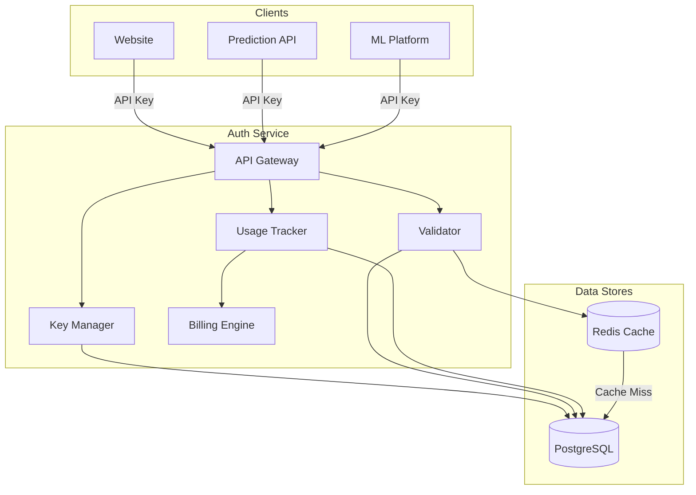

# Authentication Overview

The Hokusai Authentication Service provides centralized API key management for the entire Hokusai platform ecosystem. It handles key creation, validation, rotation, usage tracking, and billing across all Hokusai services.

## Architecture

## Key Concepts

### API Keys

API keys are the primary authentication mechanism for all Hokusai services. Each key is:

- **Cryptographically generated** — 32 random characters with an environment prefix
- **BCrypt hashed** — only the hash is stored; the full key is shown once at creation
- **Scoped** — keys can be restricted to specific operations
- **Service-bound** — each key is associated with a specific service (website, prediction, or platform)

### Environments

Keys are prefixed by environment to prevent accidental cross-environment usage:

| Environment | Prefix | Use Case |
|-------------|--------|----------|
| Production | `hk_live_` | Live traffic, real billing |
| Test | `hk_test_` | Integration testing, staging |
| Development | `hk_dev_` | Local development |

### Services

The auth service manages keys for three platform services:

| Service ID | Description |
|------------|-------------|
| `website` | The Hokusai web application |
| `prediction` | The prediction/inference API |
| `platform` | The ML platform and training infrastructure |

### Rate Limits

Each API key has a configurable rate limit (default: 1,000 requests/hour). Rate limits are enforced per key, not per IP address. You can set limits between 10 and 100,000 requests per hour when creating a key.

### Scopes

Scopes provide fine-grained access control. When creating a key, you can specify which operations it is allowed to perform (e.g., `predict`, `train`, `read`). If no scopes are set, the key has full access within its service.

## Endpoint Summary

The auth service exposes the following endpoint groups:

| Group | Endpoints | Description |
|-------|-----------|-------------|
| [Key Management](/authentication/api-keys) | 5 endpoints | Create, list, get, revoke, and rotate API keys |
| [Validation](/authentication/validation) | 1 endpoint | Validate API keys and check permissions |
| [Usage & Billing](/authentication/usage-billing) | 4 endpoints | Track usage, get statistics, billing info, and aggregates |
| Health | 3 endpoints | Service health, readiness, and metrics |

## Authentication Model

The auth service uses a two-tier authentication model:

1. **Admin Token** — A server-side bearer token required for key management operations (create, list, revoke, rotate, view stats/billing). Set via the `ADMIN_TOKEN` environment variable.
2. **API Keys** — Client-facing keys used by applications to authenticate with Hokusai services. Validated via the `/api/v1/keys/validate` endpoint.

:::info
The validation endpoint itself is public — it does not require an admin token. This allows any Hokusai service to validate incoming API keys without sharing the admin secret.
:::

## Next Steps

- **[Quickstart](/authentication/quickstart)** — Create and validate your first API key in 5 minutes
- **[API Keys](/authentication/api-keys)** — Full API key lifecycle documentation
- **[Security Best Practices](/authentication/security)** — Hardening your integration
