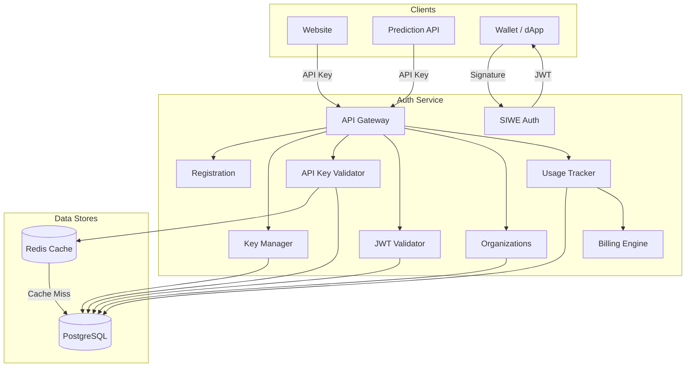

# Authentication Overview

The Hokusai Authentication Service provides centralized identity, API key management, and access control for the entire Hokusai platform. It handles user registration, wallet-based authentication (SIWE), API key lifecycle, team management, usage tracking, and billing.

## Architecture

## Key Concepts

### Authentication Methods

Hokusai supports two authentication methods:

1. **API Keys** — The primary mechanism for service-to-service and application access. Keys are cryptographically generated, BCrypt-hashed, scoped, and service-bound.
2. **Sign-In with Ethereum (SIWE)** — Wallet-based authentication for Web3 users. Returns a JWT token for session-based access to protected endpoints.

### Environments

Keys are prefixed by environment to prevent accidental cross-environment usage:

| Environment | Prefix | Use Case |
|-------------|--------|----------|
| Production | `hk_live_` | Live traffic, real billing |
| Test | `hk_test_` | Integration testing, staging |
| Development | `hk_dev_` | Local development |

### Services

The auth service manages keys for two platform services:

| Service ID | Description |
|------------|-------------|
| `prediction` | The prediction/inference API |
| `platform` | The Hokusai web application, ML platform, and general platform access |

:::info
The `website` and `ml-platform` service types have been consolidated into `platform`. Existing keys with the old types continue to work.
:::

### Organizations

Users can create organizations to manage team access. Organizations provide:

- **Role-based access control (RBAC)** — Owner, Admin, Developer, and Viewer roles
- **Organization-scoped API keys** — Keys that belong to the org, not individual users
- **Invitation system** — Invite team members via email with a specific role
- **Audit logging** — Track all actions taken within the organization

### Rate Limits

Each API key has a configurable rate limit (default: 1,000 requests/hour). Rate limits are enforced per key, not per IP address. You can set limits between 10 and 100,000 requests per hour when creating a key.

### Scopes

Scopes provide fine-grained access control. When creating a key, you can specify which operations it is allowed to perform (e.g., `predict`, `train`, `read`). If no scopes are set, the key has full access within its service.

## Endpoint Summary

The auth service exposes the following endpoint groups:

| Group | Endpoints | Description |
|-------|-----------|-------------|
| [Registration](/authentication/registration) | 3 endpoints | Register, verify email, check status |
| [Key Management](/authentication/api-keys) | 5 endpoints | Create, list, get, revoke, and rotate API keys |
| [Validation](/authentication/validation) | 2 endpoints | Validate API keys and JWT tokens |
| [SIWE Auth](/authentication/validation#sign-in-with-ethereum-siwe) | 2 endpoints | Wallet challenge and signature verification |
| [Organizations](/authentication/api-keys#organization-scoped-keys) | 12 endpoints | Org CRUD, members, invitations, org API keys, audit logs |
| [Usage & Billing](/authentication/usage-billing) | 4 endpoints | Track usage, get statistics, billing info, and aggregates |
| Health | 3 endpoints | Service health, readiness, and metrics |

## Authentication Model

The auth service uses a three-tier authentication model:

1. **Admin Token** — A server-side bearer token required for key management and registration admin operations. Set via the `ADMIN_TOKEN` environment variable.
2. **API Keys** — Client-facing keys used by applications to authenticate with Hokusai services. Validated via the `/api/v1/keys/validate` endpoint.
3. **JWT Tokens** — Session tokens issued after SIWE wallet authentication. Validated via the `/api/v1/tokens/validate` endpoint. Used for organization management and user-facing features.

:::info
The API key validation and JWT token validation endpoints are both public — they do not require an admin token. This allows any Hokusai service to validate credentials independently.
:::

## Next Steps

- **[Registration](/authentication/registration)** — Register for platform access
- **[Quickstart](/authentication/quickstart)** — Create and validate your first API key in 5 minutes
- **[API Keys](/authentication/api-keys)** — Full API key lifecycle documentation
- **[Security Best Practices](/authentication/security)** — Hardening your integration
