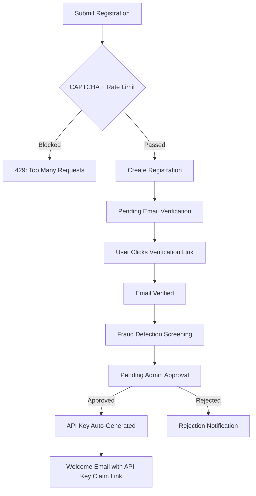

# Registration & Onboarding

Hokusai uses an application-based registration system. New users submit a registration request, verify their email, and receive API access after admin approval.

## Registration Flow



### Status Lifecycle

| Status | Description |
|--------|-------------|
| `pending_email_verification` | Registration submitted, awaiting email confirmation |
| `email_verified` | Email confirmed, awaiting fraud screening |
| `pending_approval` | Passed screening, awaiting admin review |
| `approved` | Approved — API key generated and welcome email sent |
| `rejected` | Rejected by admin (can re-apply) |

## Submit a Registration

**`POST /register`**

Submit a new registration request. The endpoint is public — no authentication required.

### Request Body

| Field | Type | Required | Description |
|-------|------|----------|-------------|
| `organization_name` | string | Yes | Your organization or project name |
| `contact_email` | string | Yes | Email address for verification and communication |
| `contact_name` | string | Yes | Your full name |
| `website_url` | string | No | Organization website |
| `use_case` | string | Yes | Description of your intended use of the platform |
| `captcha_token` | string | Conditional | reCAPTCHA token (required when CAPTCHA is enabled) |

### Example

```bash
curl -X POST https://auth.hokus.ai/register \
  -H "Content-Type: application/json" \
  -d '{
    "organization_name": "Acme AI Labs",
    "contact_email": "dev@acme.ai",
    "contact_name": "Jane Smith",
    "website_url": "https://acme.ai",
    "use_case": "Integrating Hokusai predictions into our analytics platform"
  }'
```

```python
import requests

response = requests.post(
    "https://auth.hokus.ai/register",
    json={
        "organization_name": "Acme AI Labs",
        "contact_email": "dev@acme.ai",
        "contact_name": "Jane Smith",
        "website_url": "https://acme.ai",
        "use_case": "Integrating Hokusai predictions into our analytics platform",
    },
)
print(response.json())
```

### Response

```json
{
  "id": "f47ac10b-58cc-4372-a567-0e02b2c3d479",
  "organization_name": "Acme AI Labs",
  "contact_email": "dev@acme.ai",
  "contact_name": "Jane Smith",
  "status": "pending",
  "created_at": "2026-02-12T10:30:00Z"
}
```

:::tip
A web-based registration form is also available at `https://auth.hokus.ai/register` (GET) for browser-based signups.
:::

## Check Registration Status

**`POST /registration/status`**

Check the status of a registration request by email. This is a public endpoint.

```bash
curl -X POST https://auth.hokus.ai/registration/status \
  -H "Content-Type: application/json" \
  -d '{"email": "dev@acme.ai"}'
```

```python
response = requests.post(
    "https://auth.hokus.ai/registration/status",
    json={"email": "dev@acme.ai"},
)
print(response.json()["status"])  # e.g., "pending_approval"
```

:::info
Returns an identical `404` for both not-found and invalid emails to prevent email enumeration.
:::

## Verify Your Email

After submitting a registration, you'll receive a verification email. Click the link to confirm your email address and advance to the approval stage.

**`POST /registration/verify-email`**

```bash
curl -X POST https://auth.hokus.ai/registration/verify-email \
  -H "Content-Type: application/json" \
  -d '{"token": "YOUR_EMAIL_VERIFICATION_TOKEN"}'
```

## What Happens After Approval

When your registration is approved:

1. **API key is auto-generated** — A production API key is created for your account
2. **Welcome email is sent** — Contains a claim link to retrieve your API key
3. **Initial usage credits are applied** — Based on your selected billing plan
4. **Organization profile is created** — You can invite team members and manage access

From there, follow the [Quickstart](/authentication/quickstart) to start making API calls.

## Rate Limiting

Registration submissions are rate limited at three levels:

| Level | Limit | Window |
|-------|-------|--------|
| Per IP address | Configurable | Rolling window |
| Per email domain | Configurable | Rolling window |
| Global | Configurable | Rolling window |

Exceeding the limit returns `429 Too Many Requests` with a `Retry-After` header. Repeated violations result in a temporary IP ban.

You can check your current rate limit status before submitting:

```bash
curl "https://auth.hokus.ai/register/rate-limit-status?email=dev@acme.ai"
```

## Fraud Detection

Registrations are automatically screened against several rules:

- **Disposable email detection** — Blocks temporary/throwaway email providers
- **IP velocity checks** — Flags rapid registrations from the same IP
- **Domain velocity checks** — Flags many registrations from the same email domain
- **Suspicious organization names** — Flags known patterns of abuse
- **Email pattern analysis** — Detects auto-generated email addresses

Flagged registrations are held for manual admin review. Legitimate registrations that are false-flagged will still be processed by an admin.

## Next Steps

- **[Quickstart](/authentication/quickstart)** — Use your API key after approval
- **[API Keys](/authentication/api-keys)** — Manage your keys and create organization-scoped keys
- **[Security](/authentication/security)** — Understand the security protections in place
