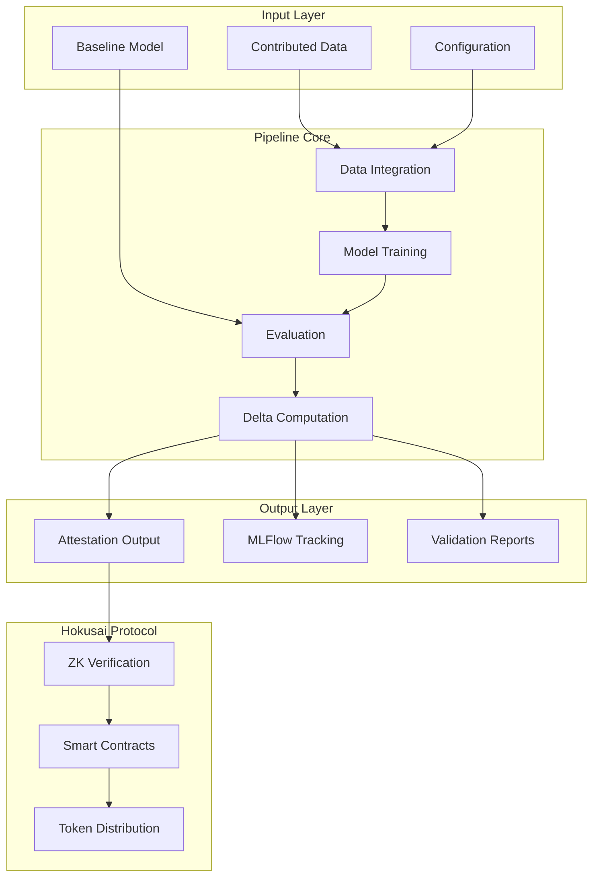
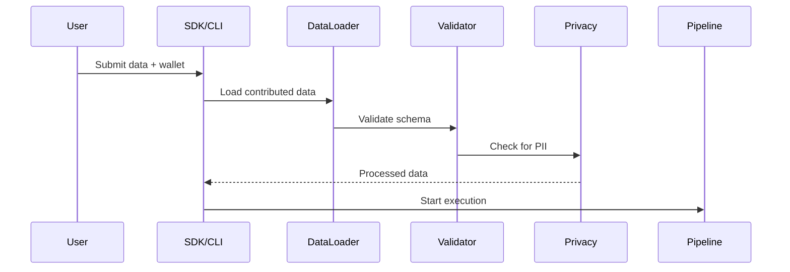
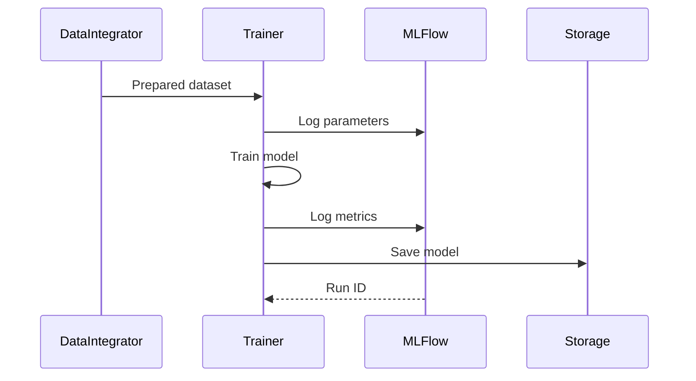
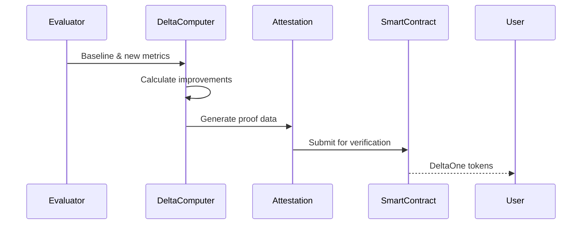
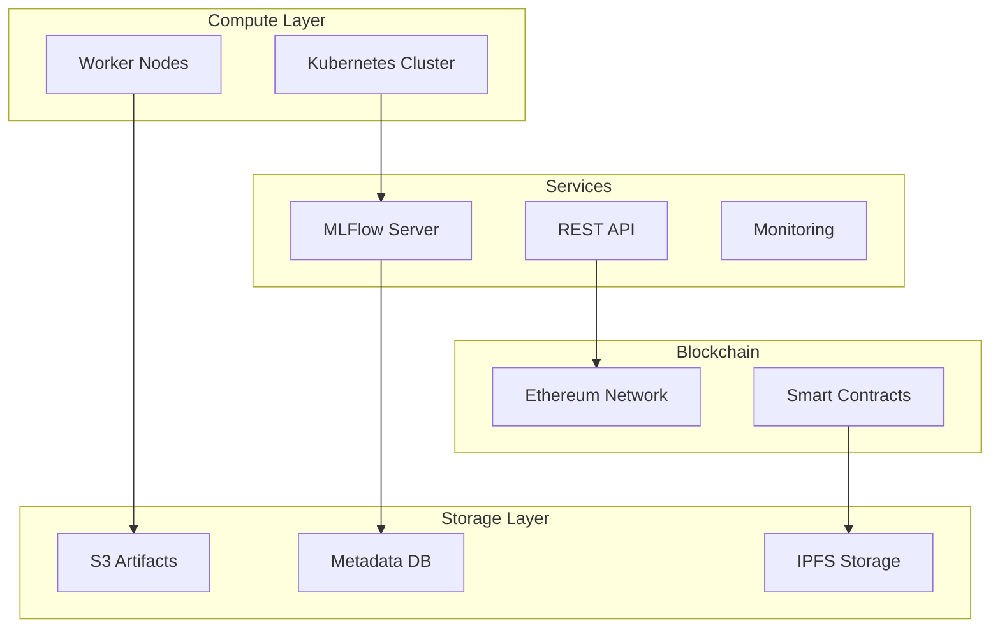

# System Architecture

## Overview

The Hokusai data pipeline is a modular, scalable system designed to evaluate machine learning model improvements using contributed data. It produces attestation-ready outputs suitable for zero-knowledge proof generation and integrates with the broader Hokusai protocol for reward distribution.

## High-Level Architecture



## Core Components

### 1. Data Integration Module

**Purpose**: Handles all aspects of contributed data processing

**Key Features**:
- Multi-format support (CSV, JSON, Parquet)
- Automatic schema validation
- PII detection and hashing
- Data quality scoring
- Deduplication strategies

**Integration Points**:
- Receives data from SDK or direct upload
- Validates against model-specific schemas
- Outputs cleaned data for training

### 2. Model Training Module

**Purpose**: Trains new models with integrated data

**Key Features**:
- Configurable training algorithms
- Hyperparameter optimization
- Distributed training support
- Model versioning
- Checkpoint management

**Supported Models**:
- Classification models
- Information retrieval models
- Custom model implementations

### 3. Evaluation Module

**Purpose**: Compares model performance to calculate improvements

**Key Features**:
- Multiple metric support (accuracy, F1, AUROC)
- Stratified evaluation
- Statistical significance testing
- Benchmark dataset management

**Delta Calculation**:
- Baseline performance measurement
- New model performance measurement
- Delta computation (1 DeltaOne = 1% improvement)

### 4. Pipeline Orchestrator

**Purpose**: Coordinates all pipeline steps using Metaflow

**Key Features**:
- Step dependency management
- Parallel execution
- Failure recovery
- Resource allocation
- Progress tracking

## Data Flow

### 1. Input Processing



### 2. Model Training Flow



### 3. Evaluation and Reward Calculation



## Technology Stack

### Core Technologies

| Component | Technology | Purpose |
|-----------|------------|---------|
| Language | Python 3.8+ | Primary implementation |
| Orchestration | Metaflow | Pipeline management |
| Tracking | MLFlow | Experiment tracking |
| Data Processing | Pandas | Data manipulation |
| ML Framework | Scikit-learn | Model training |
| Testing | Pytest | Unit/integration tests |

### Supporting Libraries

| Library | Purpose |
|---------|---------|
| NumPy | Numerical operations |
| Pydantic | Data validation |
| Click | CLI interface |
| python-dotenv | Environment management |
| Web3.py | Ethereum integration |

## Design Principles

### 1. Modularity

Each component is self-contained with clear interfaces:

```python
class DataIntegrator:
    def load_data(self, path: Path) -> pd.DataFrame
    def validate_schema(self, data: pd.DataFrame) -> bool
    def integrate_datasets(self, base: pd.DataFrame, new: pd.DataFrame) -> pd.DataFrame
```

### 2. Reproducibility

- Fixed random seeds throughout
- Deterministic data processing
- Version-locked dependencies
- Immutable configuration

### 3. Scalability

- Lazy data loading
- Batch processing capabilities
- Parallel execution where possible
- Configurable resource limits

### 4. Transparency

- Comprehensive logging
- Metric tracking
- Performance profiling
- Clear audit trails

## Security Considerations

### Data Privacy

1. **PII Protection**
   - Automatic detection of sensitive fields
   - One-way hashing for identifiers
   - No plaintext storage of personal data
   - Compliance with privacy regulations

2. **Access Control**
   - API key management
   - Wallet-based authentication
   - Secure configuration handling
   - Role-based permissions

### Attestation Security

1. **Data Integrity**
   - SHA-256 hashing of all inputs
   - Merkle tree construction
   - Tamper-evident outputs
   - Cryptographic signatures

2. **Proof Generation**
   - Deterministic computation
   - Verifiable results
   - Circuit-compatible formatting
   - Zero-knowledge proof readiness

## Performance Architecture

### Optimization Strategies

1. **Memory Efficiency**
   - Streaming data processing
   - Garbage collection tuning
   - Memory-mapped files for large datasets

2. **Compute Optimization**
   - Vectorized operations
   - GPU acceleration support
   - Distributed processing capabilities

3. **I/O Optimization**
   - Async file operations
   - Compression for storage
   - Caching frequently accessed data

### Performance Benchmarks

| Operation | Small (1K) | Medium (100K) | Large (1M) |
|-----------|------------|---------------|------------|
| Data Load | < 1s | < 10s | < 60s |
| Training | < 5s | < 5m | < 30m |
| Evaluation | < 2s | < 30s | < 3m |
| Full Pipeline | < 10s | < 10m | < 45m |

## Integration with Hokusai Protocol

### Smart Contract Integration

The pipeline outputs are designed to integrate seamlessly with Hokusai smart contracts:

1. **Attestation Format**: JSON outputs compatible with on-chain verification
2. **Wallet Integration**: Direct mapping to contributor wallets
3. **Delta Verification**: Cryptographic proofs of improvement
4. **Token Distribution**: Automatic reward calculation

### SDK Integration

The Hokusai SDK provides high-level interfaces:

```python
# SDK abstracts pipeline complexity
client = HokusaiClient(api_key, wallet_address)
result = client.submit_data(model_id, data_path)
rewards = client.get_rewards()
```

## Extension Points

### Custom Model Integration

```python
from src.modules.base import BaseModel

class CustomModel(BaseModel):
    def train(self, data: pd.DataFrame) -> None:
        # Implementation
        
    def predict(self, data: pd.DataFrame) -> np.ndarray:
        # Implementation
```

### Custom Metrics

```python
from src.modules.evaluation import register_metric

@register_metric("custom_score")
def custom_metric(y_true, y_pred):
    # Implementation
    return score
```

### Pipeline Hooks

```python
from src.pipeline import register_hook

@register_hook("pre_training")
def custom_preprocessing(data):
    # Modify data before training
    return processed_data
```

## Deployment Options

### Local Development

```
hokusai-pipeline/
├── venv/              # Virtual environment
├── mlruns/            # MLFlow tracking
├── outputs/           # Pipeline outputs
└── data/              # Local data storage
```

### Cloud Deployment



## Monitoring and Observability

### Key Metrics

- Pipeline execution time
- Data quality scores
- Model improvement deltas
- Resource utilization
- Error rates

### Logging Strategy

- Structured logging with context
- Distributed tracing
- Error aggregation
- Performance profiling

## Next Steps

- [Getting Started](../getting-started.md) - Set up your environment
- [Supplying Data](supplying-data.md) - Contribute data guide
- [Configuration](../configuration.md) - Detailed configuration options
- [API Reference](../api-reference.md) - Technical API documentation