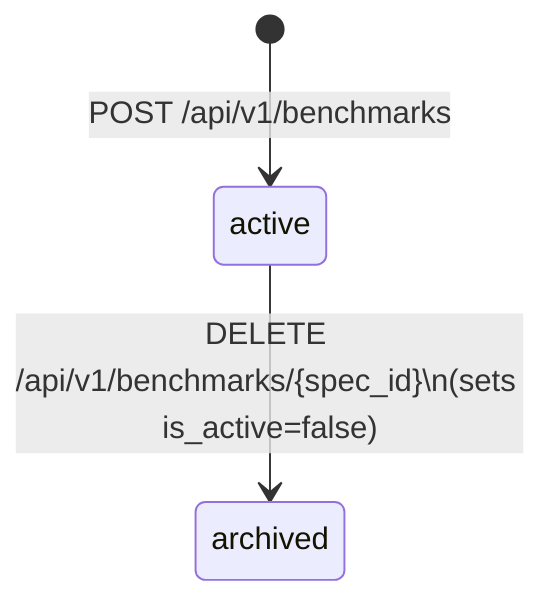

# Benchmark Specs

## Overview

A `BenchmarkSpec` is a top-level entity — not a sub-resource of any model — that defines how a model is evaluated. It owns the `eval_spec` JSONB payload, which specifies the primary metric, secondary metrics, guardrails, and the measurement, label, and coverage policies that govern evaluation.

Because `BenchmarkSpec` is independent of any individual model, a single spec can be referenced by multiple registered model versions. Every time `hokusai model register` is called with `--benchmark-spec-id`, the CLI records the spec's UUID as an MLflow tag (`benchmark_spec_id`) on both the run and the registered model version, making evaluation provenance queryable across the registry.

`BenchmarkSpec` became a first-class entity in migration `014` (`ef93d3f`), which added the `eval_spec` JSONB column to the benchmark spec table and introduced the full CRUD API under `/api/v1/benchmarks`.

## Lifecycle



Specs are created as active and soft-deleted (archived) by setting `is_active=false`. The CLI rejects inactive specs — you must create a new spec or restore an archived one before registering a model against it.

### REST CRUD

All endpoints require a bearer token (`Authorization: Bearer $HOKUSAI_API_KEY`).

**Create a spec**

```bash
curl -X POST https://api.hokus.ai/api/v1/benchmarks \
  -H "Authorization: Bearer $HOKUSAI_API_KEY" \
  -H "Content-Type: application/json" \
  -d '{
    "name": "chest-xray-auroc-v1",
    "description": "AUROC-based benchmark for chest X-ray diagnostic model",
    "eval_spec": {
      "primary_metric": {
        "name": "auroc",
        "direction": "higher_is_better",
        "threshold": 0.85,
        "unit": "score"
      },
      "secondary_metrics": [
        { "name": "f1", "direction": "higher_is_better" },
        { "name": "precision", "direction": "higher_is_better" }
      ],
      "guardrails": [
        {
          "name": "false_positive_rate",
          "direction": "lower_is_better",
          "threshold": 0.05,
          "blocking": true
        }
      ],
      "measurement_policy": { "ci_method": "bootstrap", "ci_alpha": 0.05 },
      "label_policy": { "labeler": "human", "min_annotators": 2 },
      "coverage_policy": { "min_examples_per_class": 50 }
    }
  }'
```

The response includes the spec's UUID, e.g. `"id": "bs-abc123..."`.

**List specs**

```bash
curl "https://api.hokus.ai/api/v1/benchmarks?page=1&page_size=20" \
  -H "Authorization: Bearer $HOKUSAI_API_KEY"
```

**Fetch a single spec**

```bash
curl "https://api.hokus.ai/api/v1/benchmarks/<spec_id>" \
  -H "Authorization: Bearer $HOKUSAI_API_KEY"
```

**Update a spec**

```bash
curl -X PUT "https://api.hokus.ai/api/v1/benchmarks/<spec_id>" \
  -H "Authorization: Bearer $HOKUSAI_API_KEY" \
  -H "Content-Type: application/json" \
  -d '{ "description": "Updated description" }'
```

`BenchmarkSpecUpdate` applies partial updates — only the fields you include are changed.

**Soft-delete (archive) a spec**

```bash
curl -X DELETE "https://api.hokus.ai/api/v1/benchmarks/<spec_id>" \
  -H "Authorization: Bearer $HOKUSAI_API_KEY"
```

This sets `is_active=false` and does not remove the spec from the database.

### Web UI

The Hokusai web UI at [hokus.ai/create-model](https://hokus.ai/create-model) prefills a new `BenchmarkSpec` from the metric and ticker you configure during model creation (Step 3: Performance Metrics). You can use the generated spec ID directly with `--benchmark-spec-id` without running any curl commands.

## `eval_spec` Schema

`eval_spec` is a JSONB payload stored on the `BenchmarkSpec` row. The six headline fields are:

| Field | Type | Required | Description |
| --- | --- | --- | --- |
| `primary_metric` | `MetricSpec` | **yes** | The single metric DeltaOne is computed against. |
| `secondary_metrics` | `list[MetricSpec]` | no (default `[]`) | Additional metrics measured but not used for DeltaOne scoring. |
| `guardrails` | `list[GuardrailSpec]` | no (default `[]`) | Hard constraints that block promotion if breached. |
| `measurement_policy` | `dict \| null` | no | Free-form measurement configuration (e.g. confidence-interval method, bootstrap samples). |
| `label_policy` | `dict \| null` | no | Free-form labeling rules (e.g. annotator agreement, label mapping). |
| `coverage_policy` | `dict \| null` | no | Free-form coverage or sub-population requirements (e.g. minimum examples per class). |

### `MetricSpec` shape

Used by `primary_metric` and each entry in `secondary_metrics`.

| Field | Type | Required | Description |
| --- | --- | --- | --- |
| `name` | `string` | **yes** | Metric identifier (e.g. `auroc`, `f1`). |
| `direction` | `higher_is_better` \| `lower_is_better` | **yes** | Whether larger values indicate improvement. |
| `threshold` | `float \| null` | no | Minimum acceptable value for promotion. |
| `unit` | `string \| null` | no | Human-readable unit (e.g. `score`, `ms`). |
| `mlflow_name` | `string \| null` | no | Override for the MLflow metric key if it differs from `name`. |
| `scorer_ref` | `string \| null` | no | Reference to a scorer plugin registered in the evaluation pipeline. |

### `GuardrailSpec` shape

Each entry in `guardrails` must include a `threshold`.

| Field | Type | Required | Description |
| --- | --- | --- | --- |
| `name` | `string` | **yes** | Guardrail identifier (e.g. `false_positive_rate`). |
| `direction` | `higher_is_better` \| `lower_is_better` | **yes** | Violation direction. |
| `threshold` | `float` | **yes** | The hard limit. Breaching it blocks promotion when `blocking=true`. |
| `blocking` | `bool` | no (default `true`) | If `true`, a breach prevents model promotion. |
| `mlflow_name` | `string \| null` | no | Override for the MLflow metric key. |
| `scorer_ref` | `string \| null` | no | Reference to a scorer plugin. |

### Auxiliary fields

Three additional fields are available on `EvalSpec` for advanced use cases:

- **`unit_of_analysis`** (`string | null`) — The "row" the metric is computed over (e.g. `transaction`, `patient`).
- **`min_examples`** (`int | null`, ≥ 1) — Minimum eligible evaluation rows before the run counts.
- **`metric_family`** (enum, default `proportion`) — DeltaOne comparator dispatch. Values: `proportion`, `continuous`, `zero_inflated_continuous`, `rank_or_ordinal`.

Most use cases are covered by the six headline fields above. The auxiliary fields are useful when your metric distribution requires a non-default statistical family or when you need to enforce a minimum sample size.

## Worked Example

A complete `eval_spec` payload for an AUROC-based diagnostic benchmark:

```json
{
  "primary_metric": {
    "name": "auroc",
    "direction": "higher_is_better",
    "threshold": 0.85,
    "unit": "score"
  },
  "secondary_metrics": [
    { "name": "f1", "direction": "higher_is_better" },
    { "name": "precision", "direction": "higher_is_better" }
  ],
  "guardrails": [
    {
      "name": "false_positive_rate",
      "direction": "lower_is_better",
      "threshold": 0.05,
      "blocking": true
    }
  ],
  "measurement_policy": {
    "ci_method": "bootstrap",
    "ci_alpha": 0.05,
    "n_bootstrap": 1000
  },
  "label_policy": {
    "labeler": "human",
    "min_annotators": 2,
    "agreement_threshold": 0.8
  },
  "coverage_policy": {
    "min_examples_per_class": 50,
    "stratify_by": "patient_age_band"
  }
}
```

## Registering a Model Against a Spec

Once you have a spec ID, pass it to `hokusai model register` with `--benchmark-spec-id`:

```bash
hokusai model register \
  --token-id TICKER \
  --benchmark-spec-id <spec_id> \
  --model-path ./models/final_model.pkl
```

| Flag | Description |
| --- | --- |
| `--token-id` | The token ticker for your model (e.g. `CHEST`). |
| `--benchmark-spec-id` | The UUID of the `BenchmarkSpec` to evaluate against. Spec IDs look like `bs-abc123`. |
| `--model-path` | Local path to the serialized model artifact. |

The CLI:
1. Fetches the spec via `HOKUSAI_API_KEY` and prints a `Resolved benchmark spec …` confirmation line.
2. Derives `metric` and `baseline` from `eval_spec.primary_metric` automatically.
3. Uploads the model artifact to MLflow.
4. Tags both the MLflow run and the registered model version with `benchmark_spec_id` for provenance.
5. Validates that the model meets the spec's `primary_metric.threshold` before marking the version **REGISTERED**.

If you need to override the auto-derived values, `--metric` and `--baseline` may still be supplied explicitly; the CLI will emit a warning and use your overrides. When `--benchmark-spec-id` is omitted entirely, `--metric` and `--baseline` are required (legacy mode).

:::note Legacy scalar fields are auto-uplifted at runtime
Specs created before migration `014` use scalar columns (`metric_name`, `metric_direction`, `baseline_value`) instead of `eval_spec`. The runtime translation module `spec_translation.py` (in `hokusai-data-pipeline`) synthesizes an equivalent `eval_spec` automatically when one is absent, so existing specs continue to work without any user action. New specs should populate `eval_spec` directly.
:::

## Related Reading

- [Model Lifecycle](./model-lifecycle) — how a model moves from DRAFT through REGISTERED to DEPLOYED.
- [Creating Models](../creating-models) — programmatic model creation and the on-chain token deployment flow.
- [Model Launch Guide](../guides/model-launch-guide) — end-to-end walkthrough including token configuration.
- [API Reference](../api-reference) — full endpoint documentation.
