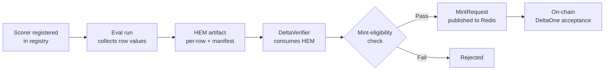

# Custom Scorers & Sales Outcome Metrics

Hokusai's evaluation system is built on a **deterministic scorer registry** — a single extension point where custom scorers are declared, hashed, and resolved by the eval runner and by DeltaVerifier. The registry underpins all four canonical sales outcome metrics, which are the primary tool for verifying and rewarding live go-to-market model improvements.

This page covers:
- How the scorer registry works and why it is the supported extension point
- The `mean_per_n` aggregator family, including the three built-in scaled aggregators
- The four sales outcome metrics (`sales:qualified_meeting_rate`, `sales:revenue_per_1000_messages`, `sales:spam_complaint_rate`, `sales:unsubscribe_rate`)
- Measurement policies and their mint-eligibility gates
- Label, denominator, and coverage edge cases

Mint-eligibility for DeltaOne rewards depends on the measurement policy declared in the `eval_spec`. See [§ Measurement policies and mint-eligibility](#measurement-policies-and-mint-eligibility) for the full policy table.

---

## The deterministic scorer registry

The scorer registry (`src/evaluation/scorers/registry.py` in `hokusai-data-pipeline`) is the canonical place to declare evaluation scorers. All scorers used in HEM artifacts and DeltaVerifier submissions must be registered.

### What a registered scorer is

A scorer entry binds a string **`scorer_ref`** to:
- A frozen `ScorerMetadata` dataclass (identity fields below)
- A callable that receives a list of row-level values and returns a scalar

`ScorerMetadata` fields:

| Field | Type | Notes |
|---|---|---|
| `scorer_ref` | `str` | Unique identifier, e.g. `sales:revenue_per_1000_messages` |
| `version` | `str` | Semver string |
| `input_schema` | `dict` | JSON Schema for the row-level input |
| `output_metric_keys` | `list[str]` | Keys the callable produces |
| `metric_family` | `str` | e.g. `proportion`, `zero_inflated_continuous` |
| `aggregation` | `Aggregation` | Enum value, e.g. `MEAN`, `MEAN_PER_N` |
| `source_hash` | `str` | SHA-256 identity hash (computed at registration) |
| `description` | `str` | Human description — excluded from identity hash |

### Source hash and determinism

`compute_source_hash()` produces a SHA-256 over the JSON-canonicalized identity fields (`scorer_ref`, `version`, `input_schema`, `output_metric_keys`, `metric_family`, `aggregation`) plus `inspect.getsource(callable_)`. The `description` field is intentionally excluded so that cosmetic edits do not change scorer identity and invalidate existing HEM artifacts.

This means that any meaningful change to a scorer — its logic, its input schema, or its aggregation method — produces a new hash and is treated as a different scorer version.

### Registration API

| Function | Behaviour |
|---|---|
| `register_scorer(ref, metadata, callable_)` | Idempotent if metadata is identical; raises `ScorerConflictError` if metadata diverges for the same `scorer_ref` |
| `resolve_scorer(ref)` | Returns `(ScorerMetadata, callable_)` or raises `UnknownScorerError` |
| `list_scorers()` | Returns all registered entries |
| `clear_scorers()` | Test utility; not for production use |

### MLflow-safe key derivation

MLflow metric keys cannot contain colons. At registration time, the registry validates that `derive_mlflow_name(key)` passes `validate_mlflow_metric_key()`. Colons are replaced with underscores:

```
sales:revenue_per_1000_messages  →  sales_revenue_per_1000_messages
```

The colon form is always the canonical `scorer_ref` used in `eval_spec` files and HEM artifacts. The underscore form is the MLflow storage key only.

### Why the registry is the supported extension point

- **Deterministic:** source hash pins the exact callable to a version identifier, so DeltaVerifier can reproduce results independently of the deployment environment.
- **Hashed:** any silent change to a scorer's logic changes its hash, making tampering detectable.
- **Eval-runner-resolvable:** the eval runner and DeltaVerifier both call `resolve_scorer(ref)` from the same registry; there is no separate dispatch mechanism to keep in sync.
- **HEM-compatible:** HEM artifacts embed `scorer_ref` and `source_hash`; on-chain verification reconstructs the hash from the registered callable before accepting a `MintRequest`.

---

## Built-in aggregators and the `mean_per_n` family

The following scorer refs are registered at import time in `src/evaluation/scorers/builtin.py`:

| Scorer ref | Aggregation | Formula |
|---|---|---|
| `mean` | `MEAN` | `sum(values) / len(values)` |
| `sum` | `SUM` | `sum(values)` |
| `pass_rate` | `MEAN` | Fraction of values ≥ 1 |
| `min` | `MIN` | `min(values)` |
| `max` | `MAX` | `max(values)` |
| `mean_per_hundred` | `MEAN_PER_N` | `mean(values) × 100` |
| `mean_per_thousand` | `MEAN_PER_N` | `mean(values) × 1000` |
| `mean_per_ten_thousand` | `MEAN_PER_N` | `mean(values) × 10000` |

### `mean_per_n` formula

```
mean_per_n(values, n) = (sum(values) / len(values)) × n   [non-empty values]
mean_per_n(values, n) = 0.0                                [empty values]
```

### Why named wrappers exist

Each of `mean_per_hundred`, `mean_per_thousand`, and `mean_per_ten_thousand` is a separate named function rather than a parameterized lambda. This is intentional: `inspect.getsource()` over a lambda would capture the same source string regardless of the scaling constant, making all three produce the same source hash. Named wrappers give each a distinct source text and therefore a distinct, stable hash.

`sales:revenue_per_1000_messages` uses `mean_per_thousand` as its aggregation because revenue is naturally expressed as USD per 1 000 delivered messages.

---

## End-to-end flow



Row-level outputs are accumulated during the eval run and written into a HEM (Hokusai Evaluation Manifest) artifact that includes the `scorer_ref`, `source_hash`, and per-row input/output pairs. DeltaVerifier fetches this artifact, re-resolves the scorer by `scorer_ref`, recomputes the source hash, and checks it against the stored hash before accepting the aggregate result. Only submissions from mint-eligible measurement policies proceed to the `MintRequest` stage.

---

## The four sales outcome metrics

The contracts below are implemented in `src/evaluation/sales_metrics.py`.

### Summary table

| Scorer ref | MLflow key | Direction | Metric family | Aggregation | Unit of analysis | Unit |
|---|---|---|---|---|---|---|
| `sales:qualified_meeting_rate` | `sales_qualified_meeting_rate` | `higher_is_better` | `proportion` | `MEAN` | `prospect_conversation` | `proportion` |
| `sales:revenue_per_1000_messages` | `sales_revenue_per_1000_messages` | `higher_is_better` | `zero_inflated_continuous` | `MEAN_PER_N` | `prospect_message` | `usd_per_1000_messages` |
| `sales:spam_complaint_rate` | `sales_spam_complaint_rate` | `lower_is_better` | `proportion` | `MEAN` | `prospect_message` | `proportion` |
| `sales:unsubscribe_rate` | `sales_unsubscribe_rate` | `lower_is_better` | `proportion` | `MEAN` | `prospect_message` | `proportion` |

---

### `sales:qualified_meeting_rate`

**What it measures:** the fraction of prospect conversations that result in a qualified meeting being booked.

**Unit of analysis:** `prospect_conversation` — each row is one conversation thread.

**Label policy:**
- Positive label: conversation resulted in a qualified meeting (`label = 1`).
- Negative label: conversation ended without a qualified meeting (`label = 0`).
- Missing label: row is excluded from both numerator and denominator. Do **not** treat a missing label as a negative outcome.

**Denominator policy:** count of conversations with a non-missing label.

**Threshold semantics:** passes when `observed_rate ≥ threshold` AND improves over baseline (proportion comparator). Threshold is a fraction in `[0, 1]`.

**Mint role:** typically the primary metric. A model with a higher qualified-meeting rate than baseline earns DeltaOnes proportional to the improvement, provided the measurement policy is mint-eligible.

---

### `sales:revenue_per_1000_messages`

**What it measures:** gross USD revenue generated per 1 000 delivered prospect messages.

**Revenue formula:**

```
revenue_per_1000_messages = sum(revenue_amount_cents) / 100 / sum(delivered_count) × 1000
```

Units are USD unless `revenue_currency` is overridden in the `eval_spec`.

**Unit of analysis:** `prospect_message` — each row is one delivered message.

**Label policy:**
- `revenue_amount_cents` present and `label_status = 'observed'` with a closed outcome window: value is included.
- `label_status = 'delayed'` or outcome window still open: mark as delayed, exclude from mint-eligible aggregation.
- `revenue_amount_cents` absent: contribute `0.0` cents **only** when `label_status = 'observed'` and the outcome window has closed; otherwise exclude.

**Denominator policy:** `sum(delivered_count)` over rows with a resolved label status.

**Threshold semantics:** passes when `observed_usd_per_1000 ≥ threshold` AND improves over baseline (zero-inflated-continuous comparator). Threshold is in USD.

**Mint role:** primary metric for revenue-optimizing models. The zero-inflated-continuous comparator handles the large fraction of messages that generate zero revenue without distorting the significance test.

---

### `sales:spam_complaint_rate`

**What it measures:** the fraction of delivered messages that generated a spam complaint.

**Unit of analysis:** `prospect_message` — each row is one delivered message.

**Label policy:**
- Positive label: message received a spam complaint (`label = 1`).
- Negative label: no complaint (`label = 0`).
- Missing label: row is excluded from numerator and denominator.

**Denominator policy:** count of messages with a non-missing complaint label.

**Threshold semantics:** blocking guardrail. Passes when `observed_rate ≤ threshold`. Threshold is a fraction in `[0, 1]`. A typical fixture default is `0.005` (0.5%).

**Mint role:** blocking guardrail. If the spam complaint rate exceeds the threshold, the entire eval submission is rejected regardless of primary-metric performance. No DeltaOne mint occurs.

---

### `sales:unsubscribe_rate`

**What it measures:** the fraction of prospect message recipients who unsubscribed.

**Unit of analysis:** `prospect_message` — each row is one delivered message.

**Label policy:**
- Positive label: recipient unsubscribed (`label = 1`).
- Negative label: no unsubscribe (`label = 0`).
- Missing label: row is excluded from numerator and denominator.

**Denominator policy:** count of messages with a non-missing unsubscribe label.

**Threshold semantics:** blocking guardrail. Passes when `observed_rate ≤ threshold`. Threshold is a fraction in `[0, 1]`. A typical fixture default is `0.03` (3%).

**Mint role:** blocking guardrail. Works identically to `sales:spam_complaint_rate` — a breach blocks the entire submission from minting.

---

## Measurement policies and mint-eligibility

Every `eval_spec` must declare a `measurement_policy` object with a `type` and `mint_eligible` boolean. DeltaOne refuses to publish a `MintRequest` for any submission where `measurement_policy.mint_eligible` is `false`.

| Policy type | Mint eligible | How outcome is attributed |
|---|---|---|
| `online_ab` | Yes | Prospective randomized live split; treatment vs. control assignment is logged at message delivery time |
| `reward_model` | Yes (requires a validated, calibrated reward model) | A registered reward model generates a score; model must be calibrated against held-out revenue data |
| `off_policy` | Yes (when overlap and propensity guardrails pass) | Logged propensities → importance-weighted estimate; guardrails enforce minimum overlap and maximum propensity ratio |
| `exact_observed_output` | Yes (byte-identical SHA-256 join only) | Generated output matches a logged sent message byte-for-byte; revenue outcome is the historical result attributed to that message |
| `diagnostic_only` | **Never** | No causal or exact-correspondence path; useful for offline exploratory analysis only |

> **`diagnostic_only` is never mint-eligible.** It has no causal attribution and cannot establish that the model being evaluated was responsible for the observed outcome. Submitting a `diagnostic_only` eval to the mint pipeline will be rejected at the DeltaOne stage.

### Why historical revenue cannot score arbitrary generated messages

For a message to carry mint-eligible revenue attribution, the protocol must be able to establish that the message being evaluated is the same message that was delivered and that generated the observed revenue. The `exact_observed_output` policy enforces this with a byte-identical SHA-256 join between the generated output hash and the logged sent message hash. Policies that use causal inference (`online_ab`, `off_policy`) establish attribution through randomization or propensity weighting rather than identity. Policies without either mechanism (`diagnostic_only`) cannot be mint-eligible.

---

## Label and denominator edge cases

These rules apply across all four sales metrics unless the metric-specific section above states otherwise.

| Condition | Effect |
|---|---|
| Zero messages delivered (`delivered_count = 0`) | Metric returns `0.0`. Row is not mint-sufficient. |
| Missing label (`label = null` or absent) | Row excluded from both numerator and denominator. Never treated as a negative label. |
| Delayed label (`label_status = 'delayed'`) | Mark as delayed; exclude from mint-eligible aggregation. May be included in `diagnostic_only` runs. |
| Partial coverage (`coverage_fraction < 1.0`) | Rows must carry a `coverage_fraction` value. Mint-eligible policies require the `eval_spec` `coverage_policy` guardrail to pass. |

---

## Example: declaring a sales eval spec

The fixture below is from `schema/examples/sales_eval_spec.online_ab.v1.json` in `hokusai-data-pipeline`. The numeric thresholds (`10.0`, `0.03`, `0.005`) and the `min_*` values are **fixture-level defaults**, not protocol-level constants. Production `eval_spec` files should set thresholds appropriate to their model and business context.

```json
{
  "primary_metric": {
    "name": "sales:revenue_per_1000_messages",
    "scorer_ref": "sales:revenue_per_1000_messages",
    "direction": "higher_is_better",
    "unit": "usd_per_1000_messages",
    "threshold": 10.0
  },
  "guardrails": [
    {
      "name": "sales:unsubscribe_rate",
      "scorer_ref": "sales:unsubscribe_rate",
      "direction": "lower_is_better",
      "threshold": 0.03,
      "blocking": true
    },
    {
      "name": "sales:spam_complaint_rate",
      "scorer_ref": "sales:spam_complaint_rate",
      "direction": "lower_is_better",
      "threshold": 0.005,
      "blocking": true
    }
  ],
  "measurement_policy": {
    "type": "online_ab",
    "mint_eligible": true,
    "outcome_window_days": 14,
    "min_treatment_size": 500,
    "min_control_size": 500
  },
  "unit_of_analysis": "prospect_message",
  "min_examples": 1000,
  "metric_family": "zero_inflated_continuous"
}
```

Source of truth for the contract shape and fixture values: `src/evaluation/sales_metrics.py` and `schema/examples/sales_eval_spec.online_ab.v1.json` in `hokusai-data-pipeline`.

---

## Related reading

- [Model Lifecycle](./model-lifecycle) — the four model states and the graduation transition
- [Reward Mechanisms](../tokenomics/rewards) — DeltaOne verification and acceptance flow
- [DeltaOne Calculations](../tokenomics/deltaone-calculations) — how improvement bps maps to token rewards
- [Verifier and Contribution](../smart-contracts/verifier-and-contribution) — on-chain DeltaVerifier contract
