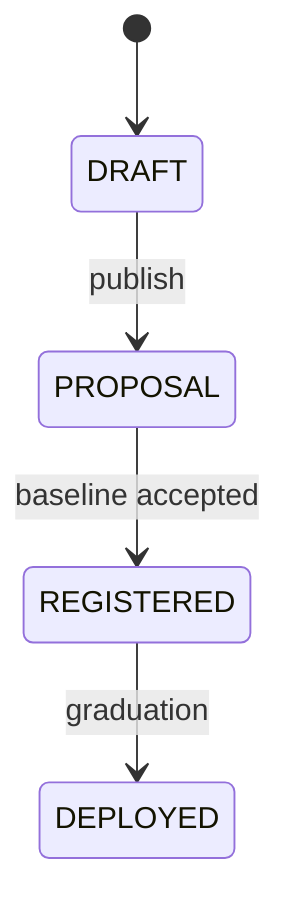

# Model Lifecycle

Every model on Hokusai moves through four explicit states: **DRAFT**, **PROPOSAL**, **REGISTERED**, and **DEPLOYED**. Those states define what is public, which contracts are active, and what each persona can do next. This page is the canonical reference for that lifecycle.

## Lifecycle at a glance

## Where each state lives

| State | Storage | Token contract | AMM pool | Trading |
| --- | --- | --- | --- | --- |
| DRAFT | Off-chain database | None | None | — |
| PROPOSAL | Off-chain database | Deployed | None | — |
| REGISTERED | On-chain via `ModelRegistry` | Deployed | None | — |
| DEPLOYED | On-chain via `ModelRegistry` | Deployed | Live | Buy immediately, sell after Day 7 |

The important distinction is that **DRAFT** and **PROPOSAL** are primarily off-chain product states, while **REGISTERED** and **DEPLOYED** are anchored on-chain through `ModelRegistry`. The AMM pool only exists after deployment.

## DRAFT

In **DRAFT**, your model exists as an unpublished work in progress. You can still revise its metadata, [benchmark spec](./benchmark-specs), licensing choices, and launch parameters before anyone else interacts with it.

This is the most private stage in the lifecycle. Other users do not treat the model as available for investment, contribution, or trading yet.

**Transition out:** publish the model to move into **PROPOSAL**.

| Persona | What you can do in DRAFT |
| --- | --- |
| Data Supplier | — The model is not open for contributions yet. |
| Model Developer | Create the model, edit metadata, define the benchmark, and prepare the baseline. |
| Investor | — There is no public proposal, no `FundingVault` commitment flow, and no token trading. |

## PROPOSAL

In **PROPOSAL**, the model becomes a public community proposal. This is the stage where attention, due diligence, and early capital formation begin. The token contract may already exist, but the AMM pool is still gated, so there is no open-market trading yet.

Investors can pre-commit USDC through `FundingVault` while the proposal is active. Until graduation is announced, those investors can also withdraw their commitments. This makes **PROPOSAL** the key coordination phase between model developers and early supporters.

If the proposal never graduates before its deadline, the model does not automatically become a live market. The contract guarantee in this stage is limited to the pre-commit flow: investors can withdraw before graduation is announced.

**Transition out:** once the baseline is accepted, the model moves to **REGISTERED**.

| Persona | What you can do in PROPOSAL |
| --- | --- |
| Data Supplier | Review the model and prepare for contribution work, but formal improvement submissions are not yet live. |
| Model Developer | Publish the model, refine the public proposal, and finalize the baseline that will be carried into registration. |
| Investor | Pre-commit USDC through `FundingVault`, evaluate the proposal, and withdraw before graduation is announced if you change your mind. |

See [Investor Guide](../guides/investor-guide) for participation context and [Seven-Day Launch Period](../tokenomics/launch-period) for what changes once the model is deployed.

## REGISTERED

In **REGISTERED**, the model's baseline has been accepted on-chain and recorded through `ModelRegistry`. This is the point where the model stops being only a proposal and becomes an active target for measurable improvement work.

The baseline matters because it fixes the threshold future contributions are judged against. That lock-in prevents the target from shifting underneath contributors and gives the protocol a stable reference point for validating model improvements.

Registration binds the model to a [**BenchmarkSpec**](./benchmark-specs) — the spec's `eval_spec` defines the metric, baseline, and guardrails the on-chain registration is anchored to.

The AMM pool is still not live in this state. Registration is about establishing the model as an accepted, on-chain baseline before launch liquidity is turned on.

**Transition out:** graduation moves the model into **DEPLOYED**.

| Persona | What you can do in REGISTERED |
| --- | --- |
| Data Supplier | Submit improvement work against the accepted baseline and compete to produce measurable gains. |
| Model Developer | Operate the registered model, monitor baseline-based contribution activity, and prepare the model for launch. |
| Investor | Track progress toward deployment, but there is still no live AMM pool to trade against. |

## DEPLOYED

In **DEPLOYED**, the model token is fully live. The AMM pool has been created, the pool is registered on-chain, and trading opens under the launch rules defined for that pool.

Deployment starts the seven-day buy-only window immediately. During that window, buyers can accumulate positions, but sellers remain locked out until Day 7 ends. After that, the model enters normal buy-and-sell trading on the AMM.

Deployment does not end model improvement. Contributors can keep driving verified performance gains, and the token system can continue reflecting those improvements after launch.

**Transition out:** none in the normal lifecycle documented here.

| Persona | What you can do in DEPLOYED |
| --- | --- |
| Data Supplier | Continue submitting improvements that can earn token rewards through the normal contribution flow. |
| Model Developer | Run the live model, manage post-launch operations, and continue improving utility and adoption. |
| Investor | Buy during the launch window, then buy or sell once the Day 7 restriction ends. |

See [HokusaiAMM](../smart-contracts/hokusai-amm), [Seven-Day Launch Period](../tokenomics/launch-period), and [API Fee Flow](../tokenomics/api-fee-flow) for the live-market mechanics after deployment.

## Graduation

Graduation is the transition that turns committed proposal capital into a live AMM pool. It is a two-step process on `FundingVault`, gated by `GRADUATOR_ROLE`.

First, `announceGraduation()` freezes new deposits and withdrawals and snapshots each depositor's commitment. Then `graduate()` uses the snapshotted USDC to create the pool through `HokusaiAMMFactory`, register it in `ModelRegistry`, and seed the market for the model token.

After graduation, depositors claim the tokens they earned from their proportional share of the committed pool capital. Protocol operators trigger this flow through an internal admin tool at `/admin/graduation`; the operational runbook for that tool is maintained separately.

If you are preparing the model side of this flow, start with [Creating Models](../creating-models). For the contract-level system around the transition, see [Smart Contract Overview](../smart-contracts/overview).

## Frequently asked

### Can a PROPOSAL fail?

Yes. A proposal can remain ungraduated and never become a live AMM market.

### What happens to USDC commitments if graduation never happens?

Before graduation is announced, investors can withdraw their committed USDC from `FundingVault`.

## Related reading

- [Creating Models](../creating-models)
- [Benchmark Specs](./benchmark-specs)
- [Model Launch Guide](../guides/model-launch-guide)
- [Investor Guide](../guides/investor-guide)
- [Smart Contract Overview](../smart-contracts/overview)
- [HokusaiAMM](../smart-contracts/hokusai-amm)
- [Seven-Day Launch Period](../tokenomics/launch-period)
- [Custom Scorers & Sales Metrics](./custom-scorers-and-sales-metrics)
