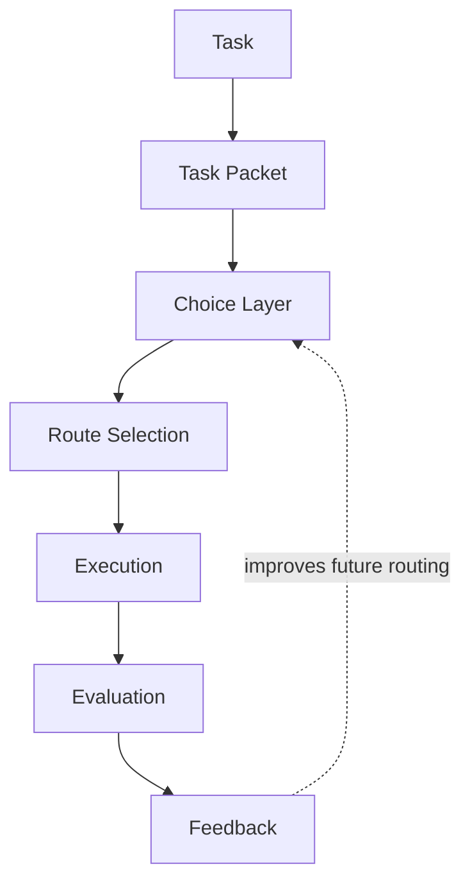
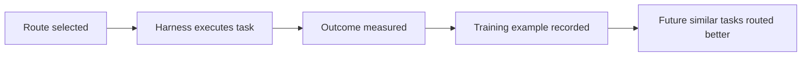

# Inside a Routing Decision

The Hokusai Technical Task Router does not directly solve coding tasks. It selects the models and workflow stages most likely to succeed for a submitted task, using prior outcomes from similar tasks as evidence.

For an integrating harness, the router is a decision service. Wavemill, Claude Code, OpenHands, custom agents, and other harnesses still execute the task, manage tools, construct prompts, and decide how to recover from failures.



## Step 1: Incoming Task

The router starts with a task submitted by an integrating harness. The task can be a plain-text user request, an issue description, a benchmark prompt, a code-review instruction, or a structured task object.

The harness may also provide optional context:

- Repository metadata
- Language and framework hints
- Available tools
- Budget or latency limits
- Candidate model list
- Prior attempt history
- Test or evaluation configuration
- Harness-specific metadata

Common task families include:

- Bug fixes
- Refactors
- Feature work
- Documentation changes
- Code review
- Test repair
- Migrations
- Infrastructure changes

Example incoming task:

```text
Refactor auth middleware to support scoped API keys.

Requirements:
- Keep the current middleware entrypoint stable for integrators.
- Enforce scope checks before request handlers run.
- Preserve existing admin flows while tightening least-privilege defaults.
- Add tests covering missing scope, partial scope, and valid scope paths.
- Document any new assumptions in code comments near the policy boundary.
```

The router treats this as input evidence, not as an execution prompt. The harness can still rewrite, expand, or contextualize the prompt before calling its selected models.

## Step 2: Task Packet Generation

The router normalizes the submitted task into a task packet: a structured representation that can be compared across different repositories, harnesses, and model providers.

A task packet may include fields such as:

| Field | Purpose |
| --- | --- |
| `language` | Dominant programming language or mixed-language profile |
| `domain` | Area of the system, such as backend, frontend, infra, tests, docs, or security |
| `task_type` | Bug fix, refactor, feature, review, documentation, migration, or test work |
| `complexity` | Estimated implementation difficulty and coordination cost |
| `risk` | Expected blast radius, regression risk, or policy/security sensitivity |
| `budget` | Cost, latency, or token limits supplied by the harness |
| `available_models` | Models the harness is willing and able to run |
| `harness_metadata` | Environment-specific details such as tool access, evaluation mode, or retry policy |

Example packet:

```json
{
  "title": "Refactor auth middleware to support scoped API keys",
  "language": "typescript",
  "domain": "backend",
  "task_type": "refactor",
  "complexity": 6,
  "risk": "medium",
  "budget": {
    "max_cost_usd": 25,
    "max_wall_clock_minutes": 20
  },
  "available_models": [
    "claude-opus-4-7",
    "claude-sonnet-4-6",
    "gpt-5.4",
    "gemini-2.5-pro",
    "o4-mini"
  ],
  "harness_metadata": {
    "harness": "wavemill",
    "tools": ["shell", "apply_patch", "tests"],
    "evaluation": ["unit_tests", "review_score", "human_acceptance"]
  }
}
```

This normalized form is intentionally portable. A task from a GitHub issue, an internal queue, an autonomous benchmark, or an IDE assistant should become comparable once represented as a packet.

## Step 3: Choice Layer

The choice layer compares the current task packet against historical tasks and their outcomes. It is not a static rules engine. Its job is to estimate which route is most likely to produce an accepted result under the current constraints.

The comparison can use several signals:

- Similarity matching against prior task packets
- Historical model performance on similar tasks
- Planner, coder, and reviewer success rates
- Cost and latency behavior
- Retry and failure patterns
- Reliability under the harness's evaluation envelope
- Model availability and provider constraints

For example, the choice layer may find that a model with the best raw coding score is not the best route when the task is security-sensitive, the budget is tight, or the harness needs a reviewer that reliably catches policy boundary regressions.

The result is a scored routing decision based on observed outcomes: what worked, what failed, what it cost, and whether the final task result held up during evaluation.

## Step 4: Route Selection

The router may select different models for different stages of the workflow:

- **Planner**: decomposes the task, identifies risk, and proposes an implementation path.
- **Coder**: edits files, runs commands, repairs failures, and produces the candidate solution.
- **Reviewer**: checks the result for correctness, regressions, missing tests, and policy issues.

These stages do not need to use the same model. A strong planner may be more expensive but valuable for ambiguous migrations. A different model may be more cost-effective for implementation. A reviewer may be selected for reliability on edge cases rather than raw coding throughput.

Example route:

| Stage | Selected model | Rationale |
| --- | --- | --- |
| Planner | `claude-opus-4-7` | Strong at shaping migration plans and isolating policy boundaries. |
| Coder | `gpt-5.4` | Good implementation performance and test repair behavior within the supplied budget. |
| Reviewer | `claude-sonnet-4-6` | Good balance for regression review and policy edge-case coverage. |

The selected route may also include fallback candidates. If the primary coder exceeds budget, fails a harness constraint, or is unavailable, the harness can use the fallback list according to its own retry policy.

## Step 5: Execution

Execution occurs inside the integrator's harness. The router returns recommendations; it does not operate the development environment.

The harness remains responsible for:

- Running the selected models
- Managing prompts and system instructions
- Supplying repository context
- Managing tools and permissions
- Running tests and static checks
- Handling retries and fallbacks
- Enforcing budget limits
- Recording the final outcome

A minimal integration flow looks like this:

```ts
import { route } from '@hokusai/router';

const decision = await route({
  task: userTask,
  context: harnessContext,
});

const plan = await models[decision.planner].run(planningPrompt);
const patch = await models[decision.coder].run(codingPrompt(plan));
const review = await models[decision.reviewer].run(reviewPrompt(patch));

await route.reportOutcome({
  decisionId: decision.id,
  result: {
    accepted: true,
    testsPassed: true,
    costUsd: 18.42,
    wallClockSeconds: 412,
    reviewScore: 9.5
  }
});
```

In practice, the integration can be simpler or more complex. Some harnesses may ask for only one model recommendation. Others may use the full planner-coder-reviewer route, multiple attempts, or custom evaluation stages.

## Step 6: Evaluation

Evaluation measures whether the route produced a useful outcome. Without evaluation, the router cannot distinguish a plausible recommendation from a successful one.

Useful evaluation signals include:

- Task success or failure
- Test pass rate
- Human acceptance
- Review score
- Cost
- Latency
- Retry count
- Regression detection
- Post-merge failure reports
- Whether the result stayed within budget

Example evaluation record:

```json
{
  "decision_id": "route_01HX...",
  "accepted": true,
  "tests": {
    "passed": 128,
    "failed": 0
  },
  "scores": {
    "planner": 9.2,
    "coder": 8.7,
    "reviewer": 9.5
  },
  "cost_usd": 18.42,
  "wall_clock_seconds": 412,
  "regressions_detected": 0
}
```

The exact evaluation schema can vary by harness. What matters is that outcomes are tied back to the route that produced them, with enough detail to compare the route against alternatives on similar tasks.

## Step 7: Feedback Loop

Outcome data becomes training data for future routing decisions.

Successful routes teach the router which model and workflow choices worked for a given kind of task. Unsuccessful routes are equally important: they show where a model struggled, where a route exceeded budget, or where a reviewer failed to catch a regression.

The feedback loop can be summarized as:



Over time, the router learns from real implementation outcomes instead of relying only on benchmark labels or provider-level model descriptions.

## Strategy Explorer

The [Strategy Explorer](https://hokus.ai/strategy-explorer) exposes a live view of the routing process. It lets integrators inspect how task attributes, budget limits, model availability, and evaluation criteria affect route selection.

Use the Strategy Explorer to:

- Inspect generated task packets
- Compare candidate routes
- See which historical outcomes influenced a recommendation
- Test how budget or model availability changes the selected route
- Understand why a planner, coder, or reviewer was chosen

For engineers evaluating an integration, the Strategy Explorer is the fastest way to validate whether the router's decisions match the constraints of a specific harness or task queue.

## Relation to Hokusai Rewards

Routing improvements create measurable performance gains. When outcome data helps the router make better decisions on future tasks, that improvement becomes part of the router's training corpus.

Contributor rewards come from verified improvements to the shared router:

- Integrators submit routing outcomes from real task execution.
- Those outcomes create new training examples.
- Better training examples improve future routing decisions.
- Contributors who improve the router receive token rewards tied to measured performance lift.

The router is designed to become a shared asset improved by the engineers and harnesses that use it, rather than a closed optimization system owned by a single provider.
