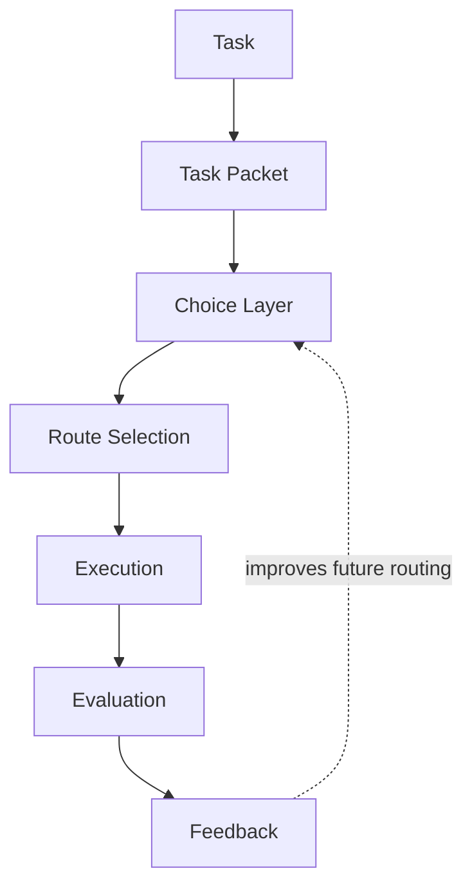
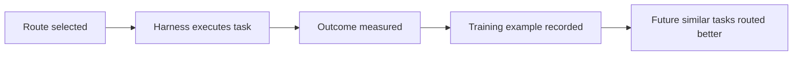

# Inside a Routing Decision

The Hokusai Technical Task Router does not directly solve coding tasks. For each routing request, it recommends one model from the candidate pool supplied by the caller, using prior outcomes from similar tasks as evidence.

For an integrating harness, the router is a decision service. Wavemill, Claude Code, OpenHands, custom agents, and other harnesses still execute the task, manage tools, construct prompts, and decide how to recover from failures.



## Step 1: Incoming Task

The router starts with a task submitted by an integrating harness. The task can be a plain-text user request, an issue description, a benchmark prompt, a code-review instruction, or a structured task object.

The harness may also provide optional context:

- Repository metadata
- Language and framework hints
- Available tools
- Budget or latency limits
- Candidate model list
- Prior attempt history
- Test or evaluation configuration
- Harness-specific metadata

Common task families include:

- Bug fixes
- Refactors
- Feature work
- Documentation changes
- Code review
- Test repair
- Migrations
- Infrastructure changes

Example incoming task:

```text
Refactor auth middleware to support scoped API keys.

Requirements:
- Keep the current middleware entrypoint stable for integrators.
- Enforce scope checks before request handlers run.
- Preserve existing admin flows while tightening least-privilege defaults.
- Add tests covering missing scope, partial scope, and valid scope paths.
- Document any new assumptions in code comments near the policy boundary.
```

The router treats this as input evidence, not as an execution prompt. The harness can still rewrite, expand, or contextualize the prompt before calling its selected models.

## Step 2: Task Packet Generation

The router derives a normalized task descriptor that can be compared across repositories, harnesses, and model providers. This internal descriptor is not the same object as the public SDK input or direct REST request.

A descriptor may include fields such as:

| Field | Purpose |
| --- | --- |
| `language` | Python, TypeScript, JavaScript, Go, Rust, Java, Bash, multi, or unknown |
| `domain` | Backend, frontend, fullstack, devops, data, ML, mobile, or unknown |
| `task_type` | Bug fix, feature, refactor, infra, tests, migration, docs, or unknown |
| `complexity` | Estimated implementation difficulty and coordination cost |
| `risk_level` | Expected blast radius, regression risk, or policy/security sensitivity |
| `repo_size_bucket` | Stable repository-size category |
| `files_touched_bucket` | Stable changed-file-count category |
| `requires_tests` | Whether the task requires test work |

Example packet:

```json
{
  "task_type": "refactor",
  "language": "typescript",
  "domain": "backend",
  "complexity": 6,
  "repo_size_bucket": "medium",
  "files_touched_bucket": "2_5",
  "description_length_bucket": "medium",
  "is_greenfield": false,
  "is_migration": false,
  "requires_tests": true,
  "cross_service": false,
  "ui_heavy": false,
  "risk_level": "medium"
}
```

Budget, latency, candidate models, and objectives remain separate routing inputs. This normalized descriptor is intentionally portable: a task from a GitHub issue, internal queue, benchmark, or IDE assistant can become comparable without sharing the integration's native task object.

See [Router Contracts](/technical-task-router/contracts) for the public SDK, direct REST, internal descriptor, and contribution-row shapes.

## Step 3: Choice Layer

The choice layer compares the current task packet against historical tasks and their outcomes. It is not a static rules engine. Its job is to estimate which route is most likely to produce an accepted result under the current constraints.

The comparison can use several signals:

- Similarity matching against prior task packets
- Historical model performance on similar tasks
- Planner, coder, and reviewer success rates
- Cost and latency behavior
- Retry and failure patterns
- Reliability under the harness's evaluation envelope
- Model availability and provider constraints

For example, the choice layer may find that a model with the best raw coding score is not the best route when the task is security-sensitive, the budget is tight, or the harness needs a reviewer that reliably catches policy boundary regressions.

The result is a scored routing decision based on observed outcomes: what worked, what failed, what it cost, and whether the final task result held up during evaluation.

## Step 4: Model Recommendation

The router ranks the candidate models the caller can actually execute. A response contains:

- **Model**: the recommended model ID.
- **Reasoning**: why the model fits the task and supplied constraints.
- **Confidence**: the router's confidence when available.
- **Alternatives**: ranked fallback candidates.
- **Route ID and correlation ID**: identifiers that connect the decision to a later optional outcome.

A harness with separate planner, coder, and reviewer stages can make one routing request per stage, using categorical context such as `stage: 'planning'` or `stage: 'review'`. The public router does not return a multi-stage workflow from one call.

If the primary recommendation is unavailable, the harness can select from `alternatives` according to its own provider and retry policy. The model recorded in any later outcome must be the model that actually ran.

## Step 5: Execution

Execution occurs inside the integrator's harness. The router returns recommendations; it does not operate the development environment.

The harness remains responsible for:

- Running the selected models
- Managing prompts and system instructions
- Supplying repository context
- Managing tools and permissions
- Running tests and static checks
- Handling retries and fallbacks
- Enforcing budget limits
- Recording the final outcome

A minimal integration flow looks like this:

```ts
import { route } from '@hokusai/router';

const decision = await route({
  task: userTask,
  context: {
    harness: 'custom',
    language: 'typescript',
    task_type: 'refactor',
  },
  availableModels: ['claude-sonnet-4-6', 'gpt-5'],
  maxCostUsd: 1,
});

const result = await models[decision.model].run(userTask);

await route.reportOutcome({
  status: result.ok ? 'succeeded' : 'failed',
  actualCostUsd: result.costUsd,
  wallClockSeconds: result.wallClockSeconds,
});
```

Outcome reporting is optional. A more complex harness can make separate routing calls for multiple workflow stages, use alternatives for retries, or add custom evaluation stages around the same one-recommendation-per-call contract.

## Step 6: Evaluation

Evaluation measures whether the route produced a useful outcome. Without evaluation, the router cannot distinguish a plausible recommendation from a successful one.

Useful evaluation signals include:

- Task success or failure
- Test pass rate
- Human acceptance
- Review score
- Cost
- Latency
- Retry count
- Regression detection
- Post-merge failure reports
- Whether the result stayed within budget

Example evaluation record:

```json
{
  "inference_log_id": "route_01HX...",
  "completion_result": "success",
  "selected_models": {
    "coder": "claude-sonnet-4-6",
    "reviewer": "claude-sonnet-4-6"
  },
  "budget_usd": 1,
  "actual_cost_usd": 0.42,
  "wall_clock_seconds": 412,
  "allowed_models": ["claude-sonnet-4-6", "gpt-5"]
}
```

The exact evaluation schema can vary by harness. What matters is that outcomes are tied back to the route that produced them, with enough detail to compare the route against alternatives on similar tasks.

## Step 7: Feedback Loop

Outcome data becomes training data for future routing decisions.

Successful routes teach the router which model and workflow choices worked for a given kind of task. Unsuccessful routes are equally important: they show where a model struggled, where a route exceeded budget, or where a reviewer failed to catch a regression.

The feedback loop can be summarized as:



Over time, the router learns from real implementation outcomes instead of relying only on benchmark labels or provider-level model descriptions.

## Strategy Explorer

The [Strategy Explorer](https://hokus.ai/strategy-explorer) exposes a live view of the routing process. It lets integrators inspect how task attributes, budget limits, model availability, and evaluation criteria affect route selection.

Use the Strategy Explorer to:

- Inspect generated task packets
- Compare candidate routes
- See which historical outcomes influenced a recommendation
- Test how budget or model availability changes the selected route
- Understand why a model was recommended for the current task or workflow stage

For engineers evaluating an integration, the Strategy Explorer is the fastest way to validate whether the router's decisions match the constraints of a specific harness or task queue.

## Relation to Hokusai Rewards

Routing improvements create measurable performance gains. When outcome data helps the router make better decisions on future tasks, that improvement becomes part of the router's training corpus.

Contributor rewards come from verified improvements to the shared router:

- Integrators submit routing outcomes from real task execution.
- Those outcomes create new training examples.
- Better training examples improve future routing decisions.
- Contributors who improve the router receive token rewards tied to measured performance lift.

The router is designed to become a shared asset improved by the engineers and harnesses that use it, rather than a closed optimization system owned by a single provider.
