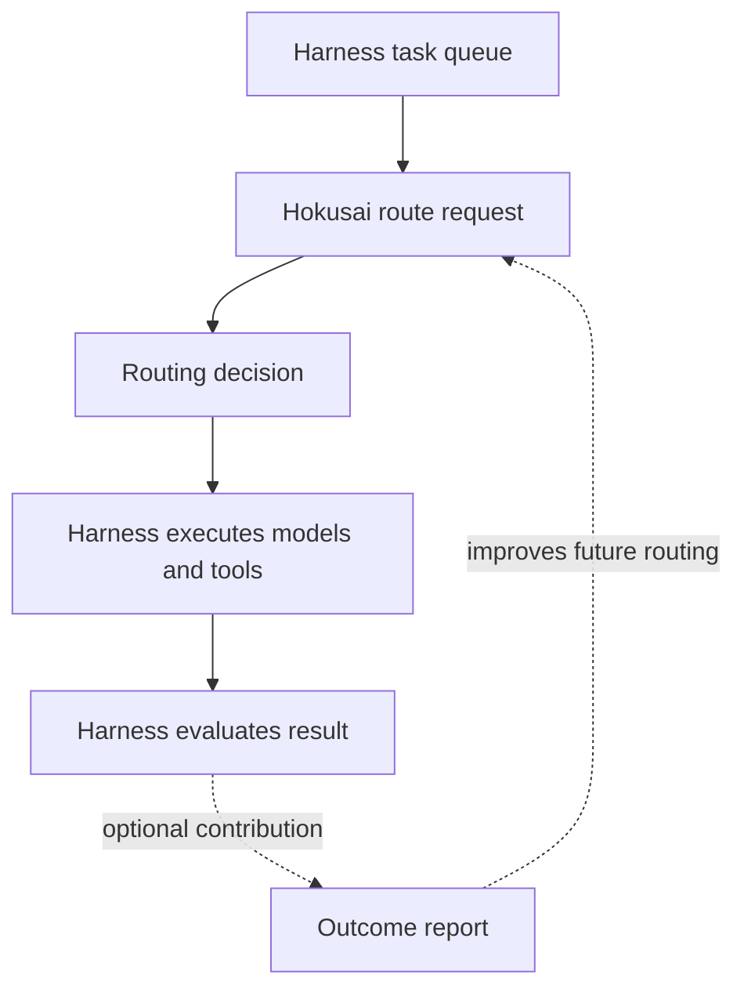

# Integrating with a Harness

Hokusai integrates as a routing decision service. It does not replace your coding harness, agent runtime, tools, prompts, or evaluation system.

## Integration Boundary



## Available integration paths

| Harness | Maturity | Starting point |
| --- | --- | --- |
| OpenHands | Example integration | Python-side RouterLLM example |
| Aider | Published adapter | `@hokusai/adapter-aider` |
| LiteLLM | Prototype | Metadata-only Python example |
| Wavemill | Supported harness integration | `@hokusai/core` route/contribute loop |
| Custom harness | Reference implementation | `examples/reference-harness` |

Use the [interactive integration guide](https://hokus.ai/router/integrate) to select the harness and get its current setup commands. “Example” and “prototype” paths are starting points rather than drop-in production packages.

## Hokusai Owns

- Task packet normalization
- Similarity matching against historical tasks
- Model selection for each routing request
- Route rationale
- Feedback ingestion
- Training data derived from outcomes

## The Harness Owns

- User experience
- Repository access
- Prompt construction
- Context assembly
- Tool permissions
- Model provider credentials
- Shell and file operations
- Test execution
- Retry policy
- Human review and acceptance

## Common Integration Patterns

### Rank a Candidate Pool

The standard path ranks at least two models your harness can execute and returns one recommendation.

```ts
const decision = await route({
  task,
  context: { harness: 'custom', stage: 'implementation' },
  availableModels: ['claude-sonnet-4-6', 'gpt-5'],
  maxCostUsd: 1,
});

const result = await runWithModel(decision.model, task);
```

### Route Multiple Workflow Stages

The SDK returns one model per request. If your harness separates planning, implementation, and review, request a route for each stage and pass the stage as categorical context.

```ts
const planner = await route({
  task,
  context: { harness: 'custom', stage: 'planning' },
  availableModels: plannerModels,
  maxCostUsd: 0.5,
});

const plan = await runWithModel(planner.model, task);

await route.reportOutcome({
  status: plan.ok ? 'succeeded' : 'failed',
  actualCostUsd: plan.costUsd,
});
```

Report the outcome before starting the next route when using the default `route` helper, which attributes an outcome to its most recent routing call.

### Deliberate Single-Model Telemetry

Ranking requires at least two distinct candidates. If you deliberately send one model for non-ranking telemetry, opt in explicitly:

```ts
const decision = await route({
  task,
  availableModels: ['claude-sonnet-4-6'],
  routingMode: 'non-ranking',
});
```

### Offline Evaluation

Use this mode when you want to replay historical tasks and compare Hokusai routes with your existing policy before sending live work through the router.

```ts
for (const task of historicalTasks) {
  const decision = await route({ task, context: replayContext });
  const score = compareAgainstBaseline(decision, task.actualOutcome);
  recordReplayScore(score);
}
```

## Implementation Advice

- Start with non-destructive tasks or replay mode.
- Include budget and available-model constraints from the beginning.
- Get a live route working before enabling optional outcomes.
- If you contribute, report failed routes as well as successful ones.
- Keep task packets stable enough that future comparisons are meaningful.
- Store detailed artifacts in your own system and report derived outcome signals to Hokusai.
- Check [Router Contracts](/technical-task-router/contracts) before constructing a raw dispatch or contribution row.
- Use [Router Troubleshooting](/technical-task-router/troubleshooting) for model mapping, attribution, and fidelity-tier errors.
