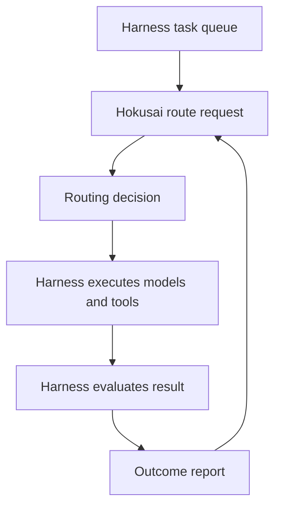

# Integrating with a Harness

Hokusai integrates as a routing decision service. It does not replace your coding harness, agent runtime, tools, prompts, or evaluation system.

## Integration Boundary



## Hokusai Owns

- Task packet normalization
- Similarity matching against historical tasks
- Model and stage selection
- Route rationale
- Feedback ingestion
- Training data derived from outcomes

## The Harness Owns

- User experience
- Repository access
- Prompt construction
- Context assembly
- Tool permissions
- Model provider credentials
- Shell and file operations
- Test execution
- Retry policy
- Human review and acceptance

## Common Integration Modes

### Single-Model Recommendation

Use this mode when your harness wants one model choice and owns the rest of the workflow.

```ts
const decision = await route({
  task,
  context,
  mode: 'single_model',
});
```

### Staged Planner / Coder / Reviewer

Use this mode when your harness separates planning, implementation, and review.

```ts
const decision = await route({
  task,
  context,
  mode: 'staged',
  stages: ['planner', 'coder', 'reviewer'],
});
```

### Offline Evaluation

Use this mode when you want to replay historical tasks and compare Hokusai routes with your existing policy before sending live work through the router.

```ts
for (const task of historicalTasks) {
  const decision = await route({ task, context: replayContext });
  const score = compareAgainstBaseline(decision, task.actualOutcome);
  recordReplayScore(score);
}
```

## Implementation Advice

- Start with non-destructive tasks or replay mode.
- Include budget and available-model constraints from the beginning.
- Report failed routes, not only successful ones.
- Keep task packets stable enough that future comparisons are meaningful.
- Store detailed artifacts in your own system and report derived outcome signals to Hokusai.
