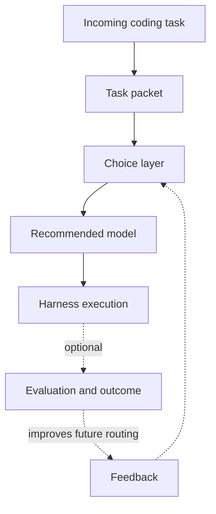

# Introduction to Hokusai

Hokusai is a protocol for improving shared AI decision layers. Its first production focus is the Technical Task Router, a model that recommends which available model is most likely to succeed on a coding task.

Most coding harnesses already make routing decisions: which model to use for a task or workflow stage, how much budget to spend, and when to retry. Those decisions are valuable, but they are usually locked inside one lab, one product, or one team's private logs.

Hokusai turns those routing decisions into a shared optimization layer. Integrators route tasks through Hokusai and execute the recommendation inside their own harness. They may then opt in to reporting a redacted outcome; successful and unsuccessful outcomes become training examples for future routing decisions.

## The First Router

The Technical Task Router is designed for multi-model coding systems, including:

- Wavemill
- Claude Code
- OpenHands
- Custom agent harnesses
- Internal developer automation systems

Each routing request recommends one model from the candidate pool supplied by the caller. A multi-stage harness can request a recommendation separately for planning, coding, or review. The router does not run shell commands, edit repositories, or manage prompts directly. The harness remains responsible for execution.

## Core Flow

## Key Concepts

- **Task packet**: A normalized internal task descriptor, including stable features such as language, domain, task type, complexity, repository size, test requirements, and risk. Routing constraints remain separate inputs.
- **Choice layer**: The routing model that compares the task packet with historical outcomes and current constraints.
- **Route**: The recommended model, rationale, confidence, and alternatives returned for one routing request.
- **Evaluation**: The measured result of a route, including test pass rate, human acceptance, cost, latency, and regression detection.
- **Feedback**: Outcome data that improves future routing decisions.
- **Rewards**: Token rewards for contributors whose outcome data or model improvements create measurable routing performance lift.

## Where to Go Next

- [Choose Your Integration](/getting-started)
- [Router Quickstart](/technical-task-router/quickstart)
- [Inside a Routing Decision](/inside-a-routing-decision)
- [Task Packets](/technical-task-router/task-packets)
- [Outcome Reporting](/technical-task-router/outcome-reporting)
- [Contributor Rewards](/contributor-rewards/routing-rewards)
