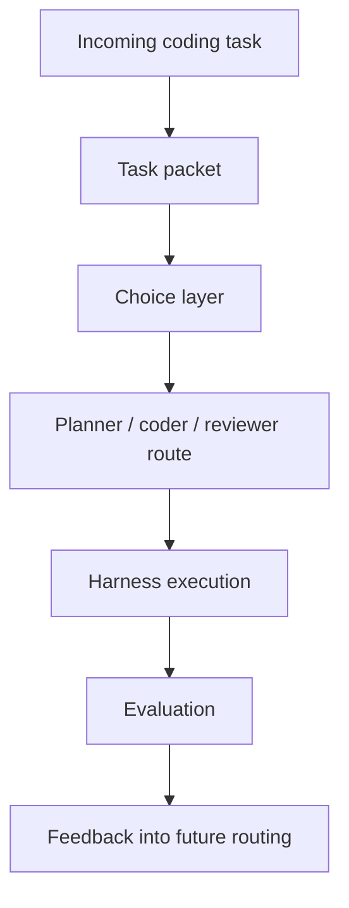

# Introduction to Hokusai

Hokusai is a protocol for improving shared AI decision layers. Its first production focus is the Technical Task Router, a model that routes coding tasks to the models and workflow stages most likely to succeed.

Most coding harnesses already make routing decisions: which model should plan, which model should edit code, which model should review, how much budget to spend, and when to retry. Those decisions are valuable, but they are usually locked inside one lab, one product, or one team's private logs.

Hokusai turns those routing decisions into a shared optimization layer. Integrators route tasks through Hokusai, execute the selected workflow inside their own harness, then report the outcome. Successful and unsuccessful outcomes become training examples for future routing decisions.

## The First Router

The Technical Task Router is designed for multi-model coding systems, including:

- Wavemill
- Claude Code
- OpenHands
- Custom agent harnesses
- Internal developer automation systems

It can recommend a single model or a staged route such as planner, coder, and reviewer. The router does not run shell commands, edit repositories, or manage prompts directly. The harness remains responsible for execution.

## Core Flow

## Key Concepts

- **Task packet**: A normalized representation of a task, including language, domain, task type, complexity, risk, budget, available models, and harness metadata.
- **Choice layer**: The routing model that compares the task packet with historical outcomes and current constraints.
- **Route**: The selected model or staged workflow, such as planner, coder, and reviewer.
- **Evaluation**: The measured result of a route, including test pass rate, human acceptance, cost, latency, and regression detection.
- **Feedback**: Outcome data that improves future routing decisions.
- **Rewards**: Token rewards for contributors whose outcome data or model improvements create measurable routing performance lift.

## Where to Go Next

- [Router Quickstart](/technical-task-router/quickstart)
- [Inside a Routing Decision](/inside-a-routing-decision)
- [Task Packets](/technical-task-router/task-packets)
- [Outcome Reporting](/technical-task-router/outcome-reporting)
- [Contributor Rewards](/contributor-rewards/routing-rewards)
