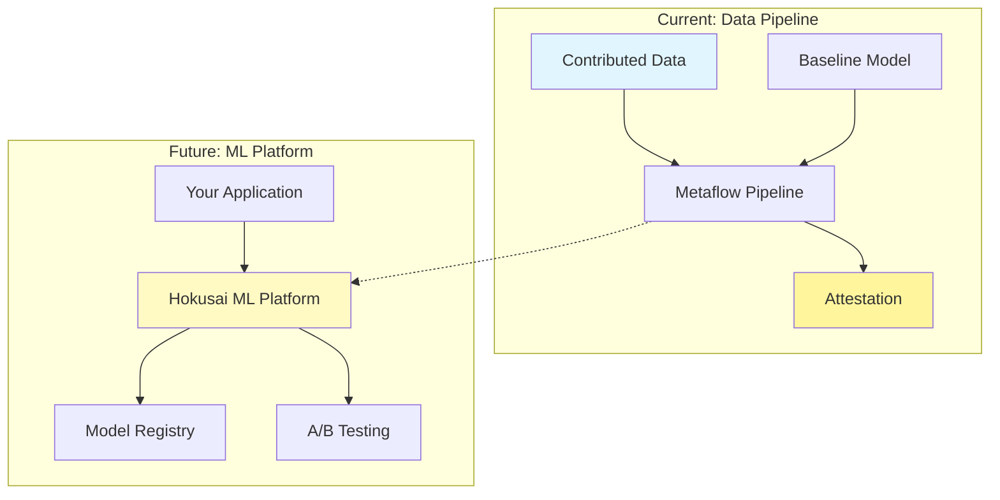
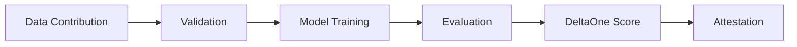

# ML Infrastructure Overview

The Hokusai ML infrastructure powers the protocol's ability to evaluate and reward data contributions that improve AI models. This section covers both the current implementation (data pipeline) and the future platform architecture.

## Architecture Overview



## Current Implementation: Data Pipeline

The Hokusai data pipeline is a production-ready Metaflow-based system that:

- **Evaluates Contributions**: Measures how contributed data improves model performance
- **Generates Attestations**: Creates cryptographic proofs of improvement (DeltaOne scores)
- **Integrates with Blockchain**: Produces outputs suitable for on-chain verification

### Key Features

1. **Automated Evaluation**: Compare baseline vs improved models
2. **Privacy Protection**: PII detection and data validation
3. **Reproducibility**: Deterministic pipeline execution
4. **Scalability**: Handle large datasets via streaming

### Pipeline Flow



## Future Vision: ML Platform

The Hokusai ML Platform (under development) will package these capabilities into a reusable library:

```python
# Future API example
from hokusai import MLPlatform

platform = MLPlatform()
result = platform.evaluate_contribution(
    baseline_model="gpt-3.5-turbo",
    contributed_data="path/to/data.csv",
    eth_address="0x..."
)
print(f"DeltaOne Score: {result.deltaone_score}")
```

### Planned Components

1. **Model Registry**: Centralized model management with MLFlow
2. **Version Control**: Semantic versioning and rollback capabilities
3. **A/B Testing**: Compare models in production environments
4. **Inference Pipeline**: Optimized serving with caching
5. **SDK Integration**: Easy integration for any ML application

## Use Cases

### For Data Contributors
- Submit datasets to improve specific models
- Track contribution impact via DeltaOne scores
- Earn rewards based on measurable improvements

### For Model Developers
- Access high-quality training data
- Leverage automated evaluation infrastructure
- Deploy improved models with confidence

### For Application Developers
- Integrate ML capabilities without building infrastructure
- Access pre-trained models via the registry
- Run A/B tests to optimize performance

## Technical Stack

- **Orchestration**: Metaflow for pipeline management
- **ML Framework**: MLFlow for experiment tracking
- **Storage**: S3-compatible object storage
- **Compute**: Kubernetes for scalable execution
- **Monitoring**: Integrated logging and metrics

## Getting Started

### Running the Pipeline Today

```bash
# Clone the repository
git clone https://github.com/Hokusai-protocol/hokusai-data-pipeline
cd hokusai-data-pipeline

# Run evaluation
python -m src.pipeline.hokusai_pipeline run \
    --contributed-data=your_data.csv \
    --eth-address=0x...
```

### Future Platform Installation

```bash
# Coming soon
pip install hokusai-ml-platform
```

## Development Status

| Component | Status | Availability |
|-----------|---------|--------------|
| Data Pipeline | ✅ Production Ready | Now |
| Model Registry | 🚧 In Development | Q2 2024 |
| A/B Testing | 📋 Planned | Q3 2024 |
| SDK | 📋 Planned | Q3 2024 |

## Next Steps

- [Pipeline Architecture](./pipeline-architecture) - Deep dive into current implementation
- [Platform Features](./platform-features) - Upcoming ML platform capabilities
- [Quick Start Guide](../getting-started/quick-start-pipeline) - Run your first evaluation
- [API Reference](../api-reference) - Programmatic usage