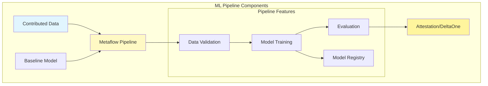
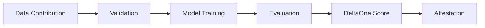

# ML Infrastructure Overview

The Hokusai ML infrastructure powers the protocol's ability to evaluate and reward data contributions that improve AI models. This production-ready system includes a Metaflow-based data pipeline for model evaluation and attestation generation.

## Architecture Overview



## Core Capabilities

The Hokusai ML pipeline is a production-ready Metaflow-based system that:

- **Evaluates Contributions**: Measures how contributed data improves model performance
- **Generates Attestations**: Creates cryptographic proofs of improvement (DeltaOne scores)
- **Integrates with Blockchain**: Produces outputs suitable for on-chain verification

### Key Features

1. **Automated Evaluation**: Compare baseline vs improved models
2. **Privacy Protection**: PII detection and data validation
3. **Reproducibility**: Deterministic pipeline execution
4. **Scalability**: Handle large datasets via streaming

### Pipeline Flow



## Platform Components

The ML pipeline includes several integrated components:

### Model Registry
MLFlow-based model management for tracking experiments and versions:
```python
# Current implementation
from src.pipeline.model_registry import ModelRegistry

registry = ModelRegistry()
model_info = registry.log_model(
    model=improved_model,
    metrics=evaluation_results,
    data_version=contribution_id
)
```

### Evaluation Framework
Automated comparison of baseline vs improved models:
```python
# Pipeline evaluation step
@step
def evaluate_models(self):
    baseline_metrics = evaluate(self.baseline_model, test_data)
    improved_metrics = evaluate(self.improved_model, test_data)
    self.deltaone_score = compute_deltaone(baseline_metrics, improved_metrics)
```

### Attestation Generation
Cryptographic proofs of model improvement:
```python
# Generate verifiable attestation
attestation = {
    "model_id": model_id,
    "deltaone_score": deltaone_score,
    "contributor": eth_address,
    "timestamp": timestamp,
    "signature": generate_signature(...)
}
```

## Use Cases

### For Data Contributors
- Submit datasets to improve specific models
- Track contribution impact via DeltaOne scores
- Earn rewards based on measurable improvements

### For Model Developers
- Access high-quality training data
- Leverage automated evaluation infrastructure
- Deploy improved models with confidence

### For Protocol Integrators
- Connect to Hokusai's evaluation infrastructure
- Submit data contributions programmatically
- Track rewards and attestations on-chain

## Technical Stack

- **Orchestration**: Metaflow for pipeline management
- **ML Framework**: MLFlow for experiment tracking
- **Storage**: S3-compatible object storage
- **Compute**: Kubernetes for scalable execution
- **Monitoring**: Integrated logging and metrics

## Getting Started

### Running the Pipeline

```bash
# Clone the repository
git clone https://github.com/Hokusai-protocol/hokusai-data-pipeline
cd hokusai-data-pipeline

# Install dependencies
pip install -r requirements.txt

# Run evaluation
python -m src.pipeline.hokusai_pipeline run \
    --contributed-data=your_data.csv \
    --eth-address=0x... \
    --model-type=gpt-3.5-turbo
```

### Quick Testing

```bash
# Run with test data
python -m src.pipeline.hokusai_pipeline run \
    --dry-run \
    --contributed-data=data/test_fixtures/test_queries.csv
```

## Key Features

| Feature | Description | Status |
|---------|-------------|---------|
| Data Validation | PII detection, schema validation | ✅ Active |
| Model Training | Automated fine-tuning with contributed data | ✅ Active |
| Evaluation | Baseline vs improved model comparison | ✅ Active |
| DeltaOne Scoring | Quantified improvement metrics | ✅ Active |
| Attestation | Cryptographic proof generation | ✅ Active |
| MLFlow Integration | Experiment tracking and model registry | ✅ Active |
| Streaming Support | Handle large datasets efficiently | ✅ Active |

## Next Steps

- [Pipeline Architecture](./pipeline-architecture) - Deep dive into current implementation
- [Platform Features](./platform-features) - Upcoming ML platform capabilities
- [Quick Start Guide](../getting-started/quick-start-pipeline) - Run your first evaluation
- [API Reference](../api-reference) - Programmatic usage