# Epoch-Based Parameter Governance

Hokusai's pricing parameters — infrastructure cost rates and per-model bonding curve inputs — are protected by an **epoch-gated update pattern**. Once a parameter change is queued, it cannot take effect until the current epoch ends. This means token holders can rely on stable fee economics for the duration of any epoch: no mid-month surprise changes to the infrastructure cost split or the base inputs that flow into token pricing.

This guarantee is implemented by two contracts: `HokusaiParams` and `InfrastructureCostOracle`. Both follow the same queue-and-apply lifecycle. Understanding it helps investors evaluate the governance risk of any model they hold.

The emergency override path (`emergencySetParam`) is the only exception. It exists for genuine operational incidents and requires admin credentials that, in production, are held by a multisig or timelock — creating an accountability layer even for emergency changes.

## Epoch model

An **epoch** is a fixed time window during which active parameters cannot change. The default epoch duration is **30 days**.

Epoch boundaries are not calendar-aligned — they are measured from the contract's own internal clock, starting at deployment or at the timestamp of the last epoch boundary. When the current time crosses a boundary, the pending update (if one was queued) becomes eligible to be applied.

The practical consequence: if a parameter change is queued on Day 1, it will not affect fee routing or bonding curve calculations until Day 30 at the earliest. Token holders watching on-chain activity can see the queued value and the boundary timestamp before the change ever takes effect.

## Queueing a parameter update

An address holding `GOV_ROLE` calls `queueParamUpdate()` to schedule a change. The new value is stored in a pending slot alongside the timestamp of the epoch boundary at which it becomes eligible.

```solidity
// Governance queues a new infrastructureAccrualBps value
hokusaiParams.queueParamUpdate(modelId, "infrastructureAccrualBps", newValue);

// Anyone can apply it once the epoch boundary has passed
hokusaiParams.applyPendingUpdate(modelId);
```

`applyPendingUpdate()` is permissionless — any address can call it after the boundary. The contract checks internally that the current timestamp has passed the scheduled boundary before writing the new value to the active slot.

The timeline looks like this:

```mermaid
gantt
    title Parameter update lifecycle
    dateFormat  X
    axisFormat  Day %s

    section Epoch N
    Active params in effect     :active, epoch-n, 0, 30
    Update queued (Day 5)       :milestone, queue, 5, 0

    section Epoch N+1 (Day 30+)
    applyPendingUpdate() callable :milestone, apply, 30, 0
    New params in effect          :active, epoch-np1, 30, 60
```



Key properties:

- Only one pending update per parameter per model is allowed at a time. A second `queueParamUpdate()` call overwrites the pending slot.
- If no update is queued, `applyPendingUpdate()` is a no-op.
- The pending value and its scheduled boundary are readable on-chain, giving token holders advance notice.

## Emergency override

`emergencySetParam()` lets an address with admin privileges bypass the epoch queue and apply a new value immediately.

```solidity
// Admin-only: takes effect immediately, skipping the epoch wait
hokusaiParams.emergencySetParam(modelId, "infrastructureAccrualBps", newValue);
```

This function is intentionally restricted and should be used only for genuine incidents — for example, if a misconfigured parameter is causing fee routing failures or reserve drain. In a standard Hokusai deployment, the admin role is held by a multisig or a governance timelock, so any emergency call leaves a permanent on-chain record and requires multisig approval.

Token holders concerned about emergency override risk should verify:

1. Who holds the admin role (`DEFAULT_ADMIN_ROLE`) on `HokusaiParams` and `InfrastructureCostOracle`
2. Whether that address is a multisig or EOA
3. Historical on-chain usage of `emergencySetParam` for the model in question

## Per-model parameter snapshots

When a model is first registered with `HokusaiParams`, the contract takes a **snapshot** of the currently active parameter values and associates them with that model ID. This snapshot becomes the model's baseline.

Subsequent queued updates do not alter the snapshot retroactively. Instead, at the next epoch boundary, the update is applied to the model's active slot — and from that point forward, the new values drive fee routing and pricing for that model.

This means:

- All models registered in the same epoch start with the same baseline parameters.
- Each model accumulates its own independent update history after registration.
- Investors can read a model's current active parameters at any time to see what is actually in effect.

## Which contracts use this pattern

| Contract | What it governs | Key parameters |
|---|---|---|
| `HokusaiParams` | Per-model economic parameters | `infrastructureAccrualBps` (fallback fee split when no oracle entry exists) |
| `InfrastructureCostOracle` | Per-model infrastructure cost estimate | `costPerThousandCalls` (USDC per 1000 API calls, used by `UsageFeeRouter`) |

Both contracts expose the same three entry points: `queueParamUpdate()`, `applyPendingUpdate()`, and `emergencySetParam()`. The epoch duration (default 30 days) is shared by both.

## What this means for token holders

:::info Mid-epoch parameter stability

For any active epoch, the parameters used to split API fees and price infrastructure costs **cannot change** unless an admin uses the emergency override. Token holders can verify the pending queue at any time to see what, if anything, will change at the next epoch boundary.

This gives investors a 30-day window of known fee economics when evaluating a model's profitability and token price trajectory.

:::

Practical checklist for investors:

- **Check active params**: read `HokusaiParams` for the model's current `infrastructureAccrualBps` and `InfrastructureCostOracle` for `costPerThousandCalls`.
- **Check the pending queue**: confirm whether a parameter change is scheduled and, if so, what the new value will be and when the boundary falls.
- **Verify admin accountability**: confirm the admin role is held by a multisig or timelock, not a bare EOA.
- **Monitor epoch boundaries**: a boundary crossing on its own does not change parameters — it only enables `applyPendingUpdate()` to be called. Nothing changes until that call is made.

## Related docs

- [Usage Fee Routing & InfrastructureReserve](/smart-contracts/usage-fee-routing) — how `costPerThousandCalls` and `infrastructureAccrualBps` drive the cost-plus fee split
- [Access Control & Roles](/smart-contracts/access-control) — `GOV_ROLE` and `DEFAULT_ADMIN_ROLE` assignment
- [API Fee Flow](/tokenomics/api-fee-flow) — end-to-end flow of API fees into the AMM reserve
