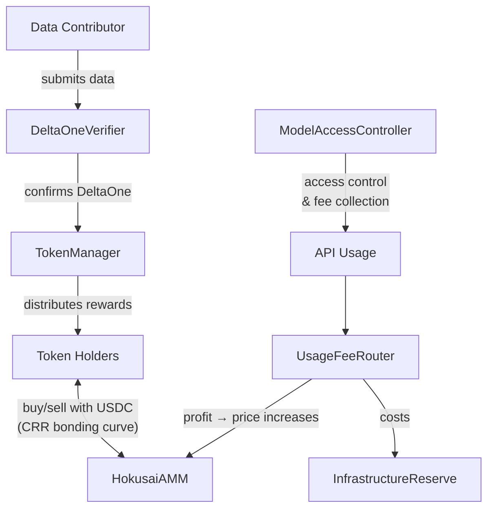

# Smart Contract Overview

Hokusai's smart contract system is modular, designed to support decentralized AI model development and tokenization. Here's a simplified flow:

> Looking for contract addresses? See [Deployments](/smart-contracts/deployments).

## Key Components

### Core Contracts
- **HokusaiToken (ERC20)**: Model-specific token, earned via performance gains
- **HokusaiParams**: Per-model parameters including `infrastructureAccrualBps`
- **TokenManager**: Issues tokens, handles mint/burn logic, distributes rewards
- **DeltaOneVerifier**: Validates performance improvements off-chain, triggers minting
- **ModelRegistry**: Maps model IDs to token addresses

### AMM & Trading
- **HokusaiAMM**: CRR bonding curve for buying/selling tokens with USDC
- **HokusaiAMMFactory**: Deploys new AMM pools for each model
- **UsageFeeRouter**: Routes API fees based on per-model parameters
- **InfrastructureReserve**: Holds infrastructure cost accruals, pays providers

### Access Control
- **ModelAccessController**: Enforces access control and fee collection for model usage
- **Governance**: Token holder voting on parameters (including infrastructure accrual rate)

## Key Features

### Seven-Day Launch Period
- Each model token starts with buy-only period (Days 0-6)
- Full trading enabled after Day 7
- Prevents manipulation and enables fair price discovery

### Infrastructure Cost Accrual
- Each model has a configurable `infrastructureAccrualBps` (50-100%)
- Infrastructure portion accrues in `InfrastructureReserve` contract
- Providers paid manually with on-chain invoice tracking
- Governance can adjust rates as actual costs become clearer

### Profit Share to AMM
- Residual after infrastructure (0-50%) flows to AMM USDC reserves
- Increases reserve without minting tokens
- Raises spot price: P = R / (w × S)
- Token holders benefit from genuine profit, not gross revenue
