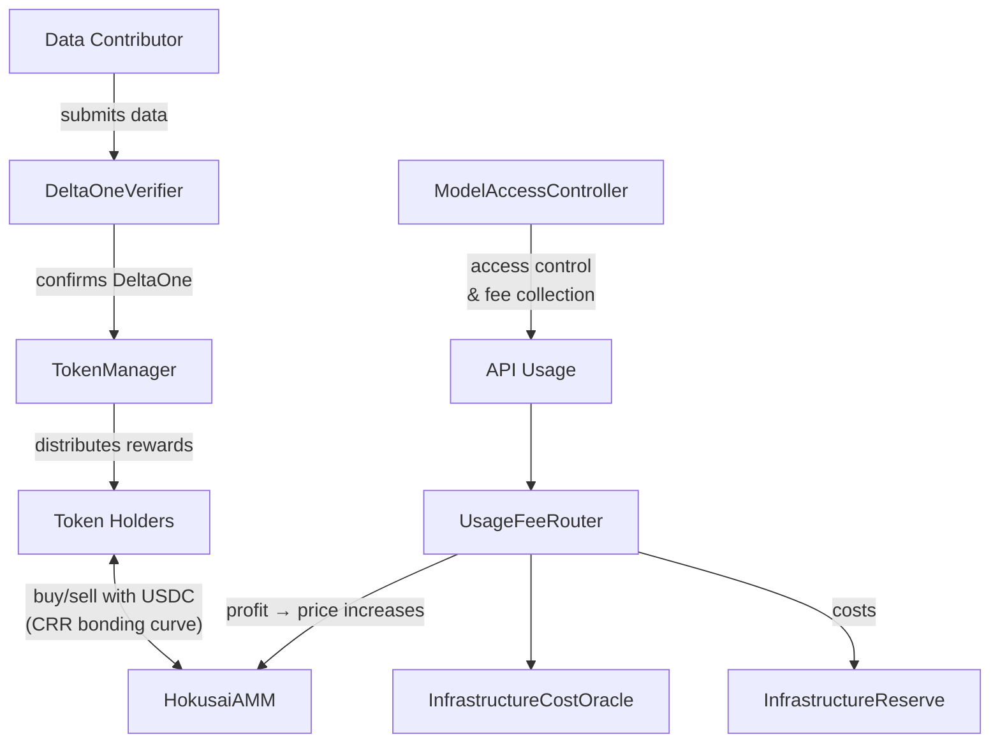

# Smart Contract Overview

Hokusai's smart contract system is modular, designed to support decentralized AI model development and tokenization. Here's a simplified flow:

> Looking for contract addresses? See [Deployments](/smart-contracts/deployments).

## Key Components

### Core Contracts
- **HokusaiToken (ERC20)**: Model-specific token, earned via performance gains
- **HokusaiParams**: Per-model parameters including `infrastructureAccrualBps`
- **TokenManager**: Issues tokens, handles mint/burn logic, distributes rewards
- **DeltaOneVerifier**: Validates performance improvements off-chain, triggers minting
- **ModelRegistry**: Maps model IDs to token addresses

### AMM & Trading
- **HokusaiAMM**: CRR bonding curve for buying/selling tokens with USDC
- **HokusaiAMMFactory**: Deploys new AMM pools for each model
- **UsageFeeRouter**: Routes API fees using cost-plus logic, with percentage fallback
- **InfrastructureCostOracle**: Stores per-model infrastructure cost estimates
- **InfrastructureReserve**: Holds infrastructure cost accruals, pays providers

### Access Control
- **ModelAccessController**: Enforces access control and fee collection for model usage
- **Governance**: Token holder voting on parameters (including infrastructure accrual rate)

## Key Features

### Initial Bonding Ratio (IBR) Phase
- Each model token starts at a flat launch price of $0.01 per token
- The AMM hands off to CRR pricing when reserves reach $25,000 USDC or 7 days elapse
- This bootstraps reserve depth before normal bonding-curve price discovery

### Infrastructure Cost Accrual
- The primary path is cost-plus routing from `InfrastructureCostOracle`
- If the oracle has no entry, each model falls back to `infrastructureAccrualBps`
- Infrastructure portion accrues in `InfrastructureReserve`
- Providers are paid manually with on-chain invoice tracking

### Profit Share to AMM
- Residual after infrastructure (0-50%) flows to AMM USDC reserves
- Increases reserve without minting tokens
- Raises spot price: P = R / (w × S)
- Token holders benefit from genuine profit, not gross revenue
