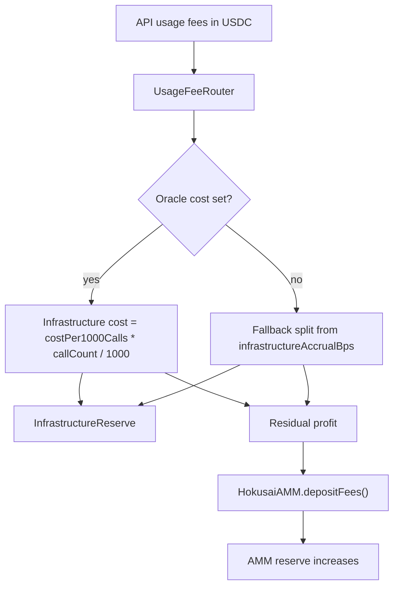

# Usage Fee Routing & InfrastructureReserve

API usage fees are routed with a **cost-plus** model:

- Estimated infrastructure cost is paid first
- Residual profit is deposited into the AMM reserve
- API usage fees do **not** flow to a protocol treasury

This flow is implemented by `UsageFeeRouter`, `InfrastructureCostOracle`, and `InfrastructureReserve`.

## Overview



## UsageFeeRouter

`UsageFeeRouter` receives usage-fee deposits from authorized fee depositors and splits each deposit between infrastructure and profit.

### Primary path: cost-plus

If the oracle has a cost estimate for the model:

```solidity
uint256 costPer1000Calls = costOracle.getEstimatedCost(modelId);
uint256 estimatedCost = (costPer1000Calls * callCount) / 1000;
infrastructureAmount = estimatedCost > amount ? amount : estimatedCost;
profitAmount = amount - infrastructureAmount;
```

- `costPer1000Calls` is denominated in USDC with 6 decimals
- `callCount` is supplied with the deposit
- Infrastructure cost is capped at the deposited amount
- Remaining amount becomes profit for token holders

### Fallback path: percentage split

If the oracle has no entry for the model, the router falls back to the model's `infrastructureAccrualBps` in `HokusaiParams`.

```solidity
uint16 infraBps = params.infrastructureAccrualBps();
infrastructureAmount = (amount * infraBps) / 10000;
profitAmount = amount - infrastructureAmount;
```

The router emits a `CostBasis` value to show which path was used:

- `ORACLE`
- `PERCENTAGE_FALLBACK`

### Key functions

```solidity
function depositFee(string memory modelId, uint256 amount, uint256 callCount) external;
function batchDepositFees(
    string[] memory modelIds,
    uint256[] memory amounts,
    uint256[] memory callCounts
) external;
function calculateFeeSplit(
    string memory modelId,
    uint256 amount,
    uint256 callCount
) external view returns (
    uint256 infrastructureAmount,
    uint256 profitAmount,
    CostBasis costBasis
);
```

### Key events

```solidity
event FeeDeposited(
    string indexed modelId,
    address indexed poolAddress,
    uint256 totalAmount,
    uint256 infrastructureAmount,
    uint256 profitAmount,
    address indexed depositor
);

event BatchDeposited(
    uint256 totalAmount,
    uint256 totalInfrastructure,
    uint256 totalProfit,
    uint256 modelCount,
    address indexed depositor
);

event FeeSplitCalculated(
    string indexed modelId,
    uint256 totalFee,
    uint256 infraShare,
    uint256 profitShare,
    uint256 callCount,
    CostBasis costBasis
);
```

## InfrastructureCostOracle

`InfrastructureCostOracle` stores estimated infrastructure cost per 1000 API calls for each model.

### What it stores

- Active cost per 1000 calls: `_costPerThousandCalls[modelId]`
- Pending updates with delayed activation
- Global `grossMarginBps` for end-user pricing markup

### Pricing stability

- Default epoch duration: 30 days
- Updates are queued by `GOV_ROLE`
- After the required epoch boundary, anyone can call `applyPendingUpdate(modelId)`

### Key view functions

```solidity
function getEstimatedCost(string memory modelId) external view returns (uint256);
function getEndUserPrice(string memory modelId) external view returns (uint256);
function grossMarginBps() external view returns (uint16);
function epochDuration() external view returns (uint256);
```

### End-user markup

`grossMarginBps` lets governance quote users above raw infrastructure cost:

```text
endUserPrice = cost + (cost * grossMarginBps / 10000)
```

That markup is separate from the router's deposit logic. The router still routes actual collected fees using cost-plus logic.

## InfrastructureReserve

`InfrastructureReserve` holds accrued infrastructure obligations and records payments to providers.

### Per-model accounting

```solidity
mapping(string => uint256) public accrued;
mapping(string => uint256) public paid;
mapping(string => address) public provider;
```

### Key functions

```solidity
function deposit(string memory modelId, uint256 amount) external;
function batchDeposit(string[] memory modelIds, uint256[] memory amounts) external;
function payInfrastructureCost(
    string memory modelId,
    address payee,
    uint256 amount,
    bytes32 invoiceHash,
    string memory memo
) external;
function batchPayInfrastructureCosts(Payment[] memory payments) external;
```

### Payment transparency

Every manual payment records:

- model ID
- payee
- amount
- invoice hash
- memo
- payer

That creates an on-chain audit trail for infrastructure spending.

## Worked examples

### Oracle path

```text
Oracle cost: 4 USDC per 1000 calls
Usage fee collected: 5 USDC
Call count: 1000

Infrastructure = (4 * 1000) / 1000 = 4 USDC
Profit = 5 - 4 = 1 USDC
```

Result:

- `4 USDC` accrues in `InfrastructureReserve`
- `1 USDC` is deposited to the AMM reserve

### Fallback path

```text
No oracle entry
infrastructureAccrualBps = 8000
Usage fee collected: 10 USDC

Infrastructure = 10 * 8000 / 10000 = 8 USDC
Profit = 2 USDC
```

Result:

- `8 USDC` accrues in `InfrastructureReserve`
- `2 USDC` is deposited to the AMM reserve

## Canonical framing

- Do **NOT** distribute fees to stakers. No staking mechanism exists.
- Do **NOT** distribute API fees to a protocol treasury. No protocol treasury exists for API fees.
- AMM trade fees and API usage fees are separate flows.

## Related docs

- [API Fee Flow](/tokenomics/api-fee-flow)
- [HokusaiAMM Contract](/smart-contracts/hokusai-amm)
- [Access Control & Roles](/smart-contracts/access-control)
