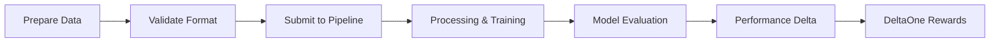
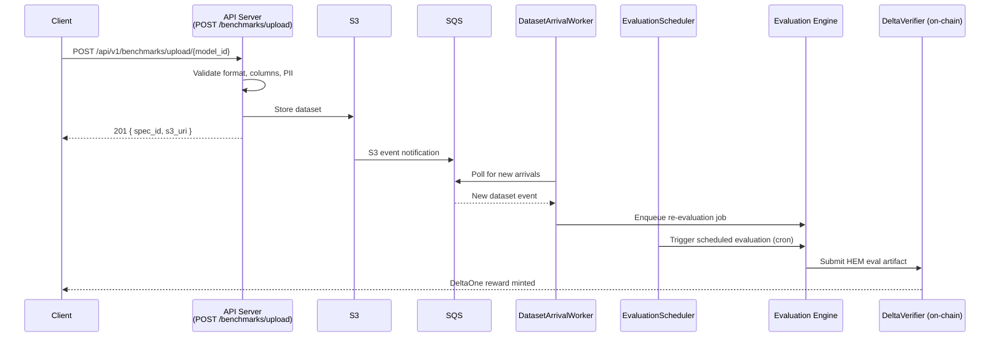

# Supplying Data to Hokusai

This guide explains how to supply data to Hokusai models and earn DeltaOne rewards through our decentralized data contribution system.

## Overview

Hokusai creates a marketplace where data suppliers contribute high-quality datasets to improve AI models. When your data leads to measurable performance improvements, you earn DeltaOne tokens through our unique reward system.

### How It Works



## Schema-driven contributions

Each Hokusai model defines its own input schema — a JSON Schema document that describes the rows contributors must submit. The on-platform Submit-Data form is built dynamically from this schema (stored in `Model.api_schema` in Postgres), and client code should do the same: **fetch the schema at runtime** rather than assuming a fixed data shape.

Two public endpoints expose the per-model contract:

| Endpoint | Returns |
|---|---|
| `GET https://hokus.ai/api/models/{modelId}/data-spec` | JSON Schema describing accepted contribution rows (`Content-Type: application/schema+json`) |
| `GET https://hokus.ai/api/models/{modelId}/data-spec/example` | A worked example row (`?format=csv` returns CSV) |

Use the schema endpoint as the source of truth — the same document drives the website's form, the SDK validators, and the pipeline. Append `?download=true` to either endpoint to download the file directly.

## Hokusai Support Program

For qualified data suppliers, Hokusai offers comprehensive support services to ensure successful data contribution:

- **Data Preparation**: Assistance with data formatting, cleaning, and optimization
- **Privacy Compliance**: Verification of data anonymization and privacy standards
- **Performance Assessment**: Evaluation of data quality and potential impact
- **Technical Integration**: Support with SDK implementation and testing
- **Wallet Setup**: Help with blockchain wallet configuration
- **Reward Optimization**: Guidance on maximizing DeltaOne earnings

### Qualification Criteria
- Significant datasets that meet our privacy and quality standards
- Data that can demonstrably improve model performance
- Commitment to ongoing data contribution

[Contact our team](https://hokus.ai/contact-us/) to discuss your dataset and learn more about our support program.

## Prerequisites

Before you begin, ensure you have:

1. **Ethereum wallet address** for reward attribution
2. **Python 3.8+** installed on your system
3. **Data** that meets our quality and privacy standards
4. **10GB free disk space** for pipeline processing

## Installation Options

### Option 1: Hokusai SDK (Recommended for Most Users)

```bash
pip install hokusai-sdk
```

### Option 2: Full Pipeline Installation (For Advanced Users)

```bash
# Clone the pipeline repository
git clone https://github.com/hokusai/hokusai-data-pipeline.git
cd hokusai-data-pipeline

# Set up environment
python -m venv venv
source venv/bin/activate  # On Windows: venv\Scripts\activate

# Install dependencies
./setup.sh
```

## Supported Data Types

The examples below show common data shapes you may encounter, but they are **illustrative only**. Each model's authoritative input schema is available at `GET https://hokus.ai/api/models/{modelId}/data-spec` — fetch it at runtime to know exactly what fields and types that model expects.

### 1. Query-Document Pairs
Common pattern for information retrieval models:

```csv
query_id,query,relevant_doc_id,label
q001,"What is machine learning?",doc123,1
q002,"How to train a model?",doc456,1
q003,"Python programming basics",doc789,0
```

### 2. Classification Data
For classification model improvements:

```json
{
  "samples": [
    {
      "id": "sample_001",
      "text": "This product is amazing!",
      "label": "positive",
      "confidence": 0.95
    }
  ]
}
```

### 3. Structured Datasets
For complex model training (Parquet format):
- Features array
- Labels
- Metadata
- Contributor ID

## Data Quality Requirements

### Minimum Requirements

| Requirement | Value | Description |
|------------|-------|-------------|
| **Size** | ≥ 100 samples | Minimum dataset size |
| **Completeness** | > 95% | Non-null value percentage |
| **Uniqueness** | > 80% | Unique sample percentage |
| **Format** | Valid CSV/JSON/Parquet | Proper file encoding |
| **Schema** | 100% compliance | Matches expected structure |

### Privacy Compliance

The pipeline automatically handles privacy:
- **PII Detection**: Automatic scanning for personal information
- **Data Hashing**: Sensitive identifiers are hashed
- **Anonymization**: Direct identifiers removed
- **Audit Trail**: Privacy actions logged

## Step-by-Step Guide

### Step 1: Prepare Your Data

The first step is to fetch the model's JSON Schema so you know the exact row shape required. Replace `21` with the ID of the model you want to contribute to.

**Fetch the schema:**

```bash
curl https://hokus.ai/api/models/21/data-spec
```

**Fetch a worked example row:**

```bash
# JSON example
curl https://hokus.ai/api/models/21/data-spec/example

# CSV example
curl "https://hokus.ai/api/models/21/data-spec/example?format=csv"
```

**Validate a row locally before submitting (Python):**

```python
import requests
import jsonschema

# Fetch the model's JSON Schema
schema = requests.get("https://hokus.ai/api/models/21/data-spec").json()

# Your candidate row — shape must match the schema
row = {
    "query": "How to use Hokusai pipeline?",
    "document_id": "doc_hokusai",
    "relevance": 1
}

# Raises jsonschema.ValidationError if the row is invalid
jsonschema.validate(instance=row, schema=schema)
print("Row is valid")
```

**Build your dataset once you've confirmed the schema:**

```python
import pandas as pd

data = pd.DataFrame({
    'query_id': ['custom_001', 'custom_002', 'custom_003'],
    'query': [
        'How to use Hokusai pipeline?',
        'What is machine learning?',
        'Best pizza recipe'
    ],
    'document_id': ['doc_hokusai', 'doc_ml', 'doc_pizza'],
    'relevance': [1, 1, 0]
})

data.to_csv('my_contribution.csv', index=False)
```

### Step 2: Add Contributor Information

Create a manifest file with your wallet address:

```json
{
  "contributor_id": "your_unique_id",
  "wallet_address": "0x742d35Cc6634C0532925a3b844Bc9e7595f62341",
  "data_description": "Technology documentation queries",
  "data_source": "Manual curation",
  "license": "CC-BY-4.0"
}
```

### Step 3: Validate Your Data

#### Using the SDK:

```python
from hokusai import HokusaiClient

client = HokusaiClient(
    api_key='your_api_key',
    wallet_address='your_wallet_address'
)

# Validate data
validation_result = client.validate_data(
    data_path='my_contribution.csv',
    model_id='target_model_id'
)

print(f"Validation status: {validation_result.status}")
print(f"Quality score: {validation_result.quality_score}")
```

#### Using the Pipeline:

```bash
python -m src.utils.validate_contribution \
    --data=my_contribution.csv \
    --manifest=manifest.json
```

### Step 4: Submit Your Data

#### Using the SDK:

```python
# Submit to specific model
result = client.submit_data(
    model_id='target_model_id',
    data_path='my_contribution.csv'
)

print(f"Submission ID: {result.submission_id}")
print(f"Status: {result.status}")
```

#### Using the Pipeline:

```bash
python -m src.pipeline.hokusai_pipeline run \
    --contributed-data=my_contribution.csv \
    --contributor-manifest=manifest.json \
    --output-dir=./outputs
```

#### Using the HTTP API:

This is the same endpoint the Hokusai website uses when you submit data through the browser UI. It requires an authenticated session (the site session cookie or a Bearer token obtained from the auth service — see the [authentication quickstart](authentication/quickstart.md) for token mechanics).

```bash
curl -X POST https://hokus.ai/api/models/21/contributions \
  -H "Content-Type: application/json" \
  --cookie "hokusai_access_token=<your_token>" \
  -d '{
    "modelId": 21,
    "benchmarkSpecId": null,
    "rows": [
      { "query": "How to use Hokusai pipeline?", "document_id": "doc_hokusai", "relevance": 1 }
    ]
  }'
```

On success the endpoint returns:
```json
{ "ok": true, "submittedRows": 1, "jobId": "job_abc123" }
```

On validation failure it returns HTTP 400 with:
```json
{
  "ok": false,
  "status": 400,
  "message": "Validation failed",
  "errors": [{ "path": "rows[0].relevance", "message": "Expected number", "rowIndex": 0 }]
}
```

**Python equivalent:**

```python
import requests

token = "<your_token>"
payload = {
    "modelId": 21,
    "benchmarkSpecId": None,
    "rows": [
        {"query": "How to use Hokusai pipeline?", "document_id": "doc_hokusai", "relevance": 1}
    ],
}

resp = requests.post(
    "https://hokus.ai/api/models/21/contributions",
    json=payload,
    cookies={"hokusai_access_token": token},
)
resp.raise_for_status()
print(resp.json())  # {"ok": True, "submittedRows": 1, "jobId": "..."}
```

:::note
`benchmarkSpecId` is always required in the request body (pass `null` unless you have a specific benchmark spec). The optional fields `schemaVersion` and `templateId` may be omitted.
:::

### Uploading a Dataset File Directly

Instead of using the SDK submit flow, you can push a CSV or Parquet file directly to the benchmark upload endpoint. This is the recommended path when you already have a clean, validated file and want a `BenchmarkSpec` created in one step.

**Endpoint:** `POST /api/v1/benchmarks/upload/{model_id}`  
**Content-Type:** `multipart/form-data`  
**Max file size:** 500 MB

#### Form fields

| Field | Type | Default | Description |
|-------|------|---------|-------------|
| `file` | file | required | CSV or Parquet file |
| `eval_split` | string | `"test"` | Which split to use for evaluation |
| `metric_name` | string | `"accuracy"` | Metric tracked for this benchmark |
| `metric_direction` | string | `"higher_is_better"` | `"higher_is_better"` or `"lower_is_better"` |
| `target_column` | string | `"target"` | Column holding ground-truth labels |
| `input_columns` | string | `""` | Comma-separated list of feature columns |
| `allow_pii` | bool | `false` | If `false`, PII detection failure rejects the upload |

#### cURL example

```bash
curl -X POST "https://api.hokus.ai/api/v1/benchmarks/upload/my-model-id" \
  -H "Authorization: Bearer $HOKUSAI_API_KEY" \
  -F "file=@dataset.csv" \
  -F "eval_split=test" \
  -F "metric_name=accuracy" \
  -F "metric_direction=higher_is_better" \
  -F "target_column=label" \
  -F "input_columns=text,context" \
  -F "allow_pii=false"
```

#### Python example

```python
import requests

api_key = "YOUR_API_KEY"  # replace with your actual key

with open("dataset.csv", "rb") as f:
    response = requests.post(
        "https://api.hokus.ai/api/v1/benchmarks/upload/my-model-id",
        headers={"Authorization": f"Bearer {api_key}"},
        files={"file": ("dataset.csv", f, "text/csv")},
        data={
            "eval_split": "test",
            "metric_name": "accuracy",
            "metric_direction": "higher_is_better",
            "target_column": "label",
            "input_columns": "text,context",
            "allow_pii": "false",
        },
    )
response.raise_for_status()
result = response.json()
print(f"Spec ID: {result['spec_id']}")
print(f"S3 URI:  {result['s3_uri']}")
```

#### Validation rules

The upload is rejected if any of these conditions are not met:

- File must be CSV or Parquet format
- Dataset must contain at least **50 rows**
- All columns declared in `target_column` and `input_columns` must exist in the file
- No declared column may be entirely empty
- PII scan must pass unless `allow_pii=true` is set

#### Success response (HTTP 201)

```json
{
  "s3_uri": "s3://hokusai-datasets/my-model-id/v1/dataset.csv",
  "sha256_hash": "abc123...",
  "spec_id": "550e8400-e29b-41d4-a716-446655440000",
  "filename": "dataset.csv",
  "file_size_bytes": 102400
}
```

The `spec_id` is the ID of the newly created `BenchmarkSpec`. Save it — you will need it to verify that a schedule can be created.

#### Error codes

| Code | Cause |
|------|-------|
| `400` | Unsupported file format |
| `413` | File exceeds the 500 MB limit |
| `422` | Validation failure (row count, missing columns, PII detected) |

---

### Automating Evaluations with Schedules

Once a `BenchmarkSpec` exists for your model (created automatically by the upload endpoint above, or via the SDK submit flow), you can configure a recurring evaluation schedule.



#### Prerequisites

- The model must have a `BenchmarkSpec` record. Uploading a dataset file creates one automatically.
- `ENABLE_EVALUATION_SCHEDULER=true` must be set on the API server for scheduled triggers to fire.

#### Create a schedule

```bash
curl -X POST "https://api.hokus.ai/api/v1/models/my-model-id/evaluation-schedule" \
  -H "Authorization: Bearer $HOKUSAI_API_KEY" \
  -H "Content-Type: application/json" \
  -d '{"cron_expression": "0 2 * * *", "enabled": true}'
```

The `cron_expression` field accepts standard cron syntax (validated by croniter). Each model may have at most one schedule; a second `POST` returns `409 Conflict`.

#### EvaluationSchedule fields

| Field | Type | Default | Description |
|-------|------|---------|-------------|
| `id` | string (UUID) | — | Schedule identifier |
| `model_id` | string | — | Associated model |
| `cron_expression` | string | — | Cron string controlling run frequency (croniter-validated) |
| `enabled` | boolean | `true` | Whether the scheduler will trigger this schedule |
| `last_run_at` | string (ISO 8601) \| null | `null` | Timestamp of the most recent triggered evaluation |
| `next_run_at` | string (ISO 8601) \| null | `null` | Computed timestamp of the next scheduled run |
| `created_at` | string (ISO 8601) | — | Creation timestamp |
| `updated_at` | string (ISO 8601) | — | Last modification timestamp |

#### Update or disable a schedule

```bash
# Pause a schedule without deleting it
curl -X PUT "https://api.hokus.ai/api/v1/models/my-model-id/evaluation-schedule" \
  -H "Authorization: Bearer $HOKUSAI_API_KEY" \
  -H "Content-Type: application/json" \
  -d '{"cron_expression": "0 2 * * *", "enabled": false}'
```

#### S3 event-driven re-evaluation

In addition to cron schedules, uploading a new dataset version triggers an automatic re-evaluation via the S3 event listener. The background `DatasetArrivalWorker` polls the SQS queue at `DATASET_ARRIVAL_SQS_QUEUE_URL`, detects new objects matching `datasets/{model_id}/{version}/`, and enqueues a re-evaluation job.

To prevent duplicate jobs during bulk uploads, arrivals within the same `EVALUATION_DEBOUNCE_WINDOW_SECONDS` window (default: 300 s) are deduplicated automatically.

#### Relevant environment variables

| Variable | Default | Description |
|----------|---------|-------------|
| `ENABLE_EVALUATION_SCHEDULER` | `false` | Set to `true` to activate the scheduled trigger service |
| `SCHEDULER_POLL_INTERVAL_SECONDS` | `60` | How often the scheduler polls for due evaluations |
| `SCHEDULER_MAX_CONCURRENT` | `5` | Maximum evaluations running at the same time |
| `DATASET_ARRIVAL_SQS_QUEUE_URL` | — | SQS queue URL for S3 dataset arrival events |
| `EVALUATION_DEBOUNCE_WINDOW_SECONDS` | `300` | Deduplication window for rapid successive uploads |
| `HOKUSAI_DATASET_BUCKET` | — | S3 bucket where uploaded datasets are stored |

---


### Step 5: Monitor Performance

Track your contribution's impact:

```python
# Check submission status
status = client.get_submission_status(result.submission_id)
print(f"Processing status: {status.status}")
print(f"Validation results: {status.validation_results}")

# Monitor model improvement
improvement = client.get_model_improvement(
    model_id='target_model_id',
    submission_id=result.submission_id
)
print(f"Performance delta: {improvement.percentage}%")
print(f"DeltaOne tokens earned: {improvement.delta_ones}")
```

### Step 6: Receive Rewards

DeltaOne rewards are automatically calculated based on:

1. **Performance Impact**: Degree of model improvement (1 DeltaOne = 1% improvement)
2. **Data Quality**: Higher quality data receives better rewards
3. **Data Volume**: Number of useful samples contributed
4. **Uniqueness**: Novel data that adds new capabilities

Track your rewards:

```python
# Check rewards
rewards = client.get_rewards()
print(f"Total DeltaOnes earned: {rewards.total}")
print(f"Recent rewards: {rewards.recent}")
print(f"Pending rewards: {rewards.pending}")
```

## Advanced Features

### Multi-Contributor Datasets

For collaborative contributions:

```json
{
  "contributors": [
    {
      "id": "alice",
      "wallet_address": "0xAlice...",
      "weight": 0.6
    },
    {
      "id": "bob", 
      "wallet_address": "0xBob...",
      "weight": 0.4
    }
  ]
}
```

### Incremental Contributions

Submit data in batches:

```bash
# First batch
python -m src.pipeline.hokusai_pipeline run \
    --contributed-data=batch1.csv \
    --incremental-mode=true

# Additional batch
python -m src.pipeline.hokusai_pipeline run \
    --contributed-data=batch2.csv \
    --incremental-mode=true \
    --previous-run-id=run_123
```

### Dry-Run Testing

Test your contribution without affecting models:

```bash
python -m src.pipeline.hokusai_pipeline run \
    --dry-run \
    --contributed-data=test_data.csv \
    --output-dir=./test_outputs
```

## Best Practices

### Data Quality
- **Clean thoroughly**: Remove duplicates and errors
- **Balance labels**: Avoid skewed distributions  
- **Include diversity**: Cover edge cases and variations
- **Document sources**: Track data provenance

### Privacy & Security
- **Remove all PII**: No personal information
- **Hash identifiers**: Use SHA-256 for any IDs
- **Verify rights**: Ensure you can share the data
- **Secure storage**: Encrypt sensitive datasets

### Optimization Tips
- **Start small**: Test with 100-1000 samples first
- **Validate early**: Check format before large submissions
- **Monitor metrics**: Track quality scores
- **Iterate**: Refine based on performance feedback

## Troubleshooting

### Common Issues

**Validation Failures**
```
Error: Column 'query_id' not found
```
Solution: Ensure your data matches the expected schema exactly

**Data Quality Issues**
```
Warning: Data quality score 0.65 below threshold 0.80
```
Solution: Review data for duplicates, missing values, or formatting issues

**Wallet Address Invalid**
```
Error: Invalid Ethereum address format
```
Solution: Verify address starts with '0x' and has 40 hex characters

**Submission Errors**
- Check API key validity
- Verify wallet connection
- Review error logs
- Contact support if persistent

## Configuration Reference

Key environment variables for the pipeline:

```bash
# Core settings
HOKUSAI_TEST_MODE=false
PIPELINE_LOG_LEVEL=INFO

# Data processing
ENABLE_PII_DETECTION=true
DATA_VALIDATION_STRICT=false
MAX_SAMPLE_SIZE=100000

# Performance
PARALLEL_WORKERS=8
BATCH_SIZE=1000
```

See [Configuration Guide](configuration.md) for complete reference.

## Next Steps

- Learn about [Data Validation Tools](data-validation-tools.md)
- Understand [Privacy Compliance](privacy-compliance.md)
- Review [Reward Mechanisms](tokenomics/rewards.md)
- Explore [Architecture Overview](core-workflows/architecture.md)

For additional support, contact our [Support Team](https://hokus.ai/contact-us/) or join our [Community Forum](https://community.hokus.ai).