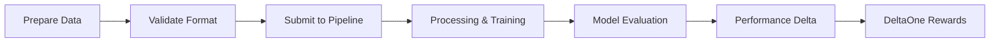

# Supplying Data to Hokusai

This guide explains how to supply data to Hokusai models and earn DeltaOne rewards through our decentralized data contribution system.

## Overview

Hokusai creates a marketplace where data suppliers contribute high-quality datasets to improve AI models. When your data leads to measurable performance improvements, you earn DeltaOne tokens through our unique reward system.

### How It Works



## Hokusai Support Program

For qualified data suppliers, Hokusai offers comprehensive support services to ensure successful data contribution:

- **Data Preparation**: Assistance with data formatting, cleaning, and optimization
- **Privacy Compliance**: Verification of data anonymization and privacy standards
- **Performance Assessment**: Evaluation of data quality and potential impact
- **Technical Integration**: Support with SDK implementation and testing
- **Wallet Setup**: Help with blockchain wallet configuration
- **Reward Optimization**: Guidance on maximizing DeltaOne earnings

### Qualification Criteria
- Significant datasets that meet our privacy and quality standards
- Data that can demonstrably improve model performance
- Commitment to ongoing data contribution

[Contact our team](https://hokus.ai/contact-us/) to discuss your dataset and learn more about our support program.

## Prerequisites

Before you begin, ensure you have:

1. **Ethereum wallet address** for reward attribution
2. **Python 3.8+** installed on your system
3. **Data** that meets our quality and privacy standards
4. **10GB free disk space** for pipeline processing

## Installation Options

### Option 1: Hokusai SDK (Recommended for Most Users)

```bash
pip install hokusai-sdk
```

### Option 2: Full Pipeline Installation (For Advanced Users)

```bash
# Clone the pipeline repository
git clone https://github.com/hokusai/hokusai-data-pipeline.git
cd hokusai-data-pipeline

# Set up environment
python -m venv venv
source venv/bin/activate  # On Windows: venv\Scripts\activate

# Install dependencies
./setup.sh
```

## Supported Data Types

### 1. Query-Document Pairs
Most common format for information retrieval models:

```csv
query_id,query,relevant_doc_id,label
q001,"What is machine learning?",doc123,1
q002,"How to train a model?",doc456,1
q003,"Python programming basics",doc789,0
```

### 2. Classification Data
For classification model improvements:

```json
{
  "samples": [
    {
      "id": "sample_001",
      "text": "This product is amazing!",
      "label": "positive",
      "confidence": 0.95
    }
  ]
}
```

### 3. Structured Datasets
For complex model training (Parquet format):
- Features array
- Labels
- Metadata
- Contributor ID

## Data Quality Requirements

### Minimum Requirements

| Requirement | Value | Description |
|------------|-------|-------------|
| **Size** | ≥ 100 samples | Minimum dataset size |
| **Completeness** | > 95% | Non-null value percentage |
| **Uniqueness** | > 80% | Unique sample percentage |
| **Format** | Valid CSV/JSON/Parquet | Proper file encoding |
| **Schema** | 100% compliance | Matches expected structure |

### Privacy Compliance

The pipeline automatically handles privacy:
- **PII Detection**: Automatic scanning for personal information
- **Data Hashing**: Sensitive identifiers are hashed
- **Anonymization**: Direct identifiers removed
- **Audit Trail**: Privacy actions logged

## Step-by-Step Guide

### Step 1: Prepare Your Data

Each model has specific format requirements. To find the exact requirements:

1. Select your target model on the platform
2. Navigate to the "Submit Data" tab
3. Review format specifications and validation rules
4. Note required metadata fields

Example data preparation:

```python
import pandas as pd

# Create your dataset
data = pd.DataFrame({
    'query_id': ['custom_001', 'custom_002', 'custom_003'],
    'query': [
        'How to use Hokusai pipeline?',
        'What is machine learning?',
        'Best pizza recipe'
    ],
    'document_id': ['doc_hokusai', 'doc_ml', 'doc_pizza'],
    'relevance': [1, 1, 0]
})

# Save to CSV
data.to_csv('my_contribution.csv', index=False)
```

### Step 2: Add Contributor Information

Create a manifest file with your wallet address:

```json
{
  "contributor_id": "your_unique_id",
  "wallet_address": "0x742d35Cc6634C0532925a3b844Bc9e7595f62341",
  "data_description": "Technology documentation queries",
  "data_source": "Manual curation",
  "license": "CC-BY-4.0"
}
```

### Step 3: Validate Your Data

#### Using the SDK:

```python
from hokusai import HokusaiClient

client = HokusaiClient(
    api_key='your_api_key',
    wallet_address='your_wallet_address'
)

# Validate data
validation_result = client.validate_data(
    data_path='my_contribution.csv',
    model_id='target_model_id'
)

print(f"Validation status: {validation_result.status}")
print(f"Quality score: {validation_result.quality_score}")
```

#### Using the Pipeline:

```bash
python -m src.utils.validate_contribution \
    --data=my_contribution.csv \
    --manifest=manifest.json
```

### Step 4: Submit Your Data

#### Using the SDK:

```python
# Submit to specific model
result = client.submit_data(
    model_id='target_model_id',
    data_path='my_contribution.csv'
)

print(f"Submission ID: {result.submission_id}")
print(f"Status: {result.status}")
```

#### Using the Pipeline:

```bash
python -m src.pipeline.hokusai_pipeline run \
    --contributed-data=my_contribution.csv \
    --contributor-manifest=manifest.json \
    --output-dir=./outputs
```

### Step 5: Monitor Performance

Track your contribution's impact:

```python
# Check submission status
status = client.get_submission_status(result.submission_id)
print(f"Processing status: {status.status}")
print(f"Validation results: {status.validation_results}")

# Monitor model improvement
improvement = client.get_model_improvement(
    model_id='target_model_id',
    submission_id=result.submission_id
)
print(f"Performance delta: {improvement.percentage}%")
print(f"DeltaOne tokens earned: {improvement.delta_ones}")
```

### Step 6: Receive Rewards

DeltaOne rewards are automatically calculated based on:

1. **Performance Impact**: Degree of model improvement (1 DeltaOne = 1% improvement)
2. **Data Quality**: Higher quality data receives better rewards
3. **Data Volume**: Number of useful samples contributed
4. **Uniqueness**: Novel data that adds new capabilities

Track your rewards:

```python
# Check rewards
rewards = client.get_rewards()
print(f"Total DeltaOnes earned: {rewards.total}")
print(f"Recent rewards: {rewards.recent}")
print(f"Pending rewards: {rewards.pending}")
```

## Advanced Features

### Multi-Contributor Datasets

For collaborative contributions:

```json
{
  "contributors": [
    {
      "id": "alice",
      "wallet_address": "0xAlice...",
      "weight": 0.6
    },
    {
      "id": "bob", 
      "wallet_address": "0xBob...",
      "weight": 0.4
    }
  ]
}
```

### Incremental Contributions

Submit data in batches:

```bash
# First batch
python -m src.pipeline.hokusai_pipeline run \
    --contributed-data=batch1.csv \
    --incremental-mode=true

# Additional batch
python -m src.pipeline.hokusai_pipeline run \
    --contributed-data=batch2.csv \
    --incremental-mode=true \
    --previous-run-id=run_123
```

### Dry-Run Testing

Test your contribution without affecting models:

```bash
python -m src.pipeline.hokusai_pipeline run \
    --dry-run \
    --contributed-data=test_data.csv \
    --output-dir=./test_outputs
```

## Best Practices

### Data Quality
- **Clean thoroughly**: Remove duplicates and errors
- **Balance labels**: Avoid skewed distributions  
- **Include diversity**: Cover edge cases and variations
- **Document sources**: Track data provenance

### Privacy & Security
- **Remove all PII**: No personal information
- **Hash identifiers**: Use SHA-256 for any IDs
- **Verify rights**: Ensure you can share the data
- **Secure storage**: Encrypt sensitive datasets

### Optimization Tips
- **Start small**: Test with 100-1000 samples first
- **Validate early**: Check format before large submissions
- **Monitor metrics**: Track quality scores
- **Iterate**: Refine based on performance feedback

## Troubleshooting

### Common Issues

**Validation Failures**
```
Error: Column 'query_id' not found
```
Solution: Ensure your data matches the expected schema exactly

**Data Quality Issues**
```
Warning: Data quality score 0.65 below threshold 0.80
```
Solution: Review data for duplicates, missing values, or formatting issues

**Wallet Address Invalid**
```
Error: Invalid Ethereum address format
```
Solution: Verify address starts with '0x' and has 40 hex characters

**Submission Errors**
- Check API key validity
- Verify wallet connection
- Review error logs
- Contact support if persistent

## Configuration Reference

Key environment variables for the pipeline:

```bash
# Core settings
HOKUSAI_TEST_MODE=false
PIPELINE_LOG_LEVEL=INFO

# Data processing
ENABLE_PII_DETECTION=true
DATA_VALIDATION_STRICT=false
MAX_SAMPLE_SIZE=100000

# Performance
PARALLEL_WORKERS=8
BATCH_SIZE=1000
```

See [Configuration Guide](configuration.md) for complete reference.

## Next Steps

- Learn about [Data Validation Tools](data-validation-tools.md)
- Understand [Privacy Compliance](privacy-compliance.md)
- Review [Reward Mechanisms](tokenomics/rewards.md)
- Explore [Architecture Overview](core-workflows/architecture.md)

For additional support, contact our [Support Team](https://hokus.ai/contact-us/) or join our [Community Forum](https://community.hokus.ai).