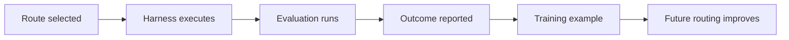

# Evaluations and Feedback

Evaluations are the source of learning for the Technical Task Router. They turn a completed task into evidence about whether a route worked.

## What to Measure

Use evaluation signals that reflect your harness's real success criteria:

- Task acceptance
- Test pass rate
- Static analysis results
- Human review outcome
- Regression detection
- Cost
- Latency
- Retry count
- Whether the task stayed within budget

The router does not require every harness to use the same scoring system. It needs enough consistent outcome data to compare route quality for similar tasks.

## Evaluation Envelope

The evaluation envelope is the set of constraints and checks used to judge a route. For example:

```json
{
  "requiredChecks": ["unit_tests", "lint", "review"],
  "acceptancePolicy": "human_accepts_patch",
  "maxCostUsd": 25,
  "maxWallClockMinutes": 20,
  "regressionPolicy": "block_on_auth_regression"
}
```

The same route may be acceptable under one envelope and unacceptable under another. Include evaluation details when you request a route and when you report an outcome.

## Feedback Loop



Successful routes teach the router what works. Failed routes teach it what to avoid. Budget misses, flaky retries, reviewer misses, and post-merge regressions are all useful signals.

## Comparing Against a Baseline

When evaluating an integration, compare Hokusai-selected routes against your current routing policy:

| Metric | Baseline policy | Hokusai route |
| --- | --- | --- |
| Acceptance rate | Current harness behavior | Routed decisions |
| Average cost | Current model selection | Selected route cost |
| Wall clock | Current workflow | Routed workflow |
| Regression rate | Existing review process | Selected reviewer route |
| Retry count | Existing fallback behavior | Routed fallback behavior |

This makes routing lift measurable instead of anecdotal.
