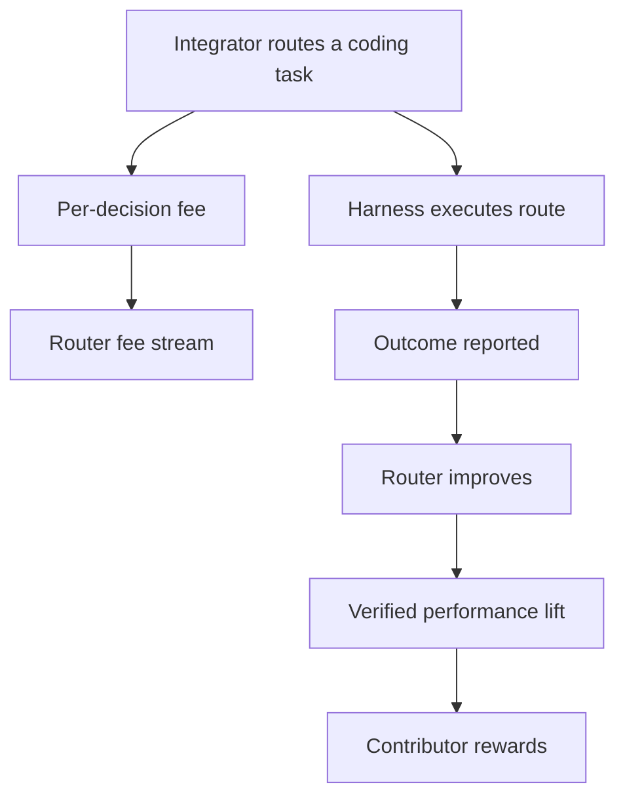

# Rewards and Fee Flow

Hokusai's token mechanics exist to connect useful AI decision-layer improvements with contributor ownership.

For the Technical Task Router, the primary economic loop is:

## What the Token Represents

The router token represents a stake in the shared routing layer. It is not a claim that every submitted task or every outcome report creates value. Rewards depend on measurable improvement to future routing behavior.

## How Value Is Created

Value can come from two sources:

- **Usage**: routing calls pay per-decision fees.
- **Improvement**: outcome data and model updates make future routes more successful, cheaper, faster, or more reliable.

For coding tasks, useful improvement signals include acceptance rate, test pass rate, reviewer accuracy, cost-adjusted success, latency, retry rate, and regression detection.

## How Rewards Are Earned

Contributors can earn rewards when their contributions create verified performance lift. In router contexts, contribution data can include task packets, route outcomes, evaluation results, and feedback that improves the choice layer.

See [Routing Rewards](/contributor-rewards/routing-rewards) for the router-specific reward model.

## Where Protocol Details Live

The docs still include detailed mechanics for AMMs, bonding curves, DeltaOne calculations, fee routing, and smart contracts. Those pages are implementation references, not the primary onboarding path for router integrators.

- [Usage Fee Routing](/smart-contracts/usage-fee-routing)
- [Token Flow](/smart-contracts/token-flow)
- [DeltaOne Calculations](/tokenomics/deltaone-calculations)
- [AMM Overview](/tokenomics/amm-overview)
- [Bonding Curve](/tokenomics/bonding-curve)

:::caution
This documentation is technical and informational. It is not financial, investment, or legal advice.
:::
