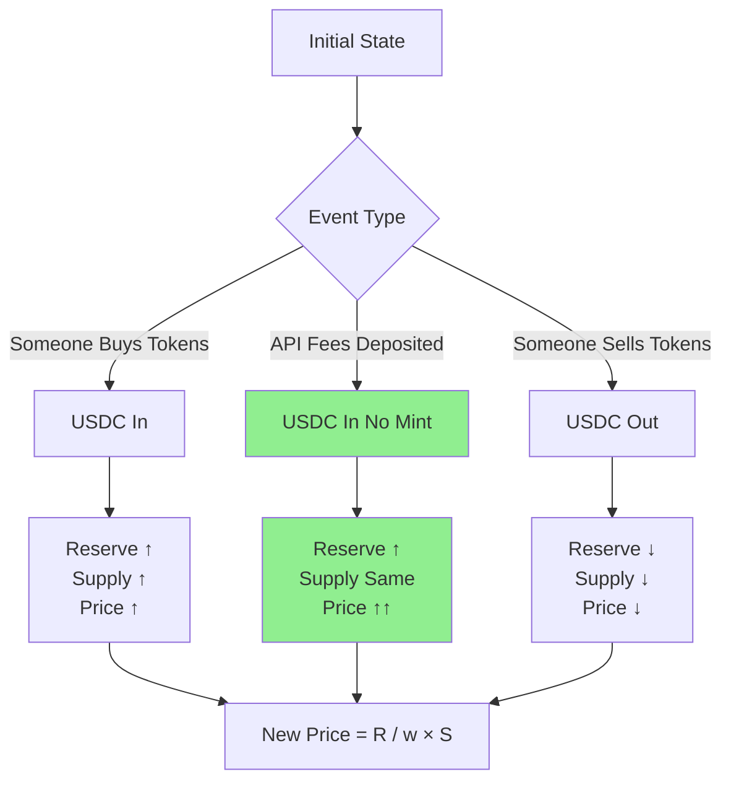

# Automated Market Maker (AMM) Overview

:::info INFORMATIONAL ONLY
This documentation explains the technical mechanics of the Hokusai AMM system. **It is not investment advice.** Trading tokens involves significant risk of loss. See the [Investor Guide](/guides/investor-guide) for complete risk disclosures.
:::

The Hokusai AMM is a **Constant Reserve Ratio (CRR) bonding curve** that enables continuous buying and selling of model tokens using USDC. Each model has its own dedicated AMM pool, providing predictable pricing and always-available liquidity.

## What is the Hokusai AMM?

The Hokusai AMM is an automated market maker built into every model token. It allows:

- **Buying tokens** with USDC at a mathematically determined price
- **Selling tokens** back to USDC under the active AMM pricing regime
- **API revenue integration** that increases USDC reserves, supporting token value
- **Predictable pricing** based on supply and reserve dynamics

### Key Benefits

| For Token Holders | For Model Contributors | For Investors |
|-------------------|------------------------|---------------|
| Always-available liquidity | Tokens have real market value | Transparent pricing |
| No need for order books | Can sell rewards for USDC | Continuous price discovery |
| API fees increase value | Flexibility in compensation | Participate in IBR or post-handoff trading |
| Deterministic pricing | Lower transaction costs | Support promising models |

## Why CRR Instead of Other AMMs?

The Hokusai protocol uses a **Constant Reserve Ratio (CRR)** bonding curve rather than traditional AMM models like Uniswap's Constant Product formula. Here's why:

### Comparison with Other AMM Types

| Feature | Hokusai CRR | Uniswap (x*y=k) | Order Book |
|---------|-------------|-----------------|------------|
| **Liquidity** | Always available | Requires LPs | Requires orders |
| **Price Discovery** | Deterministic formula | Supply/demand | Bid/ask spread |
| **Slippage** | Predictable | Variable | Depends on depth |
| **LP Needed?** | No | Yes | No |
| **Impermanent Loss** | None (single-sided) | Yes (two-sided) | N/A |
| **API Fee Integration** | Direct to reserves | Goes to LPs | N/A |

### CRR Advantages

1. **Single-Sided Liquidity**: Only USDC reserves needed, no token-USDC pairs
2. **Predictable Pricing**: Mathematical formula makes prices deterministic
3. **API Revenue Integration**: Fees directly increase reserve backing
4. **No Impermanent Loss**: Single-asset model eliminates IL risk
5. **Always Available**: No need to bootstrap liquidity providers

## How It Works: Before vs After AMM

### Before: Burn-Only Model

```
[Earn Tokens] → [Hold] → [Burn for API Access]
     ↓
  No Exit
```

- ✅ Tokens earned for performance improvements
- ❌ No way to sell tokens
- ❌ No market price discovery
- ❌ API fees just collected, didn't affect token value

### After: CRR AMM Model

```
[Earn Tokens] → [Hold] ←→ [Buy/Sell on AMM] ←→ [USDC]
     ↓             ↓            ↓
  Burn for     Liquidity   API Fees → Reserve ↑ → Price ↑
   Access
```

- ✅ Tokens earned for performance improvements
- ✅ Can sell tokens for USDC according to the AMM's current pricing regime
- ✅ Market price based on reserves and supply
- ✅ API fees increase reserves, raising token floor price

## CRR Bonding Curve Mechanics

The AMM uses a Constant Reserve Ratio (CRR) formula where the ratio between USDC reserves and token market cap remains constant.

### Visual: How Reserves Impact Price



**Key Insight**: API fee deposits increase reserves WITHOUT minting tokens, creating stronger price appreciation than buy orders.

### Numerical Example: Reserve Impact

| Event | USDC Reserve | Token Supply | Spot Price | Change |
|-------|--------------|--------------|------------|--------|
| **Initial** | $10,000 | 10,000 | $0.333 | - |
| After $1,000 buy | $11,000 | 11,000 | $0.333 | +0% |
| After $1,000 fee deposit | $11,000 | 10,000 | $0.367 | +10% |

**Why the difference?**
- **Buy order**: Both R and S increase proportionally, price stays similar
- **Fee deposit**: Only R increases, price rises significantly

### Core Formula

```
Constant: k = R^w × S

Where:
  R = USDC reserve balance
  S = Token supply
  w = Constant Reserve Ratio (CRR)
  k = Invariant constant
```

### Buy Formula

When you buy tokens by depositing USDC:

```
T = S × ((1 + E/R)^w - 1)

Where:
  T = Tokens minted
  S = Current supply before purchase
  R = Current reserve before purchase
  E = USDC deposited
  w = CRR (typically 10-30%)
```

**Example**: Buying with 1,000 USDC when R=100,000, S=1,000,000, w=0.2:
```
T = 1,000,000 × ((1 + 1,000/100,000)^0.2 - 1)
T = 1,000,000 × ((1.01)^0.2 - 1)
T = 1,000,000 × (1.00199 - 1)
T ≈ 1,990 tokens
```

### Sell Formula

When you sell tokens back for USDC:

```
F = R × (1 - (1 - T/S)^(1/w))

Where:
  F = USDC returned
  T = Tokens burned
  S = Current supply before sale
  R = Current reserve before sale
  w = CRR
```

**Example**: Selling 1,990 tokens when R=101,000, S=1,001,990, w=0.2:
```
F = 101,000 × (1 - (1 - 1,990/1,001,990)^(1/0.2))
F = 101,000 × (1 - (0.998013)^5)
F ≈ 995 USDC (after fees)
```

### Spot Price

The current price per token at any moment:

```
P = R / (w × S)

Where:
  P = Spot price (USDC per token)
  R = Current reserve
  S = Current supply
  w = CRR
```

**Example**: When R=100,000, S=1,000,000, w=0.2:
```
P = 100,000 / (0.2 × 1,000,000)
P = 100,000 / 200,000
P = 0.5 USDC per token
```

## Initial Bonding Ratio (IBR) Phase

Every new model token starts on a flat launch curve before CRR pricing takes over.

```
Launch: IBR starts at $0.01/token
During IBR: Reserves build toward $25,000 USDC
Handoff: IBR ends when reserves hit $25,000 or 7 days elapse
After handoff: Standard CRR bonding curve pricing
```

### Why IBR exists

The launch phase:
- ✅ Gives the AMM a clear starting price of $0.01/token
- ✅ Builds initial USDC reserve depth
- ✅ Makes the handoff rule explicit: $25,000 reserve or 7-day cap
- ✅ Transitions to CRR pricing only after initial bootstrap conditions are met

Learn more: [IBR Phase Guide](/tokenomics/launch-period)

## API Fee Integration

A key innovation of the Hokusai AMM is how API usage fees increase token value:

```
[Model Usage] → [API Fees Collected]
       ↓
[Convert to USDC] → [depositFees() to AMM]
       ↓
[Reserve Increases] → [Spot Price Increases]
       ↓
[Token Holders Benefit]
```

### How Fees Affect Price

When API fees are deposited:
- Reserve (R) increases
- Supply (S) stays constant
- Spot price P = R / (w × S) increases proportionally

**Example**: Reserve increases by 10%:
```
Before: P = 100,000 / (0.2 × 1,000,000) = 0.5 USDC
After:  P = 110,000 / (0.2 × 1,000,000) = 0.55 USDC
Result: +10% price increase
```

Learn more: [API Fee Flow](/tokenomics/api-fee-flow)

## Fee Structure

The system has two separate fee mechanisms - don't confuse them:

### 1. AMM Trading Fees (when buying/selling tokens on AMM)

**Trade Fees:**
- **Default**: 0.30% per trade
- **Maximum**: 10% (governance-controlled)
- **Applied to**: Both buys and sells on the AMM
- **Purpose**: AMM sustainability

**Protocol Fees:**
- **Default**: 5% of trade fees
- **Maximum**: 50% of trade fees (governance-controlled)
- **Applied to**: Portion of trade fees only
- **Purpose**: Treasury funding, future governance incentives

**Example AMM Trade**:
```
Buy: 1,000 USDC
Trade Fee (0.30%): 3.00 USDC
Protocol Fee (5% of 3.00): 0.15 USDC
Net Deposited to Reserve: 997.00 USDC
Tokens Received: ~1,984 (calculated from buy formula)
```

### AMM Launch Defaults

| Parameter | Default |
|-----------|---------|
| CRR | 20% (`200,000 ppm`) |
| Trade fee | 0.30% (`30 bps`) |
| Max IBR duration | 7 days |
| Flat-curve threshold | $25,000 USDC |
| Flat-curve price | $0.01 per token |

### 2. API Usage Fees (when using model API)

Separate from AMM trading fees, routed by `UsageFeeRouter` based on per-model parameters:

- **Infrastructure Accrual (50-100%)**: Sent to `InfrastructureReserve` contract, covers compute costs
- **Profit Share (0-50%, residual)**: Deposited to AMM Reserve, increases token backing and price

Each model has its own `infrastructureAccrualBps` parameter in `HokusaiParams` that determines the split. Governance can adjust this rate as actual costs become clearer. Token holders benefit from genuine profit after infrastructure costs.

See [API Fee Flow](/tokenomics/api-fee-flow) for complete details.

## Security Features

The HokusaiAMM contract includes comprehensive security measures:

### Slippage Protection
```solidity
function buy(uint256 minTokens, uint256 deadline) external payable {
    require(tokensReceived >= minTokens, "Slippage too high");
    require(block.timestamp <= deadline, "Transaction expired");
    // ...
}
```

Protects against:
- ✅ Price movement during transaction
- ✅ Front-running attacks
- ✅ Stale transactions

### Reentrancy Guards
All state-changing functions use OpenZeppelin's `nonReentrant` modifier to prevent reentrancy attacks.

### Emergency Pause
Contract owner can pause trading in emergency situations while preserving user funds.

### Parameter Bounds
- CRR (w): 5% to 50%
- Trade Fee: 0% to 10%
- Protocol Fee: 0% to 50%

All parameters are governance-controlled with strict bounds.

## User Personas and AMM

### Data Suppliers
- **Earn**: Tokens for improving model performance
- **Option 1**: Hold tokens for long-term value
- **Option 2**: Sell tokens on AMM for immediate USDC
- **Benefit**: Flexible compensation choices

### Model Developers
- **Launch**: Deploy token with AMM
- **Benefit**: Automatic liquidity for contributors
- **Control**: Set initial parameters and IBR configuration
- **Growth**: API fees increase token value automatically

### Investors
- **Participate**: During the IBR phase or after CRR handoff
- **Buy**: Tokens at current bonding curve price
- **Support**: Promising models with initial capital
- **Exit**: Sell according to the active AMM pricing regime

Learn more: [Investor Guide](/guides/investor-guide)

## Getting Started

### For Buyers
1. Acquire USDC in your wallet
2. Navigate to the model's AMM page
3. Get a quote: How many tokens for X USDC?
4. Set slippage tolerance (e.g., 1%)
5. Execute buy transaction

[Complete Buy Guide →](/guides/buying-tokens)

### For Sellers
1. Check whether the AMM is still in IBR or has handed off to CRR pricing
2. Get a quote: How much USDC for Y tokens?
3. Approve token spending
4. Set slippage tolerance
5. Execute sell transaction

[Complete Sell Guide →](/guides/selling-tokens)

## Technical Resources

### Smart Contracts
- **HokusaiAMM**: Core AMM implementation with buy/sell/depositFees
- **HokusaiAMMFactory**: Deploys new AMM pools for models
- **UsageFeeRouter**: Routes API fees to AMM reserves

[Contract Reference →](/smart-contracts/hokusai-amm)

### Formulas
- **Bonding Curve Math**: [Detailed Formulas](/tokenomics/bonding-curve)
- **Price Impact**: [DeltaOne Calculations](/tokenomics/deltaone-calculations)
- **Token Flow**: [Token Lifecycle](/smart-contracts/token-flow)

## FAQ

### Q: Can I lose money buying tokens?

Yes. Token prices can go down if:
- Model usage decreases (fewer API fees)
- More tokens are minted (supply increases)
- Sellers exceed buyers

### Q: What's the difference between "buying" and "minting"?

- **Minting**: Creating new tokens as rewards for performance improvements (supply ↑)
- **Buying**: Exchanging USDC for existing tokens via AMM (supply ↑, reserve ↑)

### Q: Is the first week a sell lock?

No. The launch phase is the **Initial Bonding Ratio (IBR)** window: flat pricing at **$0.01/token** until reserves reach **$25,000 USDC** or **7 days** elapse, then the AMM hands off to CRR pricing.

### Q: What happens to API fees?

API fees are converted to USDC and deposited into the AMM reserve using `depositFees()`. This increases the reserve without minting tokens, raising the spot price.

### Q: Who controls the AMM parameters?

Initially the model owner, later potentially transitioned to token holder governance.

### Q: Is there a minimum or maximum trade size?

Yes, to prevent manipulation. Exact limits are set per model and governance-controlled.

## Next Steps

- **Understand Formulas**: [Bonding Curve Mathematics](/tokenomics/bonding-curve)
- **Launch Phase**: [Initial Bonding Ratio (IBR)](/tokenomics/launch-period)
- **API Revenue**: [How Fees Increase Value](/tokenomics/api-fee-flow)
- **Start Trading**: [Buy Tokens Guide](/guides/buying-tokens)
- **Technical Deep Dive**: [HokusaiAMM Contract](/smart-contracts/hokusai-amm)

For additional support, contact our [Support Team](https://hokus.ai/contact-us/) or join our [Community Forum](https://community.hokus.ai).
