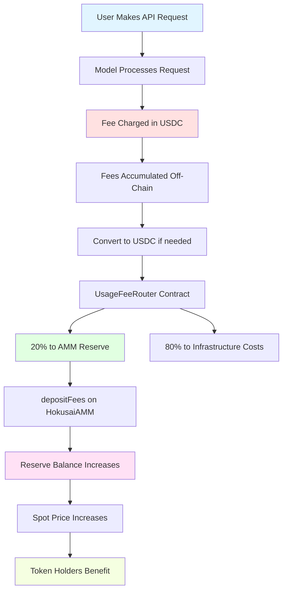

# API Fee Flow

One of the most important value accrual mechanisms in the Hokusai protocol is how API usage fees flow into the AMM's USDC reserve pool. This document explains how model usage generates revenue, how fees are collected and deposited, and how this increases token value for holders.

## Overview

### The Value Loop



**Key Insight**: API fees increase the USDC reserve **without minting new tokens**, which raises the spot price proportionally.

## How It Works

### Step 1: Model Usage

When someone uses a model via the API:

```
User Request:
POST /api/v1/models/{modelId}/infer
{
  "input": "Translate this text to Spanish",
  "parameters": {...}
}

Model Response:
{
  "output": "Traducir este texto al español",
  "usage": {
    "input_tokens": 8,
    "output_tokens": 7,
    "total_cost_usdc": 0.0015
  }
}
```

### Step 2: Fee Collection

The API service tracks usage and collects fees:

**Pricing Model** (example):
```
Base Cost per Request: $0.001
+ Input Tokens: $0.0001 per 1k tokens
+ Output Tokens: $0.0001 per 1k tokens
= Total Cost: $0.0015 USDC
```

**Fee Collection**:
```javascript
// Off-chain tracking
const usage = {
    modelId: "model-123",
    requests: 1000,
    totalCost: 1.50, // USDC
    timestamp: Date.now()
};

// Accumulated fees stored off-chain
await db.accumulateFees(usage);
```

### Step 3: Fee Aggregation

Fees are accumulated over a period (e.g., hourly, daily):

**Example Daily Accumulation**:
```
Model X - Day 15:
- API Requests: 10,000
- Total Revenue: $150 USDC
- Fee Distribution:
  - 80% to Infrastructure: $120
  - 20% to AMM Reserve: $30
```

### Step 4: USDC Acquisition

Fees collected in various forms are converted to USDC:

```javascript
// If fees collected in other tokens
if (feeToken !== USDC) {
    // Swap to USDC via DEX
    const usdcAmount = await swapToUSDC(feeToken, feeAmount);
}

// Now we have USDC ready to deposit
const totalUSDC = 120; // $120 USDC
```

### Step 5: Deposit to AMM

The `UsageFeeRouter` contract deposits USDC to the AMM:

```solidity
// UsageFeeRouter.sol
function depositFeesToAMM(bytes32 modelId, uint256 amount) external onlyAuthorized {
    // Get AMM for this model
    address ammAddress = registry.getAMM(modelId);
    HokusaiAMM amm = HokusaiAMM(ammAddress);

    // Approve USDC
    usdc.approve(ammAddress, amount);

    // Deposit fees (no token minting!)
    amm.depositFees(amount);

    emit FeesDeposited(modelId, amount, block.timestamp);
}
```

**HokusaiAMM receives the deposit**:
```solidity
// HokusaiAMM.sol
function depositFees(uint256 amount) external onlyFeeDepositor nonReentrant {
    require(amount > 0, "Amount must be > 0");

    // Transfer USDC to contract
    reserveToken.transferFrom(msg.sender, address(this), amount);

    // Reserve increases (R ↑)
    // Supply stays same (S unchanged)
    // Price increases: P = R / (w × S)

    emit FeesDeposited(msg.sender, amount, getReserve());
}
```

### Step 6: Price Impact

The spot price automatically increases:

**Before Fee Deposit**:
```
Reserve (R): 100,000 USDC
Supply (S): 1,000,000 tokens
CRR (w): 0.2 (20%)
Spot Price: P = 100,000 / (0.2 × 1,000,000) = 0.5 USDC/token
Market Cap: 0.5 × 1,000,000 = 500,000 USDC
```

**After Depositing $10,000 USDC**:
```
Reserve (R): 110,000 USDC (+10%)
Supply (S): 1,000,000 tokens (unchanged)
CRR (w): 0.2 (20%)
Spot Price: P = 110,000 / (0.2 × 1,000,000) = 0.55 USDC/token (+10%)
Market Cap: 0.55 × 1,000,000 = 550,000 USDC (+10%)
```

**Key Takeaway**: A 10% reserve increase = 10% price increase (when supply is constant).

## Fee Distribution

### Allocation Breakdown

The `UsageFeeRouter` contract splits API usage fees between two destinations:

**Standard Fee Split**:

```
100% API Revenue ($1,000 daily)
├── 80% to Infrastructure ($800)
│   └── Covers compute, hosting, and operational costs (AWS, servers, etc.)
└── 20% to AMM Reserve ($200)
    └── Increases token backing and price (no new tokens minted)
```

**Key Point**: This is the ONLY automated fee routing in the system. The 20% flowing to the AMM reserve directly increases token value by raising the USDC backing without minting new tokens. There are no staking fees, governance fees, or other automated fee mechanisms beyond this two-way split.

### Fee Distribution Contract

The `UsageFeeRouter` performs a simple two-way split:

```solidity
contract UsageFeeRouter {
    uint256 public constant PRECISION = 10000;

    uint256 public ammAllocation = 2000;          // 20% to AMM reserve
    uint256 public infrastructureAllocation = 8000; // 80% to infrastructure

    function distributeFees(
        bytes32 modelId,
        uint256 totalAmount
    ) external onlyCollector {
        // Calculate splits
        uint256 toAMM = (totalAmount * ammAllocation) / PRECISION;
        uint256 toInfrastructure = (totalAmount * infrastructureAllocation) / PRECISION;

        // Deposit to AMM reserve (increases token price)
        _depositToAMM(modelId, toAMM);

        // Send to infrastructure fund (covers operational costs)
        usdc.transfer(infrastructureFund, toInfrastructure);

        emit FeesDistributed(modelId, toAMM, toInfrastructure);
    }
}
```

**What this contract does:**
- Routes 20% of API fees to the AMM reserve to increase token backing
- Routes 80% of API fees to cover direct infrastructure costs (compute, hosting, bandwidth)

**What this contract does NOT do:**
- Does NOT distribute fees to stakers (no staking mechanism exists)
- Does NOT distribute fees for governance (separate mechanism)
- Does NOT create multiple fee streams beyond these two destinations

## Revenue Examples

### Example 1: Growing Model

**Model Performance**:
```
Month 1:
- API Calls: 100,000
- Revenue: $1,000
- To Reserve (20%): $200
- Reserve: $10,000 → $10,200 (+2%)
- Price: $0.05 → $0.051 (+2%)

Month 2:
- API Calls: 250,000 (+150%)
- Revenue: $2,500 (+150%)
- To Reserve (20%): $500
- Reserve: $10,200 → $10,700 (+4.9%)
- Price: $0.051 → $0.0535 (+4.9%)

Month 3:
- API Calls: 500,000 (+100%)
- Revenue: $5,000 (+100%)
- To Reserve (20%): $1,000
- Reserve: $10,700 → $11,700 (+9.3%)
- Price: $0.0535 → $0.0585 (+9.3%)

Quarter Total:
- Revenue: $8,500
- To Reserve: $1,700 (20%)
- Reserve Growth: +17%
- Price Growth: +17%
```

**Observation**: Consistent API usage drives steady price appreciation.

### Example 2: Viral Model

**Sudden Spike**:
```
Day 1-30: Steady
- API Calls: 10k/day
- Revenue: $100/day × 30 days = $3,000
- To Reserve (20%): $600
- Reserve: $50k → $50.6k (+1.2%)

Day 31: Goes Viral
- API Calls: 500k (50x spike!)
- Revenue: $5,000
- To Reserve (20%): $1,000
- Reserve: $50.6k → $51.6k (+2%)

Day 32-60: High Usage
- API Calls: 100k/day × 29 days = $29,000
- To Reserve (20%): $5,800
- Reserve: $51.6k → $57.4k (+11.2%)

Result:
- Reserve: $50k → $57.4k (+14.8%)
- Price: $0.25 → $0.287 (+14.8%)
```

**Observation**: Viral moments can rapidly increase token value.

### Example 3: Mature Model

**Steady State**:
```
Established Model (Month 12+):
- API Calls: 1M/month
- Revenue: $10k/month
- To Reserve (20%): $2k/month
- Reserve: $200k → $202k/month (+1%)
- Price: $1.00 → $1.01/month (+1%)

Annual Projection:
- Revenue: $120k/year
- To Reserve: $24k/year (20%)
- Reserve Growth: +12%
- Price Growth: +12%
- APY for holders: ~12% (from fees alone)
```

**Observation**: Mature models provide predictable returns.

## Impact on Token Holders

### For Long-Term Holders

**Scenario**: Hold 10,000 tokens through fee deposits

```
Initial State:
- Token Holdings: 10,000
- Price: $0.50
- Value: $5,000

After 6 Months of API Fees:
- Token Holdings: 10,000 (unchanged)
- Price: $0.75 (+50% from fees)
- Value: $7,500 (+50%)

Gain: $2,500 from API fees alone
No dilution (supply unchanged)
```

**Key Benefit**: Passive value appreciation without active trading.

### Combined with Minting

**Complete Picture** includes both fee deposits AND token minting:

```
Starting Point:
- Reserve: $100k
- Supply: 1M tokens
- Price: $0.50

Scenario A: Only Fee Deposits (6 months)
- Reserve: $100k → $150k (+50%)
- Supply: 1M (unchanged)
- Price: $0.50 → $0.75 (+50%)

Scenario B: Only Token Minting (6 months)
- Reserve: $100k (unchanged)
- Supply: 1M → 1.2M (+20% from rewards)
- Price: $0.50 → $0.417 (-16.7%)

Scenario C: Both (Reality)
- Reserve: $100k → $150k (+50%)
- Supply: 1M → 1.2M (+20%)
- Price: $0.50 → $0.625 (+25%)

Net Effect: +25% price increase
= +50% from fees
- 16.7% from dilution
```

**Key Insight**: API fees offset minting dilution and can drive net positive price growth.

## Monitoring Fee Deposits

### On-Chain Events

Listen for `FeesDeposited` events:

```solidity
event FeesDeposited(
    address indexed depositor,
    uint256 amount,
    uint256 newReserve
);
```

**Monitoring Script**:
```javascript
const amm = await ethers.getContractAt("HokusaiAMM", ammAddress);

// Listen for fee deposits
amm.on("FeesDeposited", (depositor, amount, newReserve, event) => {
    console.log(`Fee Deposit Detected!`);
    console.log(`Amount: ${ethers.formatUnits(amount, 6)} USDC`);
    console.log(`New Reserve: ${ethers.formatUnits(newReserve, 6)} USDC`);
    console.log(`Block: ${event.blockNumber}`);
    console.log(`Tx: ${event.transactionHash}`);

    // Calculate new price
    const supply = await amm.getTotalSupply();
    const newPrice = await amm.spotPrice();
    console.log(`New Price: ${ethers.formatUnits(newPrice, 18)} USDC`);
});
```

### Reserve Growth Tracking

**Calculate reserve growth rate**:
```javascript
async function getReserveGrowth(ammAddress, blocks = 1000) {
    const amm = await ethers.getContractAt("HokusaiAMM", ammAddress);
    const currentBlock = await ethers.provider.getBlockNumber();
    const pastBlock = currentBlock - blocks;

    // Get current reserve
    const currentReserve = await amm.getReserve();

    // Query past events
    const filter = amm.filters.FeesDeposited();
    const events = await amm.queryFilter(filter, pastBlock, currentBlock);

    // Calculate total fees deposited
    const totalDeposited = events.reduce((sum, event) => {
        return sum + event.args.amount;
    }, 0n);

    // Get reserve at start (approximate)
    const startReserve = currentReserve - totalDeposited;

    // Calculate growth rate
    const growthRate = Number(totalDeposited) / Number(startReserve);
    const blocksPerDay = 7200; // ~12s blocks
    const daysAnalyzed = blocks / blocksPerDay;
    const dailyGrowthRate = growthRate / daysAnalyzed;
    const annualizedRate = dailyGrowthRate * 365;

    return {
        totalDeposited: ethers.formatUnits(totalDeposited, 6),
        growthRate: (growthRate * 100).toFixed(2) + '%',
        annualizedAPY: (annualizedRate * 100).toFixed(2) + '%'
    };
}
```

## Fee Optimization Strategies

### For Model Developers

**Maximize API Revenue**:
```
1. Competitive Pricing
   - Price competitively vs alternatives
   - Offer volume discounts
   - Balance revenue vs adoption

2. Drive Usage
   - Build SDKs and integrations
   - Create compelling use cases
   - Market to developers

3. Improve Performance
   - Better performance = more DeltaOnes
   - More tokens = broader holder base
   - More holders = more advocates

4. Community Building
   - Engage users and contributors
   - Share roadmap and metrics
   - Celebrate milestones
```

### For Token Holders

**Benefit from Fee Deposits**:
```
1. Buy Before Deposits
   - Monitor upcoming fee deposits
   - Buy before large deposits hit
   - Benefit from price increase

2. Hold During Growth
   - Don't sell during launch period
   - Let fees compound
   - Reinvest proceeds

3. Track Metrics
   - Monitor API usage trends
   - Track revenue growth
   - Watch reserve vs supply ratio

4. Dollar-Cost Average
   - Buy regularly during growth
   - Accumulate during dips
   - Long-term perspective
```

## Advanced Topics

### Fee Deposit Frequency

**Batching Strategy**:

```
Option A: Continuous (Hourly)
Pros: Real-time price updates
Cons: High gas costs

Option B: Daily
Pros: Balanced gas vs timeliness
Cons: Delayed price impact

Option C: Weekly
Pros: Lowest gas costs
Cons: Significant delay

Recommended: Daily deposits for active models
```

### Fee Compounding

**Compounding Effect** over time:

```
Year 1:
- Initial Reserve: $100k
- Annual Fees: $120k (+120%)
- End Reserve: $220k
- Price: $0.50 → $1.10 (+120%)

Year 2 (Same fee rate):
- Starting Reserve: $220k
- Annual Fees: $264k (+120% of $220k)
- End Reserve: $484k
- Price: $1.10 → $2.42 (+120%)

Year 3:
- Starting Reserve: $484k
- Annual Fees: $580.8k
- End Reserve: $1,064.8k
- Price: $2.42 → $5.32 (+120%)

Compounding: $100k → $1M+ in 3 years!
```

### Reserve Efficiency

**Reserve Backing Percentage**:

```
Reserve Backing = (Reserve / Market Cap) × 100
                = w (the CRR)

Example:
w = 20%
Reserve = $200k
Market Cap = $200k / 0.20 = $1M
Supply = varies based on price

Higher CRR = More capital efficient
Lower CRR = More price sensitive
```

## FAQ

### Q: How often are fees deposited?

Depends on the model's configuration. Typical patterns:
- High-usage models: Daily
- Medium-usage models: Weekly
- Low-usage models: As accumulated

### Q: Can fee deposits be front-run?

Technically yes, but:
- Deposits are permissioned (only `FEE_DEPOSITOR_ROLE`)
- Timing is not publicly announced
- MEV risk is limited
- Large holders may anticipate and position

### Q: What if no one uses the model?

If API usage is zero:
- No fees collected
- No deposits to reserve
- Price only affected by minting/burning
- Token value depends on performance improvements

### Q: Do fees offset minting dilution?

Yes! Example:
```
Minting: +20% supply = -16.7% price
Fees: +25% reserve = +25% price
Net: +25% - 16.7% = +8.3% price increase
```

### Q: Can model developers change fee allocation?

Potentially, depending on governance model:
- Some models: Developer-controlled
- Others: Token holder governance
- Check specific model's governance docs

### Q: What prevents developers from not depositing fees?

```
Transparency:
- On-chain fee deposits are public
- Community monitors deposits
- Reputation at stake

Incentives:
- Developers often hold tokens
- Want token price to increase
- Aligned interests with holders

Governance:
- Token holders can vote
- May change fee depositor
- Enforce accountability
```

### Q: How are fees collected off-chain verified?

```
Methods:
1. Public API dashboards showing usage
2. Third-party analytics tracking calls
3. On-chain attestations of usage
4. Community verification

Future:
- Decentralized oracle integration
- Zero-knowledge proofs of usage
- Trustless verification systems
```

## Best Practices

### For Model Developers

```
☐ Deposit fees regularly (weekly minimum)
☐ Be transparent about fee collection
☐ Share API usage metrics publicly
☐ Communicate deposit schedule
☐ Align fee deposits with announcements
```

### For Token Holders

```
☐ Monitor `FeesDeposited` events
☐ Track reserve growth over time
☐ Calculate effective APY from fees
☐ Compare fee generation across models
☐ Factor into investment decisions
```

### For Investors

```
☐ Evaluate API usage potential before investing
☐ Check historical fee deposit consistency
☐ Assess fee allocation percentage
☐ Monitor revenue growth trajectory
☐ Compare to minting rate
```

## Next Steps

- **Understand Minting**: [Token Flow](/smart-contracts/token-flow)
- **AMM Mechanics**: [AMM Overview](/tokenomics/amm-overview)
- **Price Formulas**: [Bonding Curve Math](/tokenomics/bonding-curve)
- **Contract Details**: [HokusaiAMM Contract](/smart-contracts/hokusai-amm)
- **Investment Guide**: [Investor Guide](/guides/investor-guide)

For additional support, contact our [Support Team](https://hokus.ai/contact-us/) or join our [Community Forum](https://community.hokus.ai).
