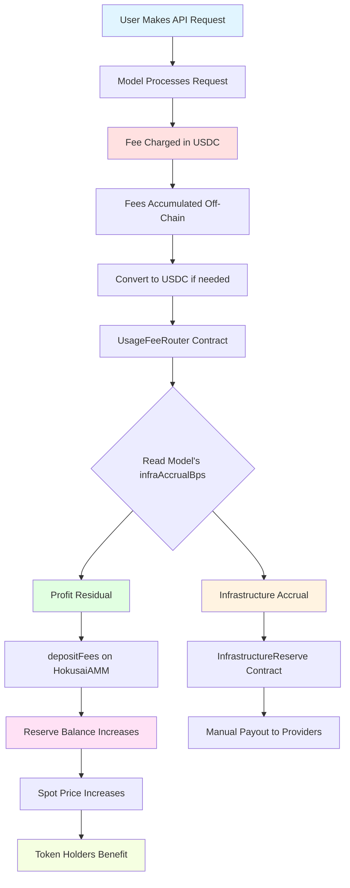

# API Fee Flow

One of the most important value accrual mechanisms in the Hokusai protocol is how API usage fees are split between **infrastructure costs** and **profit share**. This document explains how model usage generates revenue, how fees are routed through the `UsageFeeRouter`, and how the profit portion increases token value for holders.

## Overview

### The Two-Reserve System

The Hokusai protocol uses a **two-reserve system** to ensure infrastructure providers are paid first, with residual profit flowing to token holders:

1. **Infrastructure Reserve** — Accrues expected costs, pays providers (AWS, Together AI, etc.)
2. **Profit Share** — Residual after infrastructure → AMM pool (benefits token holders via price appreciation)

**Key Principle**: Infrastructure is an **obligation** (must be paid first), profit is **residual** (what remains).

### The Value Loop



**Key Insight**: Profit share increases the USDC reserve **without minting new tokens**, which raises the spot price proportionally. Infrastructure costs are tracked separately and paid from accrued reserves.

## How It Works

### Step 1: Model Usage

When someone uses a model via the API:

```
User Request:
POST /api/v1/models/{modelId}/infer
{
  "input": "Translate this text to Spanish",
  "parameters": {...}
}

Model Response:
{
  "output": "Traducir este texto al español",
  "usage": {
    "input_tokens": 8,
    "output_tokens": 7,
    "total_cost_usdc": 0.0015
  }
}
```

### Step 2: Fee Collection

The API service tracks usage and collects fees:

**Pricing Model** (example):
```
Base Cost per Request: $0.001
+ Input Tokens: $0.0001 per 1k tokens
+ Output Tokens: $0.0001 per 1k tokens
= Total Cost: $0.0015 USDC
```

**Fee Collection**:
```javascript
// Off-chain tracking
const usage = {
    modelId: "model-123",
    requests: 1000,
    totalCost: 1.50, // USDC
    timestamp: Date.now()
};

// Accumulated fees stored off-chain
await db.accumulateFees(usage);
```

### Step 3: Fee Aggregation

Fees are accumulated over a period (e.g., hourly, daily):

**Example Daily Accumulation** (model with 80% infrastructure accrual):
```
Model X - Day 15:
- API Requests: 10,000
- Total Revenue: $150 USDC
- Infrastructure Accrual Rate: 80% (from HokusaiParams)
- Fee Distribution:
  - Infrastructure Reserve: $120 (80%)
  - AMM Profit Share: $30 (20% residual)
```

### Step 4: USDC Acquisition

Fees collected in various forms are converted to USDC:

```javascript
// If fees collected in other tokens
if (feeToken !== USDC) {
    // Swap to USDC via DEX
    const usdcAmount = await swapToUSDC(feeToken, feeAmount);
}

// Now we have USDC ready to deposit
const totalUSDC = 120; // $120 USDC
```

### Step 5: Route Through UsageFeeRouter

The `UsageFeeRouter` contract routes fees with cost-plus logic first and percentage fallback second:

```solidity
function depositFee(
    string memory modelId,
    uint256 amount,
    uint256 callCount
) external onlyRole(FEE_DEPOSITOR_ROLE) {
    uint256 costPer1000Calls = costOracle.getEstimatedCost(modelId);

    uint256 infrastructureAmount;
    uint256 profitAmount;

    if (costPer1000Calls > 0) {
        uint256 estimatedCost = (costPer1000Calls * callCount) / 1000;
        infrastructureAmount = estimatedCost > amount ? amount : estimatedCost;
        profitAmount = amount - infrastructureAmount;
    } else {
        uint16 infraBps = params.infrastructureAccrualBps();
        infrastructureAmount = (amount * infraBps) / 10000;
        profitAmount = amount - infrastructureAmount;
    }

    infraReserve.deposit(modelId, infrastructureAmount);
    HokusaiAMM(poolAddress).depositFees(profitAmount);
}
```

**HokusaiAMM receives the profit share**:
```solidity
// HokusaiAMM.sol
function depositFees(uint256 amount) external nonReentrant {
    require(amount > 0, "Amount must be > 0");

    // Transfer USDC to contract
    reserveToken.transferFrom(msg.sender, address(this), amount);

    // Reserve increases (R ↑)
    // Supply stays same (S unchanged)
    // Price increases: P = R / (w × S)

    emit FeesDeposited(msg.sender, amount, reserveBalance, spotPrice());
}
```

### Step 6: Price Impact

The spot price automatically increases from the **profit share** deposit:

**Before Profit Deposit**:
```
Reserve (R): 100,000 USDC
Supply (S): 1,000,000 tokens
CRR (w): 0.2 (20%)
Spot Price: P = 100,000 / (0.2 × 1,000,000) = 0.5 USDC/token
Market Cap: 0.5 × 1,000,000 = 500,000 USDC
```

**After $50,000 API Revenue** (with 80% infrastructure accrual):
```
Total Revenue: $50,000
Infrastructure Accrual: $40,000 (80%) → InfrastructureReserve
Profit Share: $10,000 (20%) → AMM Reserve

Reserve (R): 110,000 USDC (+10%)
Supply (S): 1,000,000 tokens (unchanged)
CRR (w): 0.2 (20%)
Spot Price: P = 110,000 / (0.2 × 1,000,000) = 0.55 USDC/token (+10%)
Market Cap: 0.55 × 1,000,000 = 550,000 USDC (+10%)
```

**Key Takeaway**: A 10% reserve increase from profit = 10% price increase. Token holders benefit from **genuine profit** after infrastructure costs are accounted for.

## Fee Distribution

### Cost-Plus Splitting (Primary Path)

When `InfrastructureCostOracle` has an entry for the model, fee routing is based on estimated cost per 1000 calls:

```text
infrastructureAmount = min(amount, costPer1000Calls * callCount / 1000)
profitAmount = amount - infrastructureAmount
```

This is the canonical fee model for API usage.

### Percentage Fallback (when oracle has no entry)

If the oracle has no configured cost, the router falls back to the model's `infrastructureAccrualBps` in `HokusaiParams`.

```text
infrastructureAmount = amount * infrastructureAccrualBps / 10000
profitAmount = amount - infrastructureAmount
```

### Example Fee Splits

**High-Cost Model** (GPU-intensive inference):
```
100% API Revenue ($1,000 daily)
├── 90% to Infrastructure Reserve ($900)
│   └── Accrues for compute costs (high GPU usage)
└── 10% to AMM Reserve ($100)
    └── Residual profit increases token backing
```

**Efficient Model** (optimized inference):
```
100% API Revenue ($1,000 daily)
├── 60% to Infrastructure Reserve ($600)
│   └── Accrues for compute costs (lower requirements)
└── 40% to AMM Reserve ($400)
    └── Larger profit share benefits token holders
```

**Key Point**: This is the ONLY automated fee routing in the system. The profit share flowing to the AMM reserve directly increases token value by raising the USDC backing without minting new tokens. Infrastructure costs are paid separately from accrued reserves.

### Fee Distribution Contracts

The system uses two contracts for fee management:

#### UsageFeeRouter

Routes API fees using cost-plus logic with percentage fallback:

```solidity
contract UsageFeeRouter {
    InfrastructureReserve public immutable infraReserve;

    function depositFee(string memory modelId, uint256 amount, uint256 callCount)
        external
        nonReentrant
        onlyRole(FEE_DEPOSITOR_ROLE)
    {
        uint256 costPer1000Calls = costOracle.getEstimatedCost(modelId);
        uint256 infrastructureAmount;
        uint256 profitAmount;

        if (costPer1000Calls > 0) {
            uint256 estimatedCost = (costPer1000Calls * callCount) / 1000;
            infrastructureAmount = estimatedCost > amount ? amount : estimatedCost;
            profitAmount = amount - infrastructureAmount;
        } else {
            uint16 infraBps = params.infrastructureAccrualBps();
            infrastructureAmount = (amount * infraBps) / 10000;
            profitAmount = amount - infrastructureAmount;
        }

        // Route to infrastructure reserve (accrues for provider payments)
        if (infrastructureAmount > 0) {
            infraReserve.deposit(modelId, infrastructureAmount);
        }

        // Route profit to AMM (increases reserve, benefits token holders)
        if (profitAmount > 0) {
            pool.depositFees(profitAmount);
        }

        emit FeeDeposited(modelId, amount, infrastructureAmount, profitAmount);
    }
}
```

#### InfrastructureReserve

Holds accrued infrastructure costs and tracks per-model accounting:

```solidity
contract InfrastructureReserve {
    // Per-model accounting
    mapping(string => uint256) public accrued;  // Total accrued for infrastructure
    mapping(string => uint256) public paid;     // Total paid to providers

    function deposit(string memory modelId, uint256 amount)
        external
        onlyRole(DEPOSITOR_ROLE)
    {
        accrued[modelId] += amount;
        emit InfrastructureDeposited(modelId, amount, accrued[modelId]);
    }

    function payInfrastructureCost(
        string memory modelId,
        address payee,
        uint256 amount,
        bytes32 invoiceHash,
        string memory memo
    ) external onlyRole(PAYER_ROLE) {
        require(amount <= accrued[modelId], "Exceeds accrued balance");

        accrued[modelId] -= amount;
        paid[modelId] += amount;

        reserveToken.transfer(payee, amount);

        emit InfrastructureCostPaid(modelId, payee, amount, invoiceHash, memo);
    }
}
```

**What these contracts do:**
- Route infrastructure accrual to a dedicated reserve contract
- Route profit residual to the AMM reserve to increase token backing
- Track per-model infrastructure costs and payments with invoice references
- Enable transparent on-chain accounting for all provider payments

**What these contracts do NOT do:**
- Do NOT distribute fees to stakers (no staking mechanism exists)
- Do NOT distribute fees to a protocol treasury (none exists for API fees)
- Do NOT automatically pay providers (manual payouts with invoice tracking)

## Revenue Examples

### Example 1: Growing Model

**Model Configuration**: 70% infrastructure accrual, 30% profit share

**Model Performance**:
```
Month 1:
- API Calls: 100,000
- Revenue: $1,000
- Infrastructure Accrual (70%): $700 → InfrastructureReserve
- Profit Share (30%): $300 → AMM Reserve
- Reserve: $10,000 → $10,300 (+3%)
- Price: $0.05 → $0.0515 (+3%)

Month 2:
- API Calls: 250,000 (+150%)
- Revenue: $2,500 (+150%)
- Infrastructure Accrual (70%): $1,750
- Profit Share (30%): $750
- Reserve: $10,300 → $11,050 (+7.3%)
- Price: $0.0515 → $0.0553 (+7.3%)

Month 3:
- API Calls: 500,000 (+100%)
- Revenue: $5,000 (+100%)
- Infrastructure Accrual (70%): $3,500
- Profit Share (30%): $1,500
- Reserve: $11,050 → $12,550 (+13.6%)
- Price: $0.0553 → $0.0628 (+13.6%)

Quarter Total:
- Revenue: $8,500
- Infrastructure Accrued: $5,950 (70%)
- Profit to Reserve: $2,550 (30%)
- Reserve Growth: +25.5%
- Price Growth: +25.5%
```

**Observation**: Consistent API usage drives steady price appreciation. Infrastructure costs are fully funded from accrued reserves.

### Example 2: Viral Model

**Model Configuration**: 80% infrastructure accrual, 20% profit share

**Sudden Spike**:
```
Day 1-30: Steady
- API Calls: 10k/day
- Revenue: $100/day × 30 days = $3,000
- Infrastructure Accrued (80%): $2,400
- Profit Share (20%): $600
- Reserve: $50k → $50.6k (+1.2%)

Day 31: Goes Viral
- API Calls: 500k (50x spike!)
- Revenue: $5,000
- Infrastructure Accrued (80%): $4,000
- Profit Share (20%): $1,000
- Reserve: $50.6k → $51.6k (+2%)

Day 32-60: High Usage
- API Calls: 100k/day × 29 days = $29,000
- Infrastructure Accrued (80%): $23,200
- Profit Share (20%): $5,800
- Reserve: $51.6k → $57.4k (+11.2%)

Result:
- Reserve: $50k → $57.4k (+14.8%)
- Price: $0.25 → $0.287 (+14.8%)
- Infrastructure Reserve: $29,600 available for provider payments
```

**Observation**: Viral moments can rapidly increase token value while ensuring infrastructure costs are covered.

### Example 3: Mature Model with Governance Optimization

**Governance Adjusts Configuration**: Costs lower than expected, reduce accrual from 80% to 60%

**Steady State** (after governance adjustment):
```
Established Model (Month 12+):
- API Calls: 1M/month
- Revenue: $10k/month
- Infrastructure Accrued (60%): $6k/month
- Profit Share (40%): $4k/month
- Reserve: $200k → $204k/month (+2%)
- Price: $1.00 → $1.02/month (+2%)

Annual Projection:
- Revenue: $120k/year
- Infrastructure Accrued: $72k/year (60%)
- Profit to Reserve: $48k/year (40%)
- Reserve Growth: +24%
- Price Growth: +24%
- APY for holders: ~24% (from profit share alone)
```

**Observation**: Governance can optimize the split as actual costs become clearer, increasing returns for token holders while maintaining infrastructure funding.

## Impact on Token Holders

### For Long-Term Holders

**Scenario**: Hold 10,000 tokens through fee deposits

```
Initial State:
- Token Holdings: 10,000
- Price: $0.50
- Value: $5,000

After 6 Months of API Fees:
- Token Holdings: 10,000 (unchanged)
- Price: $0.75 (+50% from fees)
- Value: $7,500 (+50%)

Gain: $2,500 from API fees alone
No dilution (supply unchanged)
```

**Key Benefit**: Passive value appreciation without active trading.

### Combined with Minting

**Complete Picture** includes both fee deposits AND token minting:

```
Starting Point:
- Reserve: $100k
- Supply: 1M tokens
- Price: $0.50

Scenario A: Only Fee Deposits (6 months)
- Reserve: $100k → $150k (+50%)
- Supply: 1M (unchanged)
- Price: $0.50 → $0.75 (+50%)

Scenario B: Only Token Minting (6 months)
- Reserve: $100k (unchanged)
- Supply: 1M → 1.2M (+20% from rewards)
- Price: $0.50 → $0.417 (-16.7%)

Scenario C: Both (Reality)
- Reserve: $100k → $150k (+50%)
- Supply: 1M → 1.2M (+20%)
- Price: $0.50 → $0.625 (+25%)

Net Effect: +25% price increase
= +50% from fees
- 16.7% from dilution
```

**Key Insight**: API fees offset minting dilution and can drive net positive price growth.

## Monitoring Fee Deposits

### On-Chain Events

Listen for `FeesDeposited` events:

```solidity
event FeesDeposited(
    address indexed depositor,
    uint256 amount,
    uint256 newReserve
);
```

**Monitoring Script**:
```javascript
const amm = await ethers.getContractAt("HokusaiAMM", ammAddress);

// Listen for fee deposits
amm.on("FeesDeposited", (depositor, amount, newReserveBalance, newSpotPrice, event) => {
    console.log(`Fee Deposit Detected!`);
    console.log(`Amount: ${ethers.formatUnits(amount, 6)} USDC`);
    console.log(`New Reserve: ${ethers.formatUnits(newReserveBalance, 6)} USDC`);
    console.log(`Block: ${event.blockNumber}`);
    console.log(`Tx: ${event.transactionHash}`);
    console.log(`New Price: ${ethers.formatUnits(newSpotPrice, 18)} USDC`);
});
```

### Reserve Growth Tracking

**Calculate reserve growth rate**:
```javascript
async function getReserveGrowth(ammAddress, blocks = 1000) {
    const amm = await ethers.getContractAt("HokusaiAMM", ammAddress);
    const currentBlock = await ethers.provider.getBlockNumber();
    const pastBlock = currentBlock - blocks;

    // Get current reserve
    const [currentReserve] = await amm.getReserves();

    // Query past events
    const filter = amm.filters.FeesDeposited();
    const events = await amm.queryFilter(filter, pastBlock, currentBlock);

    // Calculate total fees deposited
    const totalDeposited = events.reduce((sum, event) => {
        return sum + event.args.amount;
    }, 0n);

    // Get reserve at start (approximate)
    const startReserve = currentReserve - totalDeposited;

    // Calculate growth rate
    const growthRate = Number(totalDeposited) / Number(startReserve);
    const blocksPerDay = 7200; // ~12s blocks
    const daysAnalyzed = blocks / blocksPerDay;
    const dailyGrowthRate = growthRate / daysAnalyzed;
    const annualizedRate = dailyGrowthRate * 365;

    return {
        totalDeposited: ethers.formatUnits(totalDeposited, 6),
        growthRate: (growthRate * 100).toFixed(2) + '%',
        annualizedAPY: (annualizedRate * 100).toFixed(2) + '%'
    };
}
```

## Fee Optimization Strategies

### For Model Developers

**Maximize API Revenue**:
```
1. Competitive Pricing
   - Price competitively vs alternatives
   - Offer volume discounts
   - Balance revenue vs adoption

2. Drive Usage
   - Build SDKs and integrations
   - Create compelling use cases
   - Market to developers

3. Improve Performance
   - Better performance = more DeltaOnes
   - More tokens = broader holder base
   - More holders = more advocates

4. Community Building
   - Engage users and contributors
   - Share roadmap and metrics
   - Celebrate milestones
```

### For Token Holders

**Benefit from Fee Deposits**:
```
1. Buy Before Deposits
   - Monitor upcoming fee deposits
   - Buy before large deposits hit
   - Benefit from price increase

2. Hold During Growth
   - Don't assume the AMM stays in IBR for a full week; monitor the $25,000 reserve handoff
   - Let fees compound
   - Reinvest proceeds

3. Track Metrics
   - Monitor API usage trends
   - Track revenue growth
   - Watch reserve vs supply ratio

4. Dollar-Cost Average
   - Buy regularly during growth
   - Accumulate during dips
   - Long-term perspective
```

## Advanced Topics

### Fee Deposit Frequency

**Batching Strategy**:

```
Option A: Continuous (Hourly)
Pros: Real-time price updates
Cons: High gas costs

Option B: Daily
Pros: Balanced gas vs timeliness
Cons: Delayed price impact

Option C: Weekly
Pros: Lowest gas costs
Cons: Significant delay

Recommended: Daily deposits for active models
```

### Fee Compounding

**Compounding Effect** over time:

```
Year 1:
- Initial Reserve: $100k
- Annual Fees: $120k (+120%)
- End Reserve: $220k
- Price: $0.50 → $1.10 (+120%)

Year 2 (Same fee rate):
- Starting Reserve: $220k
- Annual Fees: $264k (+120% of $220k)
- End Reserve: $484k
- Price: $1.10 → $2.42 (+120%)

Year 3:
- Starting Reserve: $484k
- Annual Fees: $580.8k
- End Reserve: $1,064.8k
- Price: $2.42 → $5.32 (+120%)

Compounding: $100k → $1M+ in 3 years!
```

### Reserve Efficiency

**Reserve Backing Percentage**:

```
Reserve Backing = (Reserve / Market Cap) × 100
                = w (the CRR)

Example:
w = 20%
Reserve = $200k
Market Cap = $200k / 0.20 = $1M
Supply = varies based on price

Higher CRR = More capital efficient
Lower CRR = More price sensitive
```

## FAQ

### Q: How often are fees deposited?

Depends on the model's configuration. Typical patterns:
- High-usage models: Daily
- Medium-usage models: Weekly
- Low-usage models: As accumulated

### Q: Can fee deposits be front-run?

Technically yes, but:
- Deposits are operationally permissioned through the router flow
- Timing is not publicly announced
- MEV risk is limited
- Large holders may anticipate and position

### Q: What if no one uses the model?

If API usage is zero:
- No fees collected
- No deposits to reserve
- Price only affected by minting/burning
- Token value depends on performance improvements

### Q: Do profit shares offset minting dilution?

Yes! Example (with 70% infrastructure accrual):
```
Revenue: $50,000
Infrastructure Accrued (70%): $35,000
Profit Share (30%): $15,000

Minting: +20% supply = -16.7% price
Profit Deposit: +15% reserve = +15% price
Net: +15% - 16.7% = -1.7% (offset most dilution)
```

With more efficient models (lower infrastructure costs), profit share increases.

### Q: Can the infrastructure accrual rate be changed?

Yes, through governance:
- Each model has its own `infrastructureAccrualBps` parameter in `HokusaiParams`
- Governance can adjust between 50% and 100%
- Lower accrual = higher profit share for token holders
- Should only be reduced when actual costs are lower than accrued

### Q: How are infrastructure costs actually paid?

Manual payouts with full transparency:
```
1. Costs accrue in InfrastructureReserve contract
2. When AWS/provider invoice arrives:
   - Admin calls payInfrastructureCost()
   - Invoice hash recorded on-chain
   - USDC transferred to provider
3. All payments visible on-chain for auditing
```

### Q: What prevents developers from not depositing fees?

```
Transparency:
- On-chain fee deposits are public
- Community monitors deposits
- Reputation at stake

Incentives:
- Developers often hold tokens
- Want token price to increase
- Aligned interests with holders

Governance:
- Token holders can vote
- May change fee depositor
- Enforce accountability
```

### Q: How are fees collected off-chain verified?

```
Methods:
1. Public API dashboards showing usage
2. Third-party analytics tracking calls
3. On-chain attestations of usage
4. Community verification

Future:
- Decentralized oracle integration
- Zero-knowledge proofs of usage
- Trustless verification systems
```

## Best Practices

### For Model Developers

```
☐ Deposit fees regularly (weekly minimum)
☐ Be transparent about fee collection
☐ Share API usage metrics publicly
☐ Communicate deposit schedule
☐ Align fee deposits with announcements
```

### For Token Holders

```
☐ Monitor `FeesDeposited` events
☐ Track reserve growth over time
☐ Calculate effective APY from fees
☐ Compare fee generation across models
☐ Factor into investment decisions
```

### For Investors

```
☐ Evaluate API usage potential before investing
☐ Check historical fee deposit consistency
☐ Assess fee allocation percentage
☐ Monitor revenue growth trajectory
☐ Compare to minting rate
```

## Next Steps

- **Understand Minting**: [Token Flow](/smart-contracts/token-flow)
- **AMM Mechanics**: [AMM Overview](/tokenomics/amm-overview)
- **Price Formulas**: [Bonding Curve Math](/tokenomics/bonding-curve)
- **Contract Details**: [HokusaiAMM Contract](/smart-contracts/hokusai-amm)
- **Investment Guide**: [Investor Guide](/guides/investor-guide)

For additional support, contact our [Support Team](https://hokus.ai/contact-us/) or join our [Community Forum](https://community.hokus.ai).
