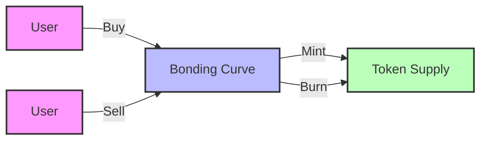

# 🪙 Tokenomics

This document outlines the core principles and mechanics of the Hokusai tokenomics system.

## Core Principles

### Value Alignment
- Token value tied to model performance
- Rewards for quality contributions
- Sustainable growth mechanisms

### Sustainable Growth
- Controlled token supply
- Balanced reward distribution
- Long-term value preservation

### Market Stability
- Price discovery through bonding curve
- Liquidity provision incentives
- Market making mechanisms

## Tokenomics Overview

### Token Distribution
- Initial supply: 100M tokens
- Distribution schedule
- Vesting periods

### Reward Mechanisms
- Performance-based rewards
- Contribution incentives
- Governance participation

### Burn Mechanisms
- Usage-based burning
- Performance penalties
- Market stability measures

## Economic Models

### Bonding Curve

### Liquidity Pools
- Automated market making
- Price stability
- Trading efficiency

### Vesting Schedules
- Linear vesting
- Cliff periods
- Performance milestones

## Performance Metrics

### Supply Metrics
- Total supply
- Circulating supply
- Burn rate

### Market Metrics
- Price discovery
- Trading volume
- Liquidity depth

### Protocol Metrics
- Model performance
- User adoption
- Network growth

## Next Steps

- Learn about [Bonding Curve](/tokenomics/bonding-curve)
- Understand [DeltaOne Calculations](/tokenomics/deltaone-calculations)
- Review [Smart Contracts](/smart-contracts/overview)

For additional support, contact our [Support Team](https://hokus.ai/contact-us/) or join our [Community Forum](https://community.hokus.ai). 