# Seven-Day Launch Period

:::warning LAUNCH PERIOD RISKS
Participating in token launches is **extremely high risk**. During the buy-only period, you **cannot sell** for 7 days. Token prices can decline significantly when selling is enabled on Day 7. Only participate if you understand and accept these risks. This is **not investment advice** - see [Investor Guide](/guides/investor-guide) for full disclosures.
:::

Every new Hokusai model token begins with a **seven-day bonding round** where buying is enabled but selling is disabled. This launch period establishes initial price discovery, prevents manipulation, and allows early supporters to accumulate positions before full trading begins.

## Overview

The seven-day launch period is a **buy-only window** designed to:

- ✅ Establish initial USDC reserves
- ✅ Enable fair price discovery
- ✅ Prevent front-running and manipulation
- ✅ Reward early model supporters
- ✅ Build initial liquidity foundation

### Timeline

```mermaid
gantt
    title Seven-Day Launch Period
    dateFormat X
    axisFormat Day %d

    section Buy-Only Period
    AMM Deployed           :milestone, m1, 0, 0d
    Buying Enabled         :active, buy1, 0, 7d
    Selling Disabled       :crit, nobuy, 0, 7d

    section Full Trading
    Full Trading Begins    :milestone, m2, 7, 0d
    Buy & Sell Enabled     :done, trade, 7, 3d
```



**Visual Timeline:**
```
Day 0    Day 1    Day 2    Day 3    Day 4    Day 5    Day 6    Day 7    Day 8+
  │        │        │        │        │        │        │        │        │
  └─────── BUY ONLY (Selling Disabled) ────────────────────────┘ ← Sell Enabled
  ▲                                                               ▲
  │                                                               │
Deploy                                                    Full Trading
AMM                                                         Begins
```

### Key Dates

| Event | Timestamp | Actions Available |
|-------|-----------|-------------------|
| **Deployment** | `block.timestamp` at deploy | None yet |
| **Buy-Only Starts** | Immediately after deploy | Buy tokens only |
| **Day 1-6** | `deployTime + 1-6 days` | Continue buying |
| **Day 7** | `deployTime + 7 days` | Buy & sell enabled |
| **Post-Launch** | `deployTime + 7+ days` | Full trading |

## Why Buy-Only?

### Problem: Launch Manipulation

Without a buy-only period, early traders could:

1. **Front-run the launch**: Buy instantly at low price
2. **Dump immediately**: Sell before others can react
3. **Extract value**: Take profits from later buyers
4. **Discourage participation**: Create fear of manipulation

### Solution: Buy-Only Window

A seven-day buy-only period:

```
Without Buy-Only:
[Launch] → Manipulator buys → Price spikes → Manipulator sells → Price crashes → Fear

With Buy-Only:
[Launch] → Everyone can buy for 7 days → No selling pressure → Fair accumulation → Healthy launch
```

## How It Works

### Smart Contract Implementation

The `HokusaiAMM` contract stores a `buyOnlyUntil` timestamp:

```solidity
contract HokusaiAMM {
    // Set at deployment
    uint256 public immutable buyOnlyUntil;

    constructor() {
        // 7 days = 604,800 seconds
        buyOnlyUntil = block.timestamp + 7 days;
    }

    function sell(...) external {
        require(block.timestamp > buyOnlyUntil, "Selling not allowed during bonding round");
        // ... sell logic
    }
}
```

### Checking Status

To check if the bonding round is active:

```javascript
const amm = await ethers.getContractAt("HokusaiAMM", ammAddress);

// Method 1: Check timestamp directly
const buyOnlyUntil = await amm.buyOnlyUntil();
const now = Math.floor(Date.now() / 1000);
const isBuyOnly = now < buyOnlyUntil;

// Method 2: Use helper function
const isBuyOnly = await amm.isBuyOnlyPeriod();

if (isBuyOnly) {
    console.log("Still in bonding round - buys only");
    const timeRemaining = buyOnlyUntil - now;
    const daysRemaining = timeRemaining / (24 * 60 * 60);
    console.log(`${daysRemaining.toFixed(1)} days until full trading`);
} else {
    console.log("Full trading enabled");
}
```

## Price Dynamics During Launch

### Initial State

When the AMM is deployed:

```
Reserve (R): Initial seed amount (e.g., 10,000 USDC)
Supply (S): Initial minted tokens (e.g., 1,000,000 tokens)
CRR (w): Set at deployment (e.g., 0.2 = 20%)
Spot Price: P = R / (w × S) = 10,000 / (0.2 × 1,000,000) = 0.05 USDC
```

### Price Progression

As buyers purchase during the bonding round:

**Day 0-1** (Early adopters):
```
R = 10,000 → 50,000 USDC (+40,000 from buys)
S = 1,000,000 → 1,400,000 tokens (+400,000 minted)
Price = 50,000 / (0.2 × 1,400,000) ≈ 0.179 USDC
Growth: +258%
```

**Day 2-4** (Growing interest):
```
R = 50,000 → 150,000 USDC (+100,000 from buys)
S = 1,400,000 → 2,200,000 tokens (+800,000 minted)
Price = 150,000 / (0.2 × 2,200,000) ≈ 0.341 USDC
Growth: +90%
```

**Day 5-7** (Anticipation of full trading):
```
R = 150,000 → 250,000 USDC (+100,000 from buys)
S = 2,200,000 → 2,800,000 tokens (+600,000 minted)
Price = 250,000 / (0.2 × 2,800,000) ≈ 0.446 USDC
Growth: +31%
```

**Post-Launch Day 7+**:
```
Selling enabled → Some take profits → Price stabilizes
First sell: Someone sells 100,000 tokens
New equilibrium based on buy/sell pressure
```

### Visualization

```
Price
  ↑
  |                    Full Trading →
  |                   ╱
0.45 |                 ╱
  |                ╱
0.34 |             ╱
  |          ╱
0.18 |      ╱
  |    ╱
0.05 |___╱
  |  |------------------|-------→
     Day 0           Day 7      Time
     Deploy         Launch
              (Buy-Only)
```

## Participation Strategy

### For Early Investors

**Advantages of buying early**:
- ✅ Lower initial prices
- ✅ First-mover advantage
- ✅ No selling pressure
- ✅ Support promising models

**Risks to consider**:
- ⚠️ Can't exit for 7 days
- ⚠️ Price may drop post-launch
- ⚠️ Model may underperform
- ⚠️ Initial liquidity is thin

**Recommended approach**:
```
1. Research the model thoroughly
   - Review performance metrics
   - Assess team and roadmap
   - Check initial token distribution

2. Start with small buys
   - Test the AMM mechanics
   - Observe price movement
   - Gauge community interest

3. Dollar-cost average
   - Buy across Days 0-6
   - Don't deploy all capital Day 0
   - Adjust based on momentum

4. Plan your exit
   - Decide holding period
   - Set price targets
   - Consider post-launch volatility
```

### For Model Developers

**Pre-launch checklist**:
```
☐ Seed initial USDC reserve (optional)
☐ Mint initial token supply
☐ Set appropriate CRR (w)
☐ Configure trade fee
☐ Deploy AMM contract
☐ Grant FEE_DEPOSITOR_ROLE to UsageFeeRouter
☐ Announce launch to community
☐ Publish model performance metrics
☐ Provide clear documentation
```

**During launch (Days 0-6)**:
```
☐ Monitor buy activity
☐ Communicate with early supporters
☐ Share updates on model development
☐ Provide transparency on token distribution
☐ Prepare for Day 7 launch
```

**Post-launch (Day 7+)**:
```
☐ Monitor initial sell pressure
☐ Ensure API fees flow to reserve
☐ Continue model improvements
☐ Maintain community engagement
```

## Common Scenarios

### Scenario 1: Successful Launch

**Characteristics**:
- Strong early buying (Days 0-2)
- Steady accumulation (Days 3-5)
- Anticipation builds (Days 6-7)
- Minimal selling post-launch
- Price stabilizes or continues growth

**Example**:
```
Day 0: $10k reserve → $50k (+400% price)
Day 3: $50k → $150k (+140% price)
Day 7: $150k → $300k (+100% price)
Day 10: $300k → $350k (+17% price, post-launch)
```

**Outcome**: Healthy model with engaged community

### Scenario 2: Moderate Launch

**Characteristics**:
- Gradual buying throughout 7 days
- Steady but not explosive growth
- Some selling post-launch
- Price consolidates

**Example**:
```
Day 0: $10k reserve → $30k (+200% price)
Day 3: $30k → $60k (+100% price)
Day 7: $60k → $100k (+67% price)
Day 10: $100k → $90k (-10% price, profit-taking)
```

**Outcome**: Stable model, potential for growth

### Scenario 3: Weak Launch

**Characteristics**:
- Minimal buying activity
- Little price movement
- Significant selling post-launch
- Price declines

**Example**:
```
Day 0: $10k reserve → $15k (+50% price)
Day 3: $15k → $20k (+33% price)
Day 7: $20k → $25k (+25% price)
Day 10: $25k → $15k (-40% price, heavy selling)
```

**Outcome**: Model struggles, may recover with improvements

## Post-Launch Dynamics

### Day 7: The Inflection Point

When the buy-only period ends at exactly `buyOnlyUntil` timestamp:

```solidity
// At block.timestamp > buyOnlyUntil
function sell(...) external {
    require(block.timestamp > buyOnlyUntil, "Selling not allowed");
    // Now selling is enabled
}
```

**What typically happens**:

1. **Profit-taking begins**: Early buyers may sell
2. **Price volatility increases**: Both buy and sell pressure
3. **True price discovery**: Market finds equilibrium
4. **Liquidity deepens**: More trading activity

### First Week Post-Launch

**Typical pattern**:
```
Day 7:    Selling enabled → Initial profit-taking → Price may dip
Day 8-10: Volatility peaks → High trading volume → Price fluctuates
Day 11-14: Stabilization → Trading normalizes → Price finds floor
Week 3+:  New equilibrium → Steady state based on fundamentals
```

### Long-Term Price Factors

After the launch period, token price depends on:

**Fundamental Factors**:
- ✅ Model performance and improvements
- ✅ API usage and fee deposits
- ✅ Token minting from performance rewards
- ✅ Community growth and engagement

**Market Factors**:
- 📊 Buy/sell pressure ratio
- 📊 Reserve balance growth
- 📊 Supply inflation rate
- 📊 Overall market conditions

## Investor Considerations

### Due Diligence

Before participating in a launch:

**Evaluate the Model**:
```
☐ Review model performance metrics
☐ Check benchmark comparisons
☐ Assess improvement trajectory
☐ Verify team credentials
☐ Read technical documentation
```

**Analyze Tokenomics**:
```
☐ Initial supply and distribution
☐ CRR setting (higher = more stable)
☐ Trade fee
☐ Expected API usage and revenue
☐ Minting schedule for rewards
```

**Assess Risks**:
```
☐ 7-day lockup (can't sell)
☐ Post-launch volatility
☐ Model underperformance risk
☐ Low liquidity risk
☐ Smart contract risk
```

### Position Sizing

**Conservative approach**:
```
- Allocate 1-5% of crypto portfolio
- Buy across multiple days
- Plan to hold 30-90 days minimum
- Set stop-loss at -50%
```

**Aggressive approach**:
```
- Allocate 5-15% of crypto portfolio
- Front-load buying Day 0-1
- Plan to hold 7-30 days
- Take profits at +100-300%
```

### Exit Strategy

**Scenario planning**:

**If price increases 2x during bonding**:
```
Option A: Sell 50% at Day 7, hold rest
Option B: Hold all, sell gradually over weeks
Option C: Sell all Day 7, lock profits
```

**If price increases less than 50% during bonding**:
```
Option A: Hold through Day 7, assess
Option B: Sell portion to break even
Option C: Hold longer, wait for fundamentals
```

**If price stable during bonding**:
```
Option A: Hold, wait for API fees
Option B: Sell if no growth by Day 10
Option C: Average down if believe in model
```

## FAQ

### Q: Can I sell before Day 7?

No. The `sell()` function will revert with "Selling not allowed during bonding round" error. You must wait until exactly `buyOnlyUntil` timestamp passes.

### Q: What happens at exactly Day 7?

At the moment `block.timestamp > buyOnlyUntil`, selling becomes enabled. Anyone can call `sell()` and trade tokens for USDC.

### Q: Can I buy after Day 7?

Yes! Buying is always enabled, both during and after the bonding round. Only selling is restricted for the first 7 days.

### Q: Who sets the initial price?

The initial price is determined by:
```
P = Initial_Reserve / (CRR × Initial_Supply)
```

Model developers set these parameters at deployment.

### Q: Can the bonding period be extended?

No. The `buyOnlyUntil` timestamp is **immutable** (set at deploy time and cannot be changed).

### Q: What if no one buys during launch?

If there's minimal buying activity:
- Price remains near initial level
- Reserve stays low
- Post-launch may see heavy selling
- Model may struggle to gain traction

### Q: Can I transfer tokens during bonding round?

Yes! ERC20 transfers are not restricted. You can:
- Transfer to another wallet
- Gift to others
- Move between accounts

Only **selling on the AMM** is disabled.

### Q: How do I know when Day 7 hits?

Check the contract:
```javascript
const buyOnlyUntil = await amm.buyOnlyUntil();
const now = Math.floor(Date.now() / 1000);
const timeRemaining = buyOnlyUntil - now;

if (timeRemaining > 0) {
    console.log(`${timeRemaining} seconds until full trading`);
    console.log(`Approximately ${(timeRemaining / 86400).toFixed(1)} days`);
} else {
    console.log("Full trading is now enabled!");
}
```

### Q: Can reserves be added during bonding round?

Yes! API fees can be deposited via `depositFees()` during the bonding round. This increases reserves and raises the spot price without minting new tokens.

### Q: Is there a maximum buy amount?

Depends on contract configuration. Some models may set per-transaction limits to prevent whale manipulation. Check contract parameters.

## Best Practices

### For Participants

1. **Do your research first**: Don't FOMO into launches
2. **Start small**: Test with small amount Day 0
3. **Observe momentum**: Gauge community interest Days 1-3
4. **Dollar-cost average**: Spread buys across Days 1-5
5. **Have an exit plan**: Decide holding period before buying
6. **Monitor post-launch**: Watch first few hours of Day 7 closely
7. **Don't panic sell**: Expect initial volatility

### For Model Developers

1. **Seed adequate reserves**: Don't start with $0
2. **Set reasonable CRR**: 15-30% for balanced growth
3. **Communicate clearly**: Regular updates during launch
4. **Build community**: Engage supporters throughout
5. **Demonstrate value**: Share metrics and improvements
6. **Prepare for Day 7**: Have plan for post-launch period
7. **Flow API fees early**: Show revenue potential

## Technical Reference

### Contract Functions

**Check bonding status**:
```solidity
function isBuyOnlyPeriod() external view returns (bool) {
    return block.timestamp <= buyOnlyUntil;
}
```

**Get remaining time**:
```javascript
const buyOnlyUntil = await amm.buyOnlyUntil();
const secondsRemaining = buyOnlyUntil - Math.floor(Date.now() / 1000);
const hoursRemaining = secondsRemaining / 3600;
const daysRemaining = hoursRemaining / 24;
```

### Events to Monitor

```solidity
event Buy(address indexed buyer, uint256 usdcSpent, uint256 tokensBought);
event FeesDeposited(address indexed depositor, uint256 amount);
event Sell(address indexed seller, uint256 tokensSold, uint256 usdcReceived);
// First Sell event = bonding round ended
```

## Next Steps

- **Understand AMM**: [AMM Overview](/tokenomics/amm-overview)
- **Learn to Buy**: [Buying Tokens Guide](/guides/buying-tokens)
- **Investor Guide**: [Complete Investor Guide](/guides/investor-guide)
- **Math Behind It**: [Bonding Curve Formulas](/tokenomics/bonding-curve)
- **Contract Details**: [HokusaiAMM Contract](/smart-contracts/hokusai-amm)

For additional support, contact our [Support Team](https://hokus.ai/contact-us/) or join our [Community Forum](https://community.hokus.ai).
