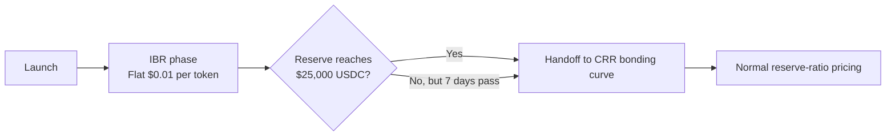

# Initial Bonding Ratio (IBR) Phase

:::warning IBR PHASE RISKS
Participating in new token launches is **extremely high risk**. During the IBR phase, trades occur on a flat-price curve at **$0.01 per token**. Once the AMM hands off to the CRR bonding curve, market price can move sharply in either direction. Only participate if you understand and accept these risks. This is **not investment advice**. See the [Investor Guide](/guides/investor-guide) for full disclosures.
:::

Every new Hokusai model token begins in an **Initial Bonding Ratio (IBR) phase**. This is a flat-price bootstrap window that helps the AMM accumulate its first reserves before normal CRR pricing takes over.

The factory defaults are:

| Parameter | Default |
|-----------|---------|
| CRR | 20% (`200,000 ppm`) |
| Trade fee | 0.30% (`30 bps`) |
| Max IBR duration | 7 days |
| Flat-curve threshold | $25,000 USDC |
| Flat-curve price | $0.01 per token |

## What the IBR phase is

The IBR phase is a **pricing regime**, not a one-week trading lock.

- Buys execute at a flat **$0.01 per token**
- Sells are not conceptually "turned on later"; they are priced according to the launch regime in effect
- API profit-share deposits can still increase reserves during this phase
- Once the handoff condition is met, pricing switches to the CRR bonding curve

In practice, IBR gives the AMM a simple, predictable starting point before reserve-based price discovery begins.

## How the IBR phase ends

The IBR phase ends when **either** of these happens first:

1. The AMM reserve reaches **$25,000 USDC**
2. **7 days** elapse from launch

That means some launches may leave IBR much earlier than Day 7 if demand is strong. The 7-day value is a **maximum cap**, not the main definition of the phase.

### Timeline



## What you can do during IBR

### Buy tokens

Buyers acquire tokens at the flat launch price:

```text
$100 USDC -> about 10,000 tokens before fees
$1,000 USDC -> about 100,000 tokens before fees
```

The standard AMM trade fee still applies, so the net amount used for pricing is reduced by the default **0.30%** fee unless governance changes it.

### Sell tokens

The key mental model is that the AMM is still in its **flat-price launch curve**. The question is not "have sells been unlocked yet?" but "is the AMM still in IBR or has it handed off to CRR pricing?"

### Watch reserve growth

Reserve growth matters because it determines when the handoff happens:

- Direct token purchases add reserve
- API profit-share deposits add reserve without minting new tokens
- Faster reserve growth means earlier transition to CRR pricing

## Handoff to the bonding curve

Once reserves hit **$25,000 USDC** or the **7-day cap** expires, the AMM leaves the flat launch curve and switches to standard CRR pricing:

```text
Spot Price = Reserve / (CRR × Supply)
```

With the default CRR of **20%**, price after handoff depends on the actual reserve and supply at that moment. There is no guaranteed "Day 7 price"; the handoff state is determined by launch participation and reserve accumulation.

## Why Hokusai uses IBR

The IBR phase is meant to:

- Give every launch a simple, legible starting price
- Bootstrap the first reserve capital without requiring LPs
- Avoid immediate dependence on a thin reserve base
- Transition into CRR pricing only after reserve depth is more meaningful

## Participation strategy

### Early IBR participants

Potential advantages:

- Clear launch price of **$0.01 per token**
- Early exposure before CRR pricing takes over
- Direct visibility into how fast reserves are building

Risks:

- Handoff can happen sooner than 7 days
- Price may move materially once CRR pricing begins
- Thin early participation can lead to uncertain post-handoff dynamics

### Mid-phase participants

What to watch:

- Current reserve versus the **$25,000** threshold
- How much of the 7-day cap remains
- Whether API profit-share deposits are already landing
- Community demand and model fundamentals

### Post-handoff participants

After IBR ends:

- Quotes are driven by the CRR curve rather than the flat launch price
- Reserve growth from API profit share becomes more important to long-term appreciation
- Price impact and slippage become more sensitive to trade size

## Example launch paths

### Scenario 1: Fast handoff

```text
Launch reserve: $5,000
New buys in first 24 hours: $20,500 net
Reserve crosses $25,000 on Day 1
Result: IBR ends early and CRR pricing starts immediately
```

### Scenario 2: Slow build

```text
Launch reserve: $8,000
Steady buys plus fee deposits: +$2,000 to +$3,000 per day
Reserve reaches $25,000 on Day 6
Result: IBR lasts most of the week, then hands off before the cap
```

### Scenario 3: Time-capped exit

```text
Launch reserve: $6,000
Demand remains light
Reserve never reaches $25,000
Day 7 arrives
Result: IBR ends because the max duration was reached
```

## FAQ

### Q: Is this a seven-day sell lock?

No. That framing is inaccurate. The launch phase is the **Initial Bonding Ratio (IBR) phase**, a flat-price window at **$0.01 per token** that ends when reserves reach **$25,000 USDC** or when **7 days** elapse.

### Q: Can I buy during IBR?

Yes. Buys use the flat launch price, subject to the AMM trade fee.

### Q: What price do I get during IBR?

The launch price is **$0.01 per token** before fees.

### Q: Does every launch stay in IBR for a full week?

No. Seven days is the **maximum** IBR duration. Strong demand can end the phase much earlier by pushing reserves to **$25,000 USDC**.

### Q: What happens when IBR ends?

Pricing switches from the flat launch curve to the standard CRR bonding curve. From that point on, trade quotes depend on reserve, supply, and the configured CRR.

### Q: Why does the reserve threshold matter?

The threshold is the point where the AMM has accumulated enough USDC depth to move from a fixed launch price to reserve-based pricing.

### Q: Do API fees matter during IBR?

Yes. Profit-share deposits can increase reserves during IBR, which can accelerate the handoff to CRR pricing.

## Best Practices

### For participants

1. Check whether the AMM is still in IBR or already on CRR pricing.
2. Watch reserve progress toward the **$25,000** handoff threshold.
3. Size positions for sharp price changes after the handoff.
4. Treat the launch price as a starting condition, not a guaranteed floor after IBR ends.

### For model developers

1. Explain the IBR mechanics clearly before launch.
2. Publish the default parameters: **20% CRR**, **0.30% trade fee**, **7-day max IBR**, **$25,000 threshold**, **$0.01 launch price**.
3. Monitor reserve growth and communicate when the handoff is approaching.
4. Start routing API profit share promptly so reserve growth is visible on-chain.

## Next Steps

- **Understand AMM mechanics**: [AMM Overview](/tokenomics/amm-overview)
- **Learn how to buy**: [Buying Tokens Guide](/guides/buying-tokens)
- **Review investor risk**: [Investor Guide](/guides/investor-guide)
- **See the math**: [Bonding Curve Formulas](/tokenomics/bonding-curve)
- **Contract reference**: [HokusaiAMM Contract](/smart-contracts/hokusai-amm)
