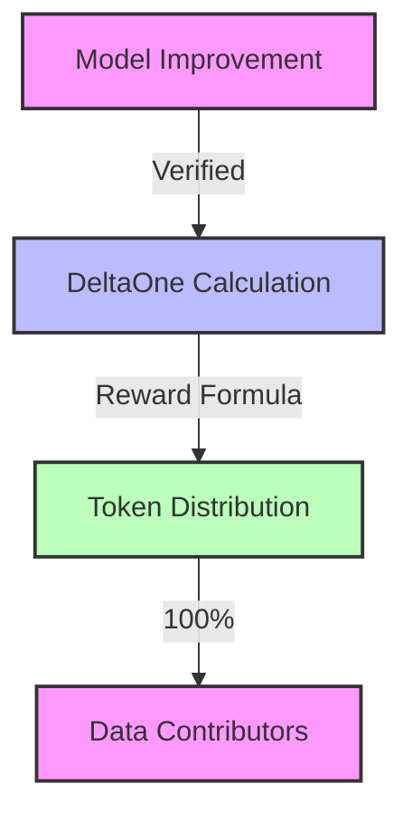

# Reward Mechanisms

This document details how rewards are distributed in the Hokusai ecosystem for contributions and participation.

## Reward Types

### 1. Performance Rewards
Rewards for improving model performance:



#### Reward Calculation
```
Reward = DeltaOnes * Tokens_Per_DeltaOne
```

Where:
- DeltaOnes = Number of percentage points of improvement (1 DeltaOne = 1% improvement)
- Tokens_Per_DeltaOne = Fixed number of tokens awarded per DeltaOne

Example:
```
Baseline Performance: 75% accuracy
New Performance: 82% accuracy
Performance Improvement: 7%
Tokens per DeltaOne: 100 tokens

Reward = 7 DeltaOnes * 100 tokens = 700 tokens
```

### 2. API Fee Rewards
API usage generates fees that flow to token holders:

#### Fee Distribution
- **20% to AMM Reserve**: Deposited as USDC, increases token price
- **80% to Infrastructure**: Covers operational costs

#### How It Benefits Token Holders
When API fees are deposited to the AMM reserve:
```
Reserve increases: R → R + Fees
Supply unchanged: S → S
Price increases: P = R / (w × S)
```

**Example**: $10,000 API fees → $2,000 to reserve → ~same % price increase for all holders

## Distribution Mechanisms

### 1. Performance Distribution
The TokenManager contract handles performance-based rewards:

```solidity
function mintForImprovement(
    bytes32 modelId,
    uint256 improvementBps,
    address contributor
) external onlyVerifier {
    require(improvementBps > 0, "No improvement");
    uint256 reward = calculateReward(improvementBps);
    _mint(contributor, reward);
    emit ImprovementRewarded(modelId, contributor, reward);
}
```

Key components:
- `DeltaOneVerifier`: Validates performance improvements
- `TokenManager`: Mints and distributes rewards
- `ModelRegistry`: Tracks model performance and token addresses

### 2. API Fee Distribution
The UsageFeeRouter contract routes API usage fees:

```solidity
function distributeFees(
    bytes32 modelId,
    uint256 totalFees
) external onlyFeeCollector {
    uint256 ammAllocation = (totalFees * 2000) / 10000; // 20%
    uint256 infrastructureAllocation = totalFees - ammAllocation; // 80%

    // Deposit to AMM reserve (increases token price)
    HokusaiAMM(ammAddress).depositFees(ammAllocation);

    // Send to infrastructure
    USDC.transfer(infrastructureAddress, infrastructureAllocation);
}
```

**Key Insight**: 20% of API fees increase USDC reserves without minting tokens, creating price appreciation for holders.

## Vesting Schedules

### 1. Performance Rewards
- 3-month cliff period
- Early withdrawal penalty

### 2. Liquidity Rewards
- Immediate distribution
- Bonus for longer commitments

## Reward Parameters

### 1. Performance Parameters
- Minimum improvement threshold: 10 bps (0.1%)
- Maximum reward per improvement
- Cooldown period between improvements

### 2. Liquidity Parameters
- Base reward rate
- Bonus multipliers
- Lock-up periods

## Monitoring and Analytics

### 1. Reward Metrics
- Total rewards distributed
- Reward distribution by type
- Vesting status

### 2. Participation Metrics
- Active contributors
- Liquidity providers

### 3. Impact Metrics
- Model improvements
- Protocol growth
- Community engagement

## Next Steps

- Review [Token Value Mechanics](/tokenomics/token-value)
- Understand [DeltaOne Calculations](/tokenomics/deltaone-calculations)
- Learn about [Smart Contracts](/smart-contracts/overview)

For additional support, contact our [Support Team](https://hokus.ai/contact-us/) or join our [Community Forum](https://community.hokus.ai). 