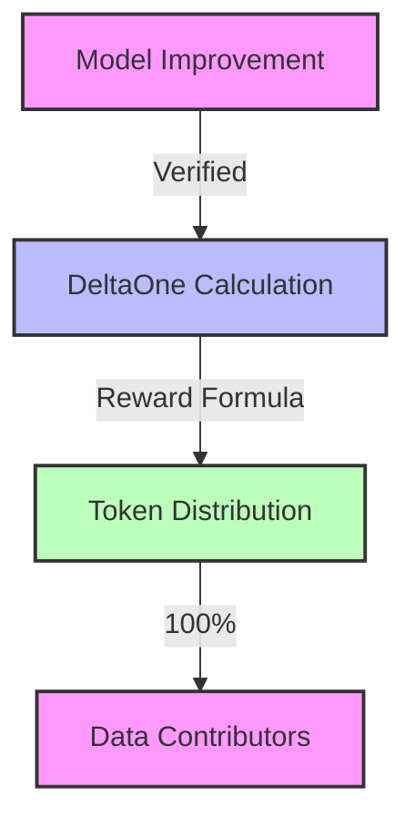

# Reward Mechanisms

This document details how contributors earn tokens and how token holders benefit from API usage.

## Token Distribution & Benefits

There are two ways value flows to participants:
1. **Performance Rewards**: Contributors earn new tokens for improving models
2. **API Fee Benefits**: Token holders benefit from price appreciation as API fees increase reserves

**Important**: There are no staking rewards, dividend distributions, or governance token rewards currently available.

### 1. Performance Rewards
Rewards for improving model performance:



#### Reward Calculation
```
Reward = DeltaOnes * Tokens_Per_DeltaOne
```

Where:
- DeltaOnes = Number of percentage points of improvement (1 DeltaOne = 1% improvement)
- Tokens_Per_DeltaOne = Fixed number of tokens awarded per DeltaOne

Example:
```
Baseline Performance: 75% accuracy
New Performance: 82% accuracy
Performance Improvement: 7%
Tokens per DeltaOne: 100 tokens

Reward = 7 DeltaOnes * 100 tokens = 700 tokens
```

### 2. API Fee Benefits
API usage generates fees that benefit token holders indirectly:

#### Fee Distribution via UsageFeeRouter
The `UsageFeeRouter` contract routes API usage fees based on each model's governance-controlled parameters:
- **Infrastructure Accrual (50-100%)**: Sent to `InfrastructureReserve` contract for provider payments
- **Profit Share (0-50%, residual)**: Deposited to AMM Reserve as USDC, increases token price

Each model has its own `infrastructureAccrualBps` parameter in `HokusaiParams`. Governance can adjust this rate as actual costs become clearer.

**Note**: These are NOT direct rewards to token holders. Instead, the profit share increases the USDC reserve backing all tokens, which raises the token price proportionally.

#### How It Benefits Token Holders
When profit share is deposited to the AMM reserve:
```
Example: $10,000 API revenue with 70% infrastructure accrual
Infrastructure Accrual: $7,000 → InfrastructureReserve (for AWS/compute costs)
Profit Share: $3,000 → AMM Reserve

Reserve increases: R → R + $3,000
Supply unchanged: S → S
Price increases: P = R / (w × S)
```

**Example**: $10,000 API fees with 70% infra accrual → $3,000 profit share to reserve → ~3% price increase for all holders

**This is NOT**:
- Staking rewards
- Dividend payments
- Direct distributions to holders
- Governance token rewards

## Distribution Mechanisms

### 1. Performance Distribution
The TokenManager contract handles performance-based rewards:

```solidity
function mintForImprovement(
    bytes32 modelId,
    uint256 improvementBps,
    address contributor
) external onlyVerifier {
    require(improvementBps > 0, "No improvement");
    uint256 reward = calculateReward(improvementBps);
    _mint(contributor, reward);
    emit ImprovementRewarded(modelId, contributor, reward);
}
```

Key components:
- `DeltaOneVerifier`: Validates performance improvements
- `TokenManager`: Mints and distributes rewards
- `ModelRegistry`: Tracks model performance and token addresses

### 2. API Fee Distribution
The UsageFeeRouter contract routes API usage fees based on per-model parameters:

```solidity
function depositFee(
    string memory modelId,
    uint256 totalFees
) external onlyFeeDepositor {
    // Get model's infrastructure accrual rate from HokusaiParams
    IHokusaiParams params = getParamsForModel(modelId);
    uint16 infraBps = params.infrastructureAccrualBps(); // e.g., 7000 = 70%

    // Calculate split
    uint256 infrastructureAmount = (totalFees * infraBps) / 10000;
    uint256 profitAmount = totalFees - infrastructureAmount;

    // Send to infrastructure reserve (for provider payments)
    infraReserve.deposit(modelId, infrastructureAmount);

    // Deposit profit to AMM reserve (increases token price)
    HokusaiAMM(ammAddress).depositFees(profitAmount);
}
```

**Key Insight**: The profit share (after infrastructure accrual) increases USDC reserves without minting tokens, creating price appreciation for holders. Models with lower infrastructure costs generate higher profit share.

## Vesting Schedules

### 1. Performance Rewards
- 3-month cliff period
- Early withdrawal penalty

### 2. Liquidity Rewards
- Immediate distribution
- Bonus for longer commitments

## Reward Parameters

### 1. Performance Parameters
- Minimum improvement threshold: 10 bps (0.1%)
- Maximum reward per improvement
- Cooldown period between improvements

### 2. Liquidity Parameters
- Base reward rate
- Bonus multipliers
- Lock-up periods

## Monitoring and Analytics

### 1. Reward Metrics
- Total rewards distributed
- Reward distribution by type
- Vesting status

### 2. Participation Metrics
- Active contributors
- Liquidity providers

### 3. Impact Metrics
- Model improvements
- Protocol growth
- Community engagement

## Next Steps

- Review [Token Value Mechanics](/tokenomics/token-value)
- Understand [DeltaOne Calculations](/tokenomics/deltaone-calculations)
- Learn about [Smart Contracts](/smart-contracts/overview)

For additional support, contact our [Support Team](https://hokus.ai/contact-us/) or join our [Community Forum](https://community.hokus.ai). 