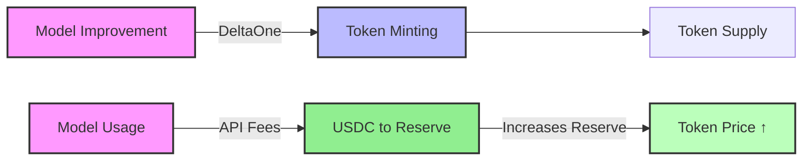

# Token Value Mechanics

This document explains how Hokusai tokens derive and maintain their value within the ecosystem.

## Value Sources

### 1. Model Performance
The primary value driver is the performance of AI models in the ecosystem:



#### Performance Metrics
- Hokusai models are uniquely focused on maximizing their performance against their defined performance benchmark. This is likely a touch myopic, but is designed for simplicity and clarity.

### 2. Usage Demand
Token value is directly tied to model usage through the AMM reserve mechanism. As models are used, **profit after infrastructure costs** flows into the token's USDC reserve, increasing the token price via the bonding curve:

#### Value Accrual Flow

```
API Usage → Fees Collected → UsageFeeRouter
                                    ↓
                    ┌───────────────┴───────────────┐
                    ↓                               ↓
        Infrastructure Accrual              Profit Residual
          (50-100%, per model)             (0-50%, to AMM)
                    ↓                               ↓
        InfrastructureReserve             Reserve Increases
          (pays providers)                   → Price ↑
```

When profit share is deposited into the reserve:
- Reserve (R) increases
- Supply (S) stays constant
- Spot price P = R / (w × S) increases proportionally

**Key distinction**: Token holders benefit from **genuine profit** (revenue minus infrastructure costs), not gross revenue. Each model's `infrastructureAccrualBps` parameter determines the split.

See [API Fee Flow](/tokenomics/api-fee-flow) for complete details.

### 3. Supply Dynamics
The token supply is managed through minting mechanisms:

#### Supply Controls
1. **Minting**
   - Performance-based minting (DeltaOne rewards)
   - Governance-controlled caps

2. **AMM Trading**
   - Buying tokens increases both reserve and supply
   - Selling tokens decreases both reserve and supply

## Price Discovery

### CRR Bonding Curve
The [AMM](/tokenomics/amm-overview) uses a Constant Reserve Ratio (CRR) bonding curve for continuous price discovery:

```
Spot Price = R / (w × S)

Where:
  R = USDC reserve balance
  S = Token supply
  w = Constant Reserve Ratio (CRR, typically 10-30%)
```

The CRR model ensures that API fees deposited into the reserve directly increase the token price, since supply remains constant while reserves grow.

### Price Impact of Profit Share

When profit share is deposited (without minting new tokens):

| Event | Reserve | Supply | Price Impact |
|-------|---------|--------|--------------|
| $50,000 API revenue (80% infra, 20% profit) | +$10,000 | No change | +10% (if reserve was $100k) |
| $50,000 API revenue (60% infra, 40% profit) | +$20,000 | No change | +20% (if reserve was $100k) |

Models with lower infrastructure costs (governance-optimized accrual rate) provide higher profit share to token holders. This mechanism creates a direct link between model usage, operational efficiency, and token value.

## Value Metrics

### Key Indicators
1. **Performance Metrics**
   - Model improvement rate
   - DeltaOne issuance
   - API fee accumulation rate

2. **Market Metrics**
   - Trading volume
   - Reserve depth (USDC backing)
   - Price stability

3. **Usage Metrics**
   - API request volume
   - Active users
   - Enterprise adoption
   - Adoption by other AI models

## Next Steps

- Learn about the [Automated Market Maker](/tokenomics/amm-overview)
- Review [Bonding Curve](/tokenomics/bonding-curve)
- Understand [API Fee Flow](/tokenomics/api-fee-flow)
- Learn about [DeltaOne Calculations](/tokenomics/deltaone-calculations)

For additional support, contact our [Support Team](https://hokus.ai/contact-us/) or join our [Community Forum](https://community.hokus.ai). 