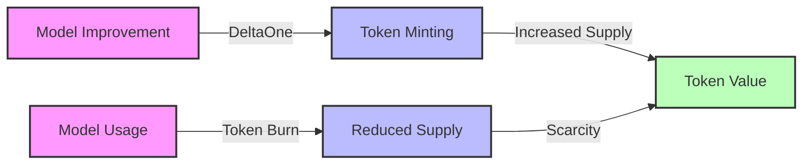

# 💎 Token Value Mechanics

This document explains how Hokusai tokens derive and maintain their value within the ecosystem.

## Value Sources

### 1. Model Performance
The primary value driver is the performance of AI models in the ecosystem:



#### Performance Metrics
- Hokusai models are uniquely focused on maximizing their performance against their defined performance benchmark. This is likely a touch myopic, but is designed for simplicity and clarity. 

### 2. Usage Demand
Token value is directly tied to model usage. As performant models generate more value, we anticipate that they will be used more frequently and/or the price of accessing the API will rise. This will then contribute to burning the supply:

#### Token Supply

```
Token Supply = Base_Value * (1 + Mint_Rate) * (1 - Burn_Rate)
```

### 3. Supply Dynamics
The token supply is managed through several mechanisms:

#### Supply Controls
1. **Minting**
   - Performance-based minting
   - Governance-controlled caps

2. **Burning**
   - Usage-based burning
   - Governance actions

## Price Discovery

### Bonding Curve
The bonding curve provides continuous price discovery:

```
Price = Initial_Price * (1 + Rate)^Supply
```

Where:
- Initial_Price = 0.01 USDC
- Rate = 0.1% per token
- Supply = Current token supply

### Price Bounds
- Minimum: 0.001 USDC
- Maximum: 10 USDC
- Dynamic adjustment through governance

## Value Metrics

### Key Indicators
1. **Performance Metrics**
   - Model improvement rate
   - DeltaOne issuance
   - Burn rate

2. **Market Metrics**
   - Trading volume
   - Liquidity depth
   - Price stability

3. **Usage Metrics**
   - API request volume
   - Active users
   - Enterprise adoption
   - Adoption by other AI models

## Next Steps

- Review [Bonding Curve](/tokenomics/bonding-curve)
- Understand [DeltaOne Calculations](/tokenomics/deltaone-calculations)
- Learn about [Governance](/smart-contracts/governance)

For additional support, contact our [Support Team](https://hokus.ai/contact-us/) or join our [Community Forum](https://community.hokus.ai). 