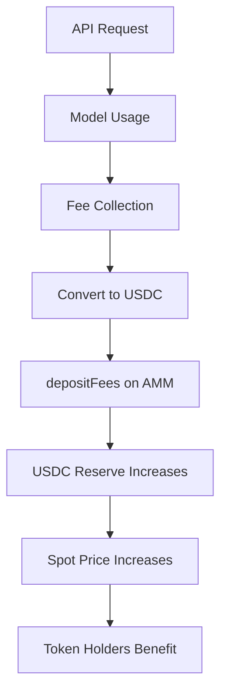
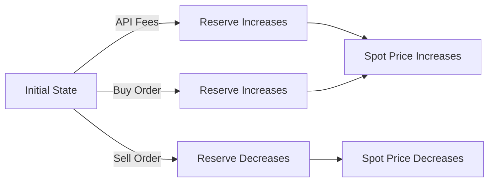

# Implementation Plan: AMM Documentation Update (HOK-661)

**Linear Issue**: HOK-661
**Created**: January 16, 2026
**Status**: Planning Phase

---

## Overview

Update and expand Hokusai documentation to reflect the new CRR-based AMM system implemented in PRs #28 and #30. The Hokusai protocol has transitioned from a "buy and burn" model to a sophisticated Constant-Reserve-Ratio (CRR) Automated Market Maker with USDC reserves, enabling users to buy and sell tokens at deterministic prices.

### What We're Building

Comprehensive documentation covering:
1. **CRR-based AMM mechanics** with mathematical formulas and examples
2. **Seven-day bonding round** (buy-only launch period)
3. **API fee integration** with USDC reserves affecting token price
4. **Buy/sell mechanisms** with slippage protection
5. **Updated smart contract references** removing outdated "buyback" terminology
6. **Interactive diagrams** showing token price dynamics and reserve flows

### Why This Matters

- **Critical Product Change**: The AMM represents a fundamental shift from burn-only to tradeable tokens
- **User Education**: Data suppliers, model developers, and investors need clear guidance
- **Technical Accuracy**: Outdated "buyback" references create confusion
- **Transparency**: Users need to understand how API fees affect token value

---

## Current State

### Existing Documentation (From Research)

#### ✅ Accurate AMM Documentation
- [`docs/docs/tokenomics/bonding-curve.md`](../../docs/docs/tokenomics/bonding-curve.md) - Generic bonding curve math (needs CRR update)
- [`docs/docs/smart-contracts/treasury-and-access.md`](../../docs/docs/smart-contracts/treasury-and-access.md) - BondingCurveTreasury mention (needs expansion)
- [`docs/docs/tokenomics/token-value.md`](../../docs/docs/tokenomics/token-value.md) - Price discovery basics (needs CRR formulas)

#### ❌ Outdated "Buyback" References (MUST FIX)
1. [`docs/docs/tokenomics.md:7`](../../docs/docs/tokenomics.md) - "buyback mechanism"
2. [`docs/docs/licensing/commercial.md:21`](../../docs/docs/licensing/commercial.md) - "token buyback mechanism"
3. [`docs/docs/licensing/proprietary.md:14`](../../docs/docs/licensing/proprietary.md) - "no token buyback"
4. [`docs/docs/licensing/open-source.md:14`](../../docs/docs/licensing/open-source.md) - "no token buyback"

#### ⚠️ Missing Critical Content
- Seven-day bonding round documentation
- CRR-specific formulas and parameters
- API fee → USDC reserve flow diagram
- Buy/sell user guide with examples
- HokusaiAMM contract reference
- Fee structure details (trade fees, protocol fees)
- Launch period mechanics for investors

### Technical Implementation (From hokusai-token PRs)

**PR #28**: CRR-based AMM System (Merged Jan 9, 2026)
- Implemented `HokusaiAMM.sol` with CRR bonding curve
- Added `HokusaiAMMFactory.sol` for pool deployment
- Created `UsageFeeRouter.sol` for API fee routing
- Established seven-day buy-only bonding round
- 615 comprehensive tests

**PR #30**: AMM Monitoring System (Merged Jan 15, 2026)
- Real-time pool monitoring
- TVL, volume, and price tracking
- Whale trade detection
- Reserve anomaly alerts

### Key Technical Specifications

#### CRR Bonding Curve Formulas
```
Buy:  T = S × ((1 + E/R)^w - 1)
Sell: F = R × (1 - (1 - T/S)^(1/w))
Spot: P = R / (w × S)

Where:
  T = tokens minted/burned
  S = current token supply
  R = USDC reserve balance
  E = USDC deposited
  F = USDC returned
  w = Constant Reserve Ratio (5-50%)
```

#### Parameters
- **CRR (w)**: 5% to 50% (governance-controlled)
- **Trade Fee**: 0.25% default (max 10%)
- **Protocol Fee**: 5% default (max 50%)
- **Bonding Round**: 7 days (buy-only period)
- **USDC**: 6-decimal MockUSDC for testing

#### Smart Contracts
- `HokusaiAMM.sol` - Core AMM with buy/sell/depositFees
- `HokusaiAMMFactory.sol` - Pool deployment
- `UsageFeeRouter.sol` - API fee routing
- `HokusaiToken.sol` - ERC20 with controller
- `TokenManager.sol` - Minting based on performance
- `ModelRegistry.sol` - Model ID to token mapping

---

## Proposed Changes

### Documentation Structure Changes

```
docs/docs/
├── tokenomics/
│   ├── bonding-curve.md           [MAJOR UPDATE - Add CRR formulas]
│   ├── amm-overview.md            [NEW - Comprehensive AMM guide]
│   ├── launch-period.md           [NEW - Seven-day bonding round]
│   ├── api-fee-flow.md            [NEW - How fees affect reserves]
│   ├── token-value.md             [UPDATE - Add CRR pricing]
│   └── deltaone-calculations.md   [MINOR UPDATE - Reference AMM]
├── smart-contracts/
│   ├── hokusai-amm.md             [NEW - HokusaiAMM contract reference]
│   ├── treasury-and-access.md     [MAJOR UPDATE - Expand AMM section]
│   ├── token-flow.md              [UPDATE - Add AMM buy/sell flows]
│   └── smart-contracts-overview.md [UPDATE - Add AMM to architecture]
├── guides/
│   ├── buying-tokens.md           [NEW - User guide for buying]
│   ├── selling-tokens.md          [NEW - User guide for selling]
│   └── investor-guide.md          [NEW - Launch period participation]
└── licensing/
    ├── commercial.md              [FIX - Remove buyback reference]
    ├── proprietary.md             [FIX - Remove buyback reference]
    └── open-source.md             [FIX - Remove buyback reference]
```

---

## Implementation Phases

### Phase 1: Fix Critical Outdated References (30 minutes)
**Goal**: Remove all "buyback" terminology immediately

**Tasks**:
1. ✅ Update `docs/docs/tokenomics.md:7`
   - Replace: "buyback mechanism"
   - With: "bonding curve AMM where tokens can be bought/sold with USDC"

2. ✅ Update `docs/docs/licensing/commercial.md:21`
   - Replace: "token buyback mechanism funds the reward pool"
   - With: "API fees flow to the AMM's USDC reserve pool, supporting token value"

3. ✅ Update `docs/docs/licensing/proprietary.md:14`
   - Replace: "no token buyback through ongoing usage"
   - With: "no AMM trading or API revenue generation"

4. ✅ Update `docs/docs/licensing/open-source.md:14`
   - Replace: "no token buyback or proprietary owner"
   - With: "no AMM trading or proprietary owner"

**Success Criteria**:
- Zero references to "buyback" or "buy back" in documentation
- Grep search returns no results: `grep -ri "buyback\|buy back" docs/docs/`

**Validation**:
```bash
# After changes, this should return empty
grep -ri "buyback" docs/docs/ --include="*.md"
```

---

### Phase 2: Create Core AMM Documentation (2-3 hours)
**Goal**: Establish comprehensive AMM overview and technical reference

**Task 2.1**: Create `docs/docs/tokenomics/amm-overview.md`
- **Content**:
  - What is the Hokusai AMM?
  - CRR bonding curve explanation
  - Why CRR instead of other AMM types (Uniswap, etc.)
  - Benefits for token holders
  - Benefits for model contributors
  - Comparison table: Before (burn-only) vs After (AMM)
  - High-level architecture diagram
  - Links to detailed pages

**Task 2.2**: Create `docs/docs/smart-contracts/hokusai-amm.md`
- **Content**:
  - Contract overview and purpose
  - CRR formulas with explanations
  - Function reference:
    - `buy(uint256 minTokens, uint256 deadline)`
    - `sell(uint256 tokenAmount, uint256 minUSDC, uint256 deadline)`
    - `depositFees(uint256 amount)`
    - `spotPrice()`
    - `getBuyQuote(uint256 usdcAmount)`
    - `getSellQuote(uint256 tokenAmount)`
  - Events emitted
  - Access control (owner, pauser)
  - Security features (reentrancy, slippage, deadline)
  - Integration with TokenManager and ModelRegistry
  - Code examples for buy/sell

**Task 2.3**: Update `docs/docs/tokenomics/bonding-curve.md`
- **Changes**:
  - Replace generic formula with CRR-specific formulas
  - Add parameter explanations (w, R, S)
  - Update examples with real CRR calculations
  - Add reserve ratio explanation
  - Show how reserve changes affect price
  - Add spot price formula
  - Update slippage protection section
  - Add fee structure table

**Success Criteria**:
- AMM overview provides clear mental model for all personas
- Smart contract reference includes all key functions with examples
- Bonding curve page has accurate CRR formulas
- Code examples are testable against hokusai-token contracts

**Validation**:
- Review accuracy against `HokusaiAMM.sol` source code
- Test formulas with sample inputs
- Verify links between documents work

---

### Phase 3: Seven-Day Launch Period Documentation (1-2 hours)
**Goal**: Document the buy-only bonding round and investor participation

**Task 3.1**: Create `docs/docs/tokenomics/launch-period.md`
- **Content**:
  - Overview: What is the seven-day bonding round?
  - Purpose: Price discovery and initial liquidity
  - Rules during bonding period:
    - Buy enabled (✅)
    - Sell disabled (❌)
    - Fee deposits enabled (✅)
  - Timeline diagram (Day 0-7)
  - What happens after day 7?
  - Initial reserve seeding
  - Price dynamics during launch
  - Why buy-only period prevents manipulation
  - Historical examples (if available)

**Task 3.2**: Create `docs/docs/guides/investor-guide.md`
- **Content**:
  - Who should participate in launch period?
  - How to evaluate a model before investing
  - Step-by-step: Buying during bonding round
  - Risks and considerations
  - Post-launch trading
  - Exit strategies
  - Fee structure for investors
  - Tax considerations (disclaimer)

**Task 3.3**: Update `docs/docs/personas.md`
- **Changes**:
  - Add "Investor" persona section (if missing)
  - Update investor use cases with AMM participation
  - Add link to investor guide

**Success Criteria**:
- Launch period mechanics are crystal clear
- Investor guide addresses common questions
- Timeline visualization helps understanding
- Risk disclosures are prominent

**Validation**:
- Review with team for accuracy
- Test step-by-step instructions
- Check timeline matches contract implementation

---

### Phase 4: API Fee Flow Documentation (1-2 hours)
**Goal**: Explain how API usage fees increase USDC reserves and token value

**Task 4.1**: Create `docs/docs/tokenomics/api-fee-flow.md`
- **Content**:
  - Overview: API fees as value accrual mechanism
  - Fee collection process:
    - Model usage → API request
    - Usage fees collected (off-chain)
    - Fees converted to USDC
    - USDC deposited to AMM via `depositFees()`
  - Impact on token price:
    - Reserve increases (R ↑)
    - Spot price increases: P = R / (w × S)
    - No token minting (supply stays constant)
  - Flow diagram: API Usage → Fees → USDC → Reserve → Price ↑
  - Fee distribution (if applicable):
    - X% to AMM reserve
    - Y% to protocol treasury
    - Z% to stakers
  - Examples with numbers
  - Comparison to traditional models

**Task 4.2**: Update `docs/docs/smart-contracts/token-flow.md`
- **Changes**:
  - Add "Fee Deposits" section
  - Update token flow diagram to include AMM
  - Show API fees flowing to reserves
  - Distinguish between:
    - Minting (performance improvements)
    - Burning (model access, AMM sells)
    - Neutral (API fees to reserve)

**Task 4.3**: Create Mermaid diagram for fee flow


**Success Criteria**:
- Fee flow is clear from API usage to price impact
- Diagram visualizes the entire flow
- Numbers and examples demonstrate real scenarios
- Token-flow.md integrates AMM properly

**Validation**:
- Verify fee percentages with team
- Test diagram rendering in Docusaurus
- Review for technical accuracy

---

### Phase 5: Buy/Sell User Guides (1-2 hours)
**Goal**: Provide clear, step-by-step instructions for trading tokens

**Task 5.1**: Create `docs/docs/guides/buying-tokens.md`
- **Content**:
  - Prerequisites (wallet, USDC, gas)
  - Finding the right AMM pool (via ModelRegistry)
  - Getting a price quote: `getBuyQuote(usdcAmount)`
  - Understanding slippage tolerance
  - Setting deadline parameter
  - Executing buy: `buy(minTokens, deadline)`
  - Transaction confirmation
  - Troubleshooting common errors:
    - Insufficient USDC
    - Slippage too high
    - Deadline passed
    - Trading paused
  - Code examples (ethers.js, web3.py)
  - UI/dApp integration tips

**Task 5.2**: Create `docs/docs/guides/selling-tokens.md`
- **Content**:
  - Prerequisites (token balance, gas)
  - Checking if bonding round is over
  - Getting a price quote: `getSellQuote(tokenAmount)`
  - Understanding price impact
  - Setting slippage and deadline
  - Approving token spend
  - Executing sell: `sell(tokenAmount, minUSDC, deadline)`
  - Transaction confirmation
  - Troubleshooting common errors:
    - Still in bonding round
    - Insufficient token balance
    - Slippage too high
    - No allowance
  - Code examples
  - UI/dApp integration tips

**Task 5.3**: Update `docs/docs/getting-started.md`
- **Changes**:
  - Add "Trading Tokens" section
  - Link to buying/selling guides
  - Add AMM to quick start flow

**Success Criteria**:
- Step-by-step guides are executable by users
- Code examples are complete and tested
- Error troubleshooting covers common issues
- UI integration tips help developers

**Validation**:
- Test code examples against testnet
- Walk through each step manually
- Verify error messages match contract code

---

### Phase 6: Update Smart Contract Architecture (1 hour)
**Goal**: Integrate AMM into overall smart contract documentation

**Task 6.1**: Update `docs/docs/smart-contracts/smart-contracts-overview.md`
- **Changes**:
  - Add HokusaiAMM to architecture diagram
  - Update flow to include buy/sell paths:
    ```
    [Data Contributor]
        ↓ submits data
    [Verifier] → confirms DeltaOne
        ↓
    [TokenManager] → mints tokens
        ↓
    [HokusaiAMM] ← buy/sell with USDC
        ↓
    [API Usage] → fees to AMM reserve
        ↓
    [ModelAccessController] → burns for usage
    ```
  - Add HokusaiAMMFactory description
  - Add UsageFeeRouter description
  - Update "Key Roles" section

**Task 6.2**: Update `docs/docs/smart-contracts/treasury-and-access.md`
- **Changes**:
  - Expand BondingCurveTreasury section (may be HokusaiAMM)
  - Add CRR mechanics
  - Add buy/sell function descriptions
  - Add fee deposit mechanism
  - Add governance parameters
  - Add security features

**Task 6.3**: Update `.cursor/rules/smart_contracts.mdc`
- **Changes**:
  - Add HokusaiAMM to ContractComponent list
  - Add HokusaiAMMFactory
  - Add UsageFeeRouter
  - Update descriptions to include CRR mechanics

**Success Criteria**:
- AMM is integrated into overall architecture
- Flow diagrams include AMM paths
- All new contracts are documented
- Cursor rules reflect current state

**Validation**:
- Visual review of architecture diagram
- Check all cross-references work
- Verify contract names match repo

---

### Phase 7: Visual Diagrams and Examples (1-2 hours)
**Goal**: Create interactive and visual aids for understanding

**Task 7.1**: Create Reserve Impact Diagram
- **Mermaid diagram** showing how reserve changes affect price


**Task 7.2**: Create Launch Period Timeline
- **Visual timeline** of seven-day period
```
Day 0: [Deploy] → Buy enabled
Day 1-6: [Bonding Round] → Buy only
Day 7: [Launch Complete] → Buy & Sell enabled
```

**Task 7.3**: Add Calculation Examples
- **Interactive examples** in bonding-curve.md:
  - Example 1: Small buy (100 USDC)
  - Example 2: Large buy (10,000 USDC)
  - Example 3: Sell after reserve increase
  - Example 4: Fee deposit impact

**Task 7.4**: Create Comparison Table
- **Before vs After AMM**:
```markdown
| Feature | Before (Burn-Only) | After (CRR AMM) |
|---------|-------------------|-----------------|
| Buy tokens | ❌ No | ✅ Yes (USDC) |
| Sell tokens | ❌ No | ✅ Yes (after bonding) |
| Price discovery | ❌ None | ✅ Bonding curve |
| Liquidity | ❌ None | ✅ Always available |
| API fee impact | 🔥 Burn only | 📈 Increases reserve |
```

**Success Criteria**:
- Diagrams render correctly in Docusaurus
- Examples use real formula calculations
- Timeline is visually clear
- Comparison table highlights key differences

**Validation**:
- Test diagram rendering
- Verify example calculations
- Review for visual clarity

---

### Phase 8: Update Sidebar Navigation (30 minutes)
**Goal**: Ensure new pages are discoverable

**Task 8.1**: Update `docs/sidebars.js`
- **Changes**:
```javascript
{
  type: 'category',
  label: 'Tokenomics',
  items: [
    'tokenomics/index',
    'tokenomics/token-value',
    'tokenomics/amm-overview',      // NEW
    'tokenomics/bonding-curve',
    'tokenomics/launch-period',      // NEW
    'tokenomics/api-fee-flow',       // NEW
    'tokenomics/deltaone-calculations',
    'tokenomics/rewards'
  ]
},
{
  type: 'category',
  label: 'Smart Contracts',
  items: [
    'smart-contracts/smart-contracts-overview',
    'smart-contracts/hokusai-amm',   // NEW
    'smart-contracts/model-tokens-and-token-manager',
    'smart-contracts/treasury-and-access',
    'smart-contracts/token-flow',
    'smart-contracts/governance',
    'smart-contracts/security'
  ]
},
{
  type: 'category',
  label: 'Guides',
  items: [
    'guides/quick-start',
    'guides/buying-tokens',          // NEW
    'guides/selling-tokens',         // NEW
    'guides/investor-guide',         // NEW
    // ... existing guides
  ]
}
```

**Task 8.2**: Update index pages
- Add links to new AMM pages in:
  - `docs/docs/tokenomics/index.md`
  - `docs/docs/smart-contracts/smart-contracts-overview.md`
  - `docs/docs/getting-started.md`

**Success Criteria**:
- All new pages appear in sidebar
- Navigation order is logical
- Index pages link to new content

**Validation**:
- Run `npm start` and check sidebar
- Verify all links work
- Check mobile navigation

---

### Phase 9: Cross-Reference Updates (30-60 minutes)
**Goal**: Update all internal links and cross-references

**Task 9.1**: Add "Next Steps" links
- Update existing pages to link to new AMM docs:
  - `tokenomics/token-value.md` → link to `amm-overview.md`
  - `tokenomics/deltaone-calculations.md` → link to `api-fee-flow.md`
  - `smart-contracts/token-flow.md` → link to `hokusai-amm.md`
  - `getting-started.md` → link to `buying-tokens.md`

**Task 9.2**: Update terminology throughout docs
- Search and replace where appropriate:
  - "BondingCurveTreasury" → "HokusaiAMM" (if contract was renamed)
  - Add CRR clarifications where bonding curve is mentioned

**Task 9.3**: Update `.cursor/rules/tokenomics.mdc`
- Add CRR AMM mechanics
- Update with seven-day launch period
- Add API fee flow information

**Success Criteria**:
- All cross-references are accurate
- Terminology is consistent
- Cursor rules reflect current implementation

**Validation**:
- Check all internal links
- Grep for old terminology
- Review cursor rules accuracy

---

### Phase 10: Review and Polish (1 hour)
**Goal**: Final quality check and optimization

**Task 10.1**: Content Review
- Read through all new/updated pages
- Check for clarity and completeness
- Verify technical accuracy
- Fix any typos or formatting issues

**Task 10.2**: Build and Test
```bash
cd docs/
npm run build
npm run serve
```
- Test all pages render correctly
- Check mobile responsiveness
- Verify code examples display properly
- Test all links

**Task 10.3**: SEO and Metadata
- Add meta descriptions to new pages
- Update page titles
- Add keywords for search

**Task 10.4**: Create Summary Document
- Document all changes made
- List all new files created
- List all modified files
- Note any deprecations

**Success Criteria**:
- Documentation builds without errors
- All pages are mobile-friendly
- Links and navigation work perfectly
- Metadata is optimized

**Validation**:
```bash
# Check build
npm run build

# Check links
npm run validate-links

# Check for broken references
grep -r "\.md#" docs/ --include="*.md" | grep -v "^docs/docs/"
```

---

## Success Criteria

### Automated Checks
- ✅ Build passes: `npm run build`
- ✅ TypeScript checks pass: `npm run typecheck`
- ✅ No broken links: `npm run validate-links`
- ✅ Zero "buyback" references: `grep -ri "buyback" docs/docs/ returns empty`
- ✅ All new pages in sidebar

### Manual Verification
- ✅ All formulas are mathematically correct
- ✅ Code examples are executable
- ✅ Diagrams render correctly
- ✅ Mobile layout is readable
- ✅ Cross-references work
- ✅ Technical accuracy confirmed against hokusai-token source

### Content Completeness
- ✅ All three personas understand AMM:
  - Data suppliers understand reward token tradability
  - Model developers understand API fee impact
  - Investors understand launch period and trading
- ✅ Seven-day bonding round is fully documented
- ✅ API fee flow is clear with diagram
- ✅ Buy/sell guides are step-by-step executable
- ✅ Smart contract reference includes all key functions

### User Acceptance
- ✅ Team review confirms accuracy
- ✅ Sample users can follow guides successfully
- ✅ Questions in FAQ are answered

---

## Out of Scope

The following are explicitly **NOT** included in this documentation update:

### 1. Contract Development
- No changes to smart contracts
- No new contract deployments
- No contract testing (beyond documentation examples)

### 2. Frontend/dApp Development
- No UI implementation
- No web3 integration code
- No wallet connection logic
- (Only documentation and code snippets)

### 3. Backend API Changes
- No API endpoint modifications
- No fee collection automation
- No monitoring system changes

### 4. Governance Decisions
- No parameter value recommendations
- No fee percentage decisions
- No CRR ratio selections
- (Document the parameters, not choose them)

### 5. Legal/Compliance
- No legal disclaimers beyond standard boilerplate
- No tax advice
- No regulatory analysis

### 6. Historical Migration
- No guide for migrating old tokens (if not applicable)
- No deprecation of old systems
- (Assume AMM is current system)

### 7. Other Repositories
- No changes to hokusai-token repo
- No changes to hokusai-auth-service
- No changes to hokusai-data-pipeline
- No changes to hokusai-site
- (Only hokusai-docs)

---

## Risks and Mitigations

### Risk 1: Technical Inaccuracy
**Impact**: High - Users could lose funds following incorrect guidance
**Probability**: Medium
**Mitigation**:
- Validate all formulas against HokusaiAMM.sol source
- Test code examples on testnet
- Technical review by hokusai-token developers
- Add disclaimer: "Always test on testnet first"

### Risk 2: Incomplete Fee Flow Information
**Impact**: Medium - Users don't understand value accrual
**Probability**: Low - Have good info from PR #28
**Mitigation**:
- Clarify fee routing with team if unclear
- Document what's known, mark TBD if needed
- Follow up with team on specifics

### Risk 3: Seven-Day Period Misunderstanding
**Impact**: Medium - Investors surprised by sell restrictions
**Probability**: Low - Clear documentation of buy-only period
**Mitigation**:
- Prominent warnings about sell restrictions
- Visual timeline showing restrictions
- FAQ addressing common concerns

### Risk 4: Formula Complexity
**Impact**: Low - Users confused by math
**Probability**: Medium
**Mitigation**:
- Progressive disclosure (simple → complex)
- Visual examples before formulas
- Interactive calculator (future enhancement)
- Plain English explanations

### Risk 5: Breaking Changes in Future
**Impact**: Low - Documentation becomes outdated
**Probability**: High - AMM will evolve
**Mitigation**:
- Version documentation
- Note current contract addresses
- Document parameters as governance-controlled
- Link to source of truth (GitHub)

---

## Timeline Estimate

| Phase | Estimated Time | Dependencies |
|-------|---------------|--------------|
| Phase 1: Fix buyback references | 30 min | None |
| Phase 2: Core AMM docs | 2-3 hours | Phase 1 |
| Phase 3: Launch period docs | 1-2 hours | Phase 2 |
| Phase 4: API fee flow | 1-2 hours | Phase 2 |
| Phase 5: Buy/sell guides | 1-2 hours | Phase 2 |
| Phase 6: Smart contract updates | 1 hour | Phase 2 |
| Phase 7: Diagrams & examples | 1-2 hours | Phases 2-6 |
| Phase 8: Sidebar navigation | 30 min | Phases 2-6 |
| Phase 9: Cross-references | 30-60 min | Phases 1-8 |
| Phase 10: Review & polish | 1 hour | All phases |
| **Total** | **9-14 hours** | - |

**Suggested Schedule**:
- **Day 1 (2-3 hours)**: Phases 1-2 (Fix critical errors, create core docs)
- **Day 2 (3-4 hours)**: Phases 3-5 (Launch period, API fees, user guides)
- **Day 3 (2-3 hours)**: Phases 6-8 (Integration, diagrams, navigation)
- **Day 4 (2 hours)**: Phases 9-10 (Cross-refs, review, polish)

---

## Dependencies

### External
- ✅ hokusai-token repository (https://github.com/Hokusai-protocol/hokusai-token)
- ✅ PR #28 information (CRR AMM implementation)
- ✅ PR #30 information (Monitoring system)
- ⏳ Team review for accuracy confirmation
- ⏳ Final fee percentage confirmation (if not in contracts)

### Internal (hokusai-docs)
- ✅ Docusaurus 3.7.0 setup
- ✅ Existing smart contract documentation
- ✅ Existing tokenomics documentation
- ✅ Mermaid.js for diagrams
- ✅ `.cursor/rules/` context files

### Tools
- ✅ Node.js v18+
- ✅ npm/yarn
- ✅ Git
- ✅ Code editor with Markdown support

---

## Questions for Team

Before starting implementation, confirm:

1. **Contract Names**: Is "BondingCurveTreasury" the same as "HokusaiAMM", or are they different?
2. **Fee Percentages**: Are the fee percentages documented in PR #28 final, or subject to governance?
3. **Deployment Status**: Are these contracts deployed to mainnet/testnet? If so, what are the addresses?
4. **Launch Period**: Is the seven-day period a fixed parameter, or can it vary per model?
5. **API Fee Routing**: Is the UsageFeeRouter contract fully implemented and documented?
6. **Migration**: Are there any old tokens that need migration guidance?
7. **Terminology**: Should we use "bonding curve" or "AMM" or both throughout docs?

---

## Appendices

### Appendix A: File Change Summary

**New Files (12)**:
- `docs/docs/tokenomics/amm-overview.md`
- `docs/docs/tokenomics/launch-period.md`
- `docs/docs/tokenomics/api-fee-flow.md`
- `docs/docs/smart-contracts/hokusai-amm.md`
- `docs/docs/guides/buying-tokens.md`
- `docs/docs/guides/selling-tokens.md`
- `docs/docs/guides/investor-guide.md`

**Modified Files (15+)**:
- `docs/docs/tokenomics.md`
- `docs/docs/tokenomics/bonding-curve.md`
- `docs/docs/tokenomics/token-value.md`
- `docs/docs/tokenomics/deltaone-calculations.md`
- `docs/docs/tokenomics/index.md`
- `docs/docs/smart-contracts/treasury-and-access.md`
- `docs/docs/smart-contracts/token-flow.md`
- `docs/docs/smart-contracts/smart-contracts-overview.md`
- `docs/docs/smart-contracts/overview.md`
- `docs/docs/licensing/commercial.md`
- `docs/docs/licensing/proprietary.md`
- `docs/docs/licensing/open-source.md`
- `docs/docs/getting-started.md`
- `docs/docs/personas.md`
- `docs/sidebars.js`
- `.cursor/rules/smart_contracts.mdc`
- `.cursor/rules/tokenomics.mdc`

### Appendix B: CRR Formula Reference

```
Buy Formula:
  T = S × ((1 + E/R)^w - 1)

  Derivation:
  - Start with constant k = R^w × S
  - After buy: k = (R + E)^w × (S + T)
  - Solve for T: T = S × ((1 + E/R)^w - 1)

Sell Formula:
  F = R × (1 - (1 - T/S)^(1/w))

  Derivation:
  - Start with constant k = R^w × S
  - After sell: k = (R - F)^w × (S - T)
  - Solve for F: F = R × (1 - (1 - T/S)^(1/w))

Spot Price:
  P = dR/dS = R / (w × S)

  Where:
  - R = Reserve (USDC)
  - S = Supply (tokens)
  - w = Constant Reserve Ratio (CRR)
```

### Appendix C: Research Sources

1. **hokusai-token Repository**: https://github.com/Hokusai-protocol/hokusai-token
2. **PR #28**: CRR-based AMM System (HOK-650)
3. **PR #30**: AMM Monitoring System
4. **HokusaiAMM.sol**: Contract source code
5. **Previous Documentation Research**: 31 files analyzed in hokusai-docs

---

**Plan Status**: ✅ Ready for Review
**Next Step**: User approval to proceed with `/implement-plan`
